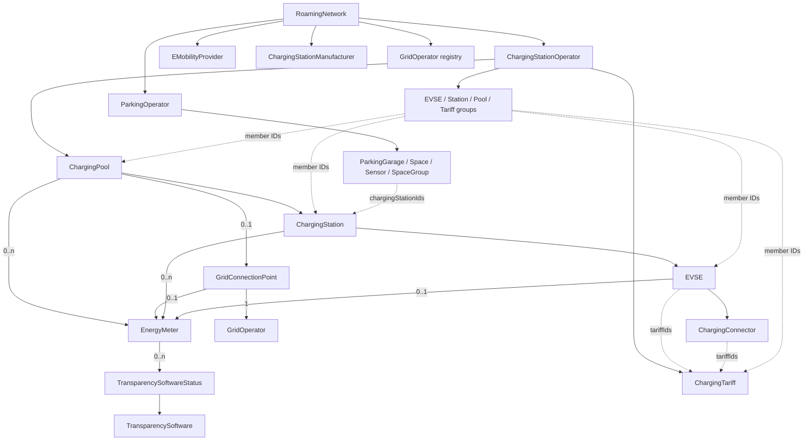

# WWCP Point-of-Interest

WWCP POI models static charging-infrastructure data as an immutable, versioned dataset.
Current statuses, measurements and forecasts remain mutable runtime data within the entities.
It is a spin-off from **WWCP-Core** and a .NET 10 library for applications that import,
maintain, exchange and synchronize charging-infrastructure data.

The starting point is a `RoamingNetwork`. Its operators own charging pools, stations,
EVSEs, connectors, tariffs and four kinds of groups. E-mobility providers, manufacturers,
grid operators and parking operators belong to the same network. Parking operators own their
parking garages, spaces, sensors and space groups.

Instead of repeatedly transferring a complete dataset for every update, an application
can describe changes as an ordered **ChangeSet**. Applying that batch returns a new network
version. Each ChangeSet carries canonical JSON and CBOR SHA-256 identifiers of both its
expected source and expected result. The receiver checks both before accepting the new
version. The previous version remains available, and unchanged immutable data is shared.

`RoamingNetworkHistory` retains these versions as deterministic commits, including their original
batches and ordered parents. It publishes a new head against the expected previous commit ID and
can persist/recover the complete static history as a CBOR archive. Equal peer commit signatures
authenticate ancestry without changing the commit ID. Bounded incremental JSON/CBOR pages
exchange missing ancestry atomically. A separate preview/explicit adoption API selects retained
descendants, including merges reached through a second parent, while carrying local runtime lifetimes.
New replicas can bootstrap a frozen checkpoint and complete history through bounded, resumable
JSON/CBOR fragments. Validation previews precede explicit activation into a separate history.

## Documentation

| Document | Contents |
| --- | --- |
| [Architecture and implementation](docs/ARCHITECTURE.md) | Data model, immutable storage, copy-on-write, validation, concurrency and source organization |
| [Using ChangeSets](docs/CHANGESETS.md) | Before/after ETags, operations, preconditions, revisions, errors and practical examples |
| [Owned graph and references](docs/GRAPH.md) | Ownership collections, groups, manufacturers, parking, reference validation and deletion |
| [Nested element operations](docs/ELEMENT-OPERATIONS.md) | IDs, structured owner paths, individual collection edits and merge behavior |
| [Runtime updates](docs/RUNTIME.md) | Scoped status instructions, preconditions, history retention and static head publication |
| [Interoperability profile and references](docs/INTEROPERABILITY.md) | Static-v1 byte contracts, fixed JSON/CBOR/signature vectors and replica/recovery workflows |
| [ETags and CBOR](docs/ETAGS-CBOR.md) | Immutability audit, canonical content identifiers, metrological CBOR and roundtrips |
| [ChangeSet CBOR](docs/CHANGESET-CBOR.md) | Complete binary exchange preserving signed values, paths and all peer signatures |
| [Commit history and atomic heads](docs/HISTORY.md) | Typed commit IDs, ancestry, publication, duplicate delivery, signatures and archive recovery |
| [Incremental replication](docs/REPLICATION.md) | Retained-tip announcements, bounded commit pages, atomic import and explicit head adoption |
| [Bootstrap new replicas](docs/BOOTSTRAP.md) | Frozen archive fragments, local limits, disk staging, restart and explicit validated activation |
| [Integrating retained branches](docs/MERGING.md) | Three-way comparison, best common ancestors, structured conflicts and explicit merge commits |
| [JSON contracts](docs/JSON.md) | Network snapshots, ChangeSet JSON, reference resolution, precision and explicit units |
| [Greenfield model](docs/GREENFIELD.md) | Removed format variants, typed quantities and remaining dependency boundaries |
| [Grid connections](docs/GRIDCONNECTIONS.md) | Pool energy meters, grid connection points, operators, electrical ratings and location identifiers |
| [Signatures and trust](docs/SIGNATURES.md) | Signing/verification, equal peer signatures, commit descriptions/metadata and trust policy |
| [Domain-specific ChangeSet details](WWCP_POI/ChangeSets/README.md) | Tariffs, transparency software, energy meters and storage APIs |
| [Tests](WWCP_POI_Tests/README.md) | NUnit coverage, wire conventions and test commands |
| [Development roadmap](docs/ROADMAP.md) | Completed corrections, type coverage and remaining steps towards distributed commit exchange |

## Charging-infrastructure hierarchy



An EVSE represents the individually addressable charging unit. A connector describes a
socket outlet or cable connection belonging to that EVSE. Connector IDs are local to their EVSE.

Addresses, coordinates, opening hours, brands, licenses, electrical values, energy mixes and
energy meters provide additional POI data. Pools and stations can directly own multiple energy meters,
for example with `role: "grid"` at its electricity uplink and `role: "pv"` at a photovoltaic
connection. An EVSE can additionally own one energy meter. Transparency software and certificate
status are nested under each meter. These nested values are stored as properties of their owners.

A pool can additionally have one grid connection point. It always references a grid operator
and can own one meter, independently of the pool's direct meters. Optional connection data
includes voltage level, agreed import/export powers and market/metering-location identifiers.

The registry and the operator description embedded in a grid connection point are independent
ownership slots. Equal IDs do not automatically share configuration or runtime; see
[graph boundaries](docs/GRAPH.md#content-identifiers-and-runtime).

## What is implemented

- JSON and CBOR parsing/serialization of the nested network hierarchy, providers, tariffs and support values.
- Typed immutable ETags over canonical JSON and deterministic CBOR SHA-256 POI content.
- Explicit `wwcp-poi-static-v1` transport declarations, bound into commit identity/signatures.
- Published byte/digest/signature/merge/archive references with automated replica and crash-recovery coverage.
- Current operational/admin statuses, timestamps and custom data in network snapshots.
- Sealed infrastructure, support and group types with immutable POI data and mutable runtime statuses.
- Immutable entity storage with persistent dictionaries and sets.
- Atomic, ordered `Add`, `Remove`, `UpdateProperty` and explicit property-removal operations.
- Addressed nested Add/Remove/Replace/property edits with immutable owner paths and element IDs.
- Mandatory before/after JSON and CBOR ETag checks, revision checks and optional expected-old-value checks.
- ChangeSet preparation that computes both expected states before exchange or signing.
- `TryMerge` previews compatible batches from a common source and prepares their merge only on explicit request.
- Validation of entity IDs, ownership, editable fields and indexed tariff/group/parking references.
- Lazy domain hierarchies with independent runtime schedules for each network version.
- Canonical ChangeSet signing/verification with Styx, equal peer signatures and a verifier per signature.
- Immutable multilingual commit descriptions and arbitrary JSON metadata, covered by every signature.
- Deterministic ChangeSet CBOR exchange preserving signed values, peer signatures and native ETag digest bytes.
- Versioned JSON/CBOR reloads retaining valid optional-property presence and explicit nulls.
- Deterministic typed commit IDs binding ordered ancestry, resulting state and unsigned batch content.
- Atomic expected-head publication, retained branches and conflicting batch-ID/duplicate detection.
- Equal peer commit signatures binding ancestry, separate from existing batch signatures.
- Static JSON/CBOR history archives and file persistence with writer leases and replay-based recovery.
- Scoped runtime delivery through the same history gate as static head publication.
- Three-way integration of retained/published branches with structured base/left/right conflicts.
- Explicit conflict resolution and fresh unsigned merge commits with authenticated audit metadata.
- Bounded incremental JSON/CBOR commit exchange, including all merge parents and atomic page import.
- Explicit expected-head adoption with previews, divergence notices and conservative local runtime retention.
- Bounded bootstrap fragments with frozen manifests, disk receipts, restart, complete validation and explicit activation.
- NUnit coverage for JSON roundtrips, conflicts, storage sharing and schema validation.

The “git for charging data” idea now includes cryptographic POI content identities and
ChangeSets binding source and result states, signed descriptions/metadata and multiple peer
signatures, retained ancestry and recoverable head publication. Numeric revisions count along
the first-parent chain; static ETags distinguish data at the same revision, and commit IDs bind
that data to ordered operations, metadata and history. The history merge API integrates already-published
branches against a retained ancestor and prepares explicit resolutions as a fresh commit. Additional
parents recorded by the generic commit API remain explicit ancestry claims. Recursive virtual merge
bases, rebase, a streaming archive codec and an HTTP synchronization service remain future work.
The transport-independent incremental exchange/adoption contract has dedicated JSON/CBOR,
atomic failure, runtime lifetime, concurrency and persistence/recovery coverage. Peer signatures
remain separate from commit identity.

## Quick start

The following example imports one EVSE, changes its maximum power and retains the original version:

```csharp
using System.Text.Json;
using cloud.charging.open.protocols.WWCP.POI;

var network = RoamingNetwork.Parse("""
    {
      "@id": "network-a",
      "name": { "en": "Example network" },
      "chargingStationOperators": [
        {
          "@id": "DE*ABC",
          "name": { "en": "Example operator" },
          "chargingPools": [
            {
              "@id": "DE*ABC*P1",
              "chargingStations": [
                {
                  "@id": "DE*ABC*S1",
                  "EVSEs": [
                    {
                      "@id": "DE*ABC*E1",
                      "currentType": [ "DC" ],
                      "maxPower": "100 kW",
                      "socketOutlets": [ { "@id": "1", "type": "CCS" } ]
                    }
                  ]
                }
              ]
            }
          ]
        }
      ]
    }
    """);

var original = network.DataSnapshot;
var oldPower = original.GetEntity(InfrastructureEntityType.EVSE, "DE*ABC*E1")
                       .Properties["maxPower"];

var changeSet = original.CreateChangeSet(
    id: "change-42",
    createdAt: DateTimeOffset.UtcNow,
    changes: [
        RoamingNetworkChange.UpdateProperty(
            entityType: "EVSE",
            entityId: "DE*ABC*E1",
            propertyName: "maxPower",
            oldValue: oldPower,
            newValue: JsonSerializer.SerializeToElement("150 kW"))
    ]);

var next = network.ApplyChangeSet(changeSet);

// Both sides of the transition are checked automatically by ApplyChangeSet.
Console.WriteLine(changeSet.BeforeETags[0]); // json:sha256:hex:...
Console.WriteLine(changeSet.AfterETags[0]);  // json:sha256:hex:...

Console.WriteLine(network.Revision); // 0
Console.WriteLine(next.Revision);    // 1

var json = next.ToJSONSnapshot().ToString();
var restored = RoamingNetwork.Parse(json);
```

For static persistence use `next.DataSnapshot.ToCBOR(IncludeVersionMetadata: true)` and
`RoamingNetworkDataSnapshot.ParseCBOR(...)`, or the ETag-validating JSON
`RoamingNetworkDataSnapshot.Parse(...)`. An unversioned import starts at revision zero.
Include version metadata to continue applying batches after reload.

ChangeSets now have their own binary transport:

```csharp
var bytes = changeSet.ToCBOR();
var received = RoamingNetworkChangeSet.ParseCBOR(bytes);
var replicaNext = replica.ApplyChangeSet(received); // verifier required when signed
```

To retain the transition and publish its head atomically:

```csharp
using var history = new RoamingNetworkHistory(network);
var source = history.Head;
var commit = history.PrepareCommit(source.Id, changeSet);
if (!history.TryPublish(source.Id, commit, out var result))
    throw new InvalidOperationException($"{result.Outcome}: {result.Error}");

Console.WriteLine(result.Head.Id); // Deterministic commit identity, including ancestry.
var archive = history.ToCBOR();   // Static checkpoint, original commits/peers and head.
using var recoveredHistory = RoamingNetworkHistory.ParseCBOR(archive);
```

Use `CreatePersistent(path, network)` / `Open(path)` for integrated CBOR file persistence and
recovery. Signed batches/commits require configured verifiers; authorization can require keys or
quorum. Route runtime status instructions through `history.ApplyRuntimeUpdate(...)` to share the
publication gate. See [history and atomic heads](docs/HISTORY.md) for contracts and boundaries.

Signed batches keep all signatures and their v2 signing bytes. Native metrological readings,
exact JSON-number spelling and optional payload presence are described in
[ChangeSet CBOR](docs/CHANGESET-CBOR.md).

Static hashes and complete exports read the stored snapshot properties directly. Valid explicit
`null` differs from an absent optional property; both survive reload and old-value checks.
Managed creation/change timestamps receive initial defaults once, and owned graph collections
export as ID-sorted arrays, including `[]`. This corrects the previous Domain-projection-based
hash input: re-export snapshots and prepare/sign batches against the current ETags.

Power values use explicit SI units. Use `ToJSONSnapshot()` for versioned persistence with
current statuses. Static POI changes use ChangeSets; constructors and parsers create the initial
immutable hierarchy. Public static setters and in-place Add/Remove/UpdateWith factory APIs have
been removed, which is a breaking API change.

`Status`, `AdminStatus`, their histories, real-time measurements and forecasts still live inside
the entities and remain mutable. Updating them directly does not change the POI revision or its
creation/change timestamps. A derived network receives independent runtime schedules captured
when `ApplyChangeSet()` runs. `DataSnapshot` contains only static data; `ToJSONSnapshot()`
overlays the current runtime statuses on that version. Static ChangeSets reject runtime fields,
including statuses embedded in meter and connection-point replacements. Matching nested
identities under the same owner retain independent copies of their current histories.

Use `ApplyRuntimeUpdate()` for scoped status/admin-status instructions with an explicit timestamp,
optional expected current status and optional static ETags. It updates the existing runtime
schedule without changing the static snapshot, revision, timestamps or ETags. Direct domain status
setters remain available. See [runtime updates](docs/RUNTIME.md) for targeting and publication rules.

`ImmutableI18NString` and `ImmutableOpeningTimes` are local immutable replacements for mutable
Illias values. Collections are detached on input; mutable nested dependency values are copied
on input and access. Energy meters expose immutable static data and their own mutable runtime
statuses. Dependency `IEntity` text access returns detached copies, and `IInternalData` mutation
of static data is rejected. `InternalData` is mutable application runtime context.

`ChargingCable`, `EnergyMeter`, `GridOperator`, `ParkingOperator`, `TransparencySoftware` and its
certificate status follow the same static-data boundary. The local `ChargingStationManufacturer`
fork stores immutable multilingual values and `ImmutableCryptoKeyInfo` documents. Parking children
are immutable as well. EVSE, station, pool and tariff groups freeze membership; `WithMembers`,
`WithMember` and `WithoutMember` return new groups. `ChargingPoolGroup` now groups actual pools.
The ChangeSet graph includes these groups, manufacturers, grid/parking operators and parking
children as independently addressed nodes. JSON/CBOR network imports resolve group and parking
references automatically. The persistent `References` index rejects dangling or out-of-scope links
and prevents deletion of referenced members. See [graph ownership](docs/GRAPH.md).

Nested owned values support `AddElement`, `RemoveElement`, `ReplaceElement`,
`UpdateElementProperty` and `RemoveElementProperty`, with a typed `ElementPath`. Meters, brands, licenses, group membership
and parking/tariff references can be changed individually. Optional singletons use their
owner/property slot. See [element operations](docs/ELEMENT-OPERATIONS.md).

`RemoveProperty`/`RemoveElementProperty` delete existing optional keys completely, preserving
absence instead of writing a present JSON null. Remaining domain data and references are validated.

Pool and station `MaxCurrent`, `MaxPower` and `MaxCapacity` use immutable Styx `Ampere`, `Watt`
and `WattHour` quantities supplied through their constructors. They roundtrip as SI strings such
as `"125 A"`, `"250 kW"` and `"20 kWh"`, participate in both ETags and support `UpdateProperty`.
Null clears an optional limit; zero is retained; negative limits and numeric/unitless JSON are rejected.
Their real-time values and forecasts use the same quantity types but remain mutable runtime data.

## Merge concurrent ChangeSets

Two batches prepared against the same snapshot can be checked together. Both must match its
network, revision and `BeforeETags`; their individual `AfterETags` and any signatures are checked
as well. `TryMerge` defaults to a preview: success returns a notice and no merged batch.

```csharp
// left and right were both prepared against original.
if (original.TryMerge(left, right, out _, out var preview))
    Console.WriteLine(preview.Message); // Compatible; explicit merge preparation is required.

// Call this after the application/user explicitly chooses to merge.
if (original.TryMerge(left, right, out var merged, out var report,
                      merge: true, mergedChangeSetId: "merge-43"))
{
    var combined = network.ApplyChangeSet(merged!);
    // combined.Revision == original.Revision + 1
    // merged.BeforeETags identify original; merged.AfterETags identify combined.
}
else
{
    foreach (var issue in report.Issues)
        Console.WriteLine(issue.Message);
}
```

The check executes both batch orders on unpublished immutable maps, preserving the operations
and their old-value checks. Both orders must be valid and yield the same complete static data.
Runtime updates are outside this merge. Different properties of one entity can merge;
competing replacements, subtree deletion versus modification and failed reference/old-value
checks are reported. Explicit element operations can merge disjoint collection edits and distinct
properties of a nested object. `UpdateProperty` still replaces its complete value. The check is
conservative: it does not rewrite preconditions, deduplicate operations or choose a winning value.

The merged batch contains the left operations followed by the right operations. Its timestamp
defaults to the later input timestamp, or uses an explicitly supplied `createdAt`. That single
timestamp drives changed ancestors and omitted metadata defaults. Original signatures are
verified via `verifySignature` and are not copied; sign the new batch separately if required.
`network.TryMerge(...)` delegates to its static `DataSnapshot`. Applying to the common source
produces one successor. Applications coordinate publication of their current head and retain
branch successors as needed. See [merge details](docs/CHANGESETS.md#merging-concurrent-batches).

For retained branches, including an already-published left tip, use the history's state comparison:

```csharp
if (history.TryMerge(history.Head.Id, retainedRight.Id, out _, out var preview))
    Console.WriteLine(preview.Message); // Preview does not create a commit.

if (history.TryMerge(history.Head.Id, retainedRight.Id, out var prepared, out var report,
                     merge: true, mergedChangeSetId: "integrate-44") && prepared is not null)
{
    // Sign the fresh batch/commit as required, then publish against its exact first parent.
    history.TryPublish(prepared.Parents[0], prepared, out var publication);
}
```

`resolveConflict:` accepts explicit base/left/right/removal/custom-value choices. Reports include
stable scoped paths and all three JSON values; multiple best ancestors require explicit selection.
The prepared batch targets the left state and records ancestor/tips/resolutions in signed metadata.
It rechecks ownership/references and uses addressed element edits for supported collections.
Missing or out-of-scope references return `Reference` conflicts with the consumer in `Entity`,
the affected `PropertyName` and typed target in `RelatedEntity`. All currently affected consumers
and targets are reported. Whole-subtree choices are revalidated immediately, so repaired issues
drop out and repeated invalid choices terminate. Creation/owner changes remain structural choices;
connectors retain their EVSE scope. Criss-cross histories require an explicit best-ancestor choice.
Recreating a referenced target can require an explicit consumer detach transition when the generated
merge delta has no legal operation order; no temporary detach/restore operations are inferred.
See [three-way integration](docs/MERGING.md) for preparation, signing and boundaries.

## Exchange missing commits and adopt a retained head

The receiver announces all retained branch tips. The sender returns bounded original commits
in parent-before-child order, including both sides of a merge. Import validates an entire page
before retaining it and preserves the receiver's current head and runtime. Keep the requested tip
fixed and refresh the receiver announcement between pages:

```csharp
var target = sender.GetReplicationState().Head;
var expected = receiver.Head.Id;
RoamingNetworkCommitPack page;
do
{
    if (!sender.TryCreateCommitPack(receiver.GetReplicationState(), target, out var outgoing, out var export))
        throw new InvalidOperationException(export.Error);
    page = RoamingNetworkCommitPack.ParseCBOR(outgoing.ToCBOR());
    if (!receiver.TryImportCommitPack(page, out var import))
        throw new InvalidOperationException(import.Error);
}
while (!page.Complete);

if (!receiver.TryAdoptHead(expected, target, out var preview))
    throw new InvalidOperationException(preview.Error);
if (preview.Outcome == RoamingNetworkHeadAdoptionOutcome.AdoptionAvailable &&
    !receiver.TryAdoptHead(expected, target, out var adopted, adopt: true))
    throw new InvalidOperationException(adopted.Error);
```

`TryAdoptHead` previews by default. A merge whose second parent is the receiver's current head
can be selected without creating another commit or changing its signatures. Divergent tips return
`Diverged` and require explicit `TryMerge`; ancestors never rewind the head. Runtime survives only
where its lifetime can be proved, and uncertain branch lifetimes start with domain defaults.
Different checkpoints return `CheckpointMismatch` and require separate explicit archive bootstrap.
See [replication](docs/REPLICATION.md) for wire profiles, limits, outcomes and runtime policy.

## Bootstrap a new replica

`CreateBootstrap()` freezes the original checkpoint, head, retained branches and peer signatures.
Its manifest binds the complete deterministic CBOR archive and ordered fragment digests. JSON
transports binary fragments as explicitly labelled Base64; CBOR uses native byte strings.

```csharp
var source = sender.CreateBootstrap(chunkBytes: 64 * 1024);
var manifest = RoamingNetworkBootstrapManifest.ParseCBOR(source.Manifest.ToCBOR());
var expectedManifest = manifest.Id; // Retain independently from the staging directory.
using var receiver = RoamingNetworkBootstrapReceiver.Create(stagingDirectory, manifest);
while (receiver.NextChunk < manifest.ChunkCount)
{
    var chunk = RoamingNetworkBootstrapChunk.ParseCBOR(source.CreateChunk(receiver.NextChunk).ToCBOR());
    if (!receiver.TryAcceptChunk(chunk, out var receipt))
        throw new InvalidOperationException(receipt.Error);
}

if (!receiver.TryActivate(expectedManifest, out _, out var preview,
    verifyBatchSignature: VerifyBatch, verifyCommitSignature: VerifyCommit,
    authorizeCommit: AuthorizeCommit, authorizeBootstrap: AuthorizeBootstrap))
    throw new InvalidOperationException(preview.Error);
if (!receiver.TryActivate(expectedManifest, out var replica, out var activation,
    activate: true, archivePath: newArchivePath,
    verifyBatchSignature: VerifyBatch, verifyCommitSignature: VerifyCommit,
    authorizeCommit: AuthorizeCommit, authorizeBootstrap: AuthorizeBootstrap))
    throw new InvalidOperationException(activation.Error);
// Explicitly select replica in the application, and dispose it when finished.
```

Reopen an interrupted transfer with `Open(stagingDirectory, expectedManifest)` and request its
`NextChunk` from the same frozen source. Receipts are flushed and installed before acknowledgement;
reopening verifies them again. Preview/activation checks profiles, all digests, original signatures,
authorization and replay of every branch. Existing histories/archives are never replaced by bootstrap.
The new history starts with fresh local runtime and can continue incremental exchange immediately.
Authenticate the selected manifest/channel or pin its identity and expected head in application policy.

`RoamingNetworkBootstrapLimits` bounds raw archive, chunk/count/commit and encoded message sizes.
Source export and final replay still materialize a complete archive; fragment bounds do not bound
total replay memory or work. See [bootstrap](docs/BOOTSTRAP.md) for contracts, failure outcomes,
trust, staging lifecycle and executed tests.

## Sign ChangeSets with descriptions and metadata

```csharp
using org.GraphDefined.Vanaheimr.Illias;

var signed = changeSet
    .WithDescription("de", "Maximalleistung angepasst")
    .WithDescription("en", "Updated maximum power")
    .WithMetadata("acme:ticketId", "INC-4711")
    .WithMetadata("acme:approval", new { department = "operations", approved = true })
    .Sign(alicePrivateKey, "acme:alice", COSEAlgorithm.Ed25519)
    .Sign(bobPrivateKey,   "acme:bob",   COSEAlgorithm.Ed25519);

// trustedKeys maps authorized application key IDs to their public keys.
var next = network.ApplyChangeSet(signed, VerifySignature: (batch, signature) =>
    trustedKeys.TryGetValue(signature.KeyId, out var key) &&
    batch.VerifySignature(signature, key, signature.KeyId, out _));
```

`Signatures` is an immutable array of equal peers. `Sign` appends; `TrySign` returns an error
instead of throwing. `VerifySignature` checks one peer and `VerifySignatures` checks all peers
with an application key resolver. Signing accepts Bouncy Castle keys or Styx `COSEKey` objects.
Every supplied signature must pass the Apply/Merge callback. Applications resolve trusted keys
and enforce their signer policy; unsigned batches remain accepted by the core applier.

The versioned `wwcp-poi-changeset-json-v2` profile signs the header, operations and their full
element ownership paths, both ETag arrays,
descriptions and metadata using Styx canonical JSON. It also binds each peer's profile, algorithm,
key ID and Base64 encoding. Signatures themselves are excluded so further peers can independently
sign the same content. Descriptions and metadata do not change POI state ETags. Editing either
returns an unsigned copy; existing signatures cannot be retained over changed content.
See [the complete signing profile](docs/SIGNATURES.md).
**Signing profile change:** v2 includes `ElementPath` on every signed operation. Built-in
verification does not accept signatures from the previous profile; those batches need new
signatures. The static JSON/CBOR ETag profiles are unchanged.

## Build and tests

Install the .NET 10 SDK. The current project references sibling source repositories:

```text
parent/
  WWCP_POI/
    WWCP_POI/WWCP_POI.csproj
    WWCP_POI_Tests/WWCP_POI_Tests.csproj
  WWCP_Core/
    WWCP_CoreData/WWCP_CoreData.csproj
  Hermod/
    Hermod/Hermod.csproj
  Styx/
    Styx/Styx.csproj
```

Their contents must be compatible with the project references; this checkout is not a
standalone NuGet-only build. Timestamp restoration uses the local immutable metadata base;
canonical JSON, deterministic CBOR and metrological tag support use Styx. The retained
[dependency patch](patches/README.md) documents the earlier external timestamp helper.

Run from this repository's root:

```powershell
dotnet build WWCP_POI/WWCP_POI.csproj
dotnet test WWCP_POI_Tests/WWCP_POI_Tests.csproj
```

The library targets `net10.0`, with nullable reference types and implicit usings enabled.
POI documents use Newtonsoft.Json; immutable storage and ChangeSet payloads use System.Text.Json.
The tests use NUnit. The full run on 2026-10-07 passed **509 tests**, with one skipped child-process
worker (executed separately by the crash tests). The explicit reference generator is excluded from
ordinary discovery. The **61 new replication/adoption cases** cover exact count/byte bounds,
multi-page JSON/CBOR exchange, atomic rollback of states/peers/batch IDs, signed merge adoption,
local runtime lifetimes, expected-head races, gated runtime delivery and persistence/recovery.
The suite also covers fixed cryptographic references, domain JSON and immutable storage.
The **32 bootstrap cases** cover bounded JSON/CBOR fragments, restart, corruption, failed receipts,
full trust/replay validation, preview/activation, fresh runtime and incremental continuation.
The **34 structural merge cases** cover deletion/recreation/addition/owner conflicts, precise
reference diagnostics and choices, connector scopes, signed resolution recovery, criss-cross
ancestor selection, resolver reentry/exceptions and unschedulable referenced replacements.
See the [profile and reference vectors](docs/INTEROPERABILITY.md) and [test coverage](WWCP_POI_Tests/README.md).

## License

The source files carry the GNU Affero General Public License, version 3.0 notice.

## POI content identifiers and CBOR

`network.ETags` is an `ImmutableArray<ETag>`, containing JSON then CBOR identifiers. Each
`readonly struct ETag` holds typed `Format`, `Algorithm` and immutable `Digest` bytes.
`ToString()` displays `json:sha256:hex:<hex>` or `cbor:sha256:hex:<hex>`. The digests use
Styx canonical JSON and deterministic CBOR with metrological extensions. Both describe the full
static POI hierarchy, including static timestamps and owned children. Dynamic statuses, measurements,
revision metadata and derived ETags are excluded. The fixed profile is `POIContentProfile.Id` (`wwcp-poi-static-v1`), declared as `contentProfile`
on tagged POI transports. Commit/archive headers require `ContentProfile`; commit identities and
ancestry signatures bind it. These declarations are excluded from static state hash inputs.
Complete tagged imports reject missing/unsupported declarations. Servers using this profile can compare
the corresponding identifiers to check content agreement.

The first field identifies the **hashed representation**, independently of the transport format.
JSON writes the JSON ETag as `["json", "sha256", "hex", "<64 lowercase hex digits>"]` and the CBOR
ETag as `["cbor", "sha256", "hex", "<64 lowercase hex digits>"]`. CBOR transports both identifiers
using native byte strings: `["json", "sha256", h'<32 JSON digest bytes>']` and
`["cbor", "sha256", h'<32 CBOR digest bytes>']`, respectively.
System.Text.Json and Newtonsoft.Json use the same structured JSON contract. Packed ETag strings
are a display form; wire parsers require the tuple arrays.
The explicit textual encoding supports `hex` (the default) and standard padded `base64`.
`tag.ToJSON(ETagDigestEncoding.Base64)` or
`network.ToJSONWithETags(DigestEncoding: ETagDigestEncoding.Base64)` selects Base64 output.
Both decode to the same immutable digest bytes and compare equally. Encoding is a transport
choice, so neither ETag equality nor the canonical state hashes change. Native CBOR stays binary.

```csharp
// Preserve the static version's revision when transferring it to another replica.
var bytes = network.ToCBOR(IncludeVersionMetadata: true);
var replica = RoamingNetwork.ParseCBOR(bytes);

var batch = network.CreateChangeSet("change-43", DateTimeOffset.UtcNow, [/* operations */]);
var received = RoamingNetworkChangeSet.ParseCBOR(batch.ToCBOR());
var next = replica.ApplyChangeSet(received);
```

The default `ToCBOR()` exports static content without revision bookkeeping; parsing it starts
an unversioned network at revision zero. Use the version-preserving form above to continue a
ChangeSet chain. Add `IncludeRuntime: true` to export current statuses as well. The same independent
flags exist on `ToJSONWithETags()`. A `DataSnapshot` has no runtime state and rejects
`IncludeRuntime: true`; use a domain network for that export.

`BeforeETags` and `AfterETags` are required `ImmutableArray<ETag>` values containing both identifiers.
The applier checks the target, revision and source ETags, verifies every peer signature, applies all
operations locally, updates timestamps and then checks the result ETags. Any mismatch rejects
the whole batch and leaves the source unchanged. `CreateChangeSet` validates and computes the
result on immutable maps without publishing it. `Sign` appends a cryptographic peer signature
after preparation and commit-metadata edits; `WithSignature` appends an external envelope.
The canonical signing profile binds both ETag arrays, operations, descriptions and metadata.

**Breaking contract change:** constructing or deserializing a ChangeSet requires both typed arrays
and their structured wire entries. Default/uninitialized ETags are rejected.
Use `CreateChangeSet` for local preparation or pass trusted expected identifiers to its constructor.
Runtime updates retain POI ETags; static ChangeSets reject operational status fields.
Empty batches advance revision and touch the root; unchanged content
can still have the same ETags when the timestamp is also unchanged.

Hash verification traverses the complete stored static hierarchy. Snapshot identifiers are
computed lazily and cached; the immutable storage update continues to share unchanged entries.
See [ETags and CBOR](docs/ETAGS-CBOR.md) for the complete profile and
[ChangeSets](docs/CHANGESETS.md) for preparation, validation order and errors.
