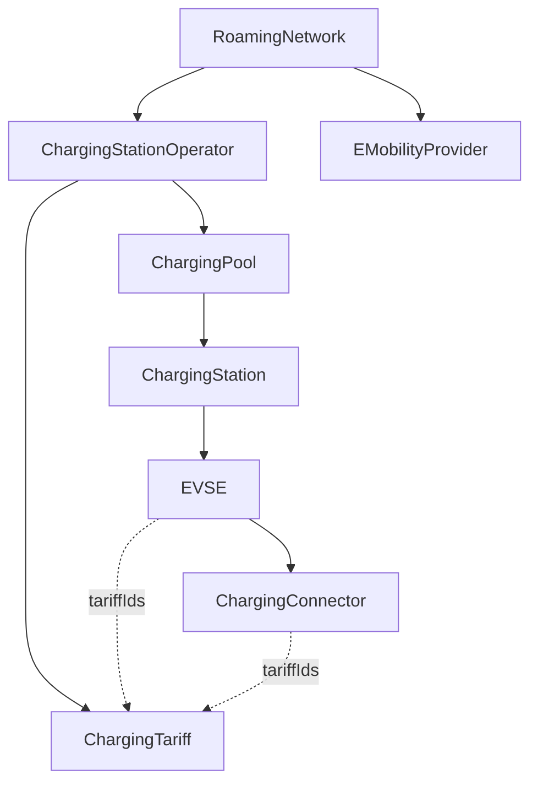

# WWCP Point-of-Interest

WWCP POI models charging infrastructure and its current status as a versioned dataset.
It is a spin-off from **WWCP-Core** and a .NET 10 library for applications that import,
maintain, exchange and synchronize charging-infrastructure data.

The starting point is a `RoamingNetwork`. Its operators own charging pools, stations,
EVSEs, connectors and tariffs. E-mobility providers belong to the same network.

Instead of repeatedly transferring a complete dataset for every update, an application
can describe changes as an ordered **ChangeSet**. Applying that batch returns a new network
version. The previous version remains available, and unchanged immutable data is shared.

## Documentation

| Document | Contents |
| --- | --- |
| [Architecture and implementation](docs/ARCHITECTURE.md) | Data model, immutable storage, copy-on-write, validation, concurrency and source organization |
| [Using ChangeSets](docs/CHANGESETS.md) | Operations, parent IDs, preconditions, revisions, errors and practical examples |
| [JSON contracts](docs/JSON.md) | Network snapshots, ChangeSet JSON, reference resolution, precision and compatibility |
| [Signatures and trust](docs/SIGNATURES.md) | Implemented verification hook, caller responsibilities and work needed for signed commits |
| [Domain-specific ChangeSet details](WWCP_POI/ChangeSets/README.md) | Tariffs, transparency software, energy meters and storage APIs |
| [Tests](WWCP_POI_Tests/README.md) | NUnit coverage, wire conventions and test commands |

## Charging-infrastructure hierarchy



An EVSE represents the individually addressable charging unit. A connector describes a
socket outlet or cable connection belonging to that EVSE. Connector IDs are local to their EVSE.

Addresses, coordinates, opening hours, brands, licenses, electrical values, energy mixes and
energy meters provide additional POI data. Transparency software and certificate status are
nested under an EVSE's energy meter. These nested values are stored as properties of their owners.

## What is implemented

- JSON parsing and serialization of the nested network hierarchy, providers and tariffs.
- Current operational/admin statuses, timestamps and custom data in network snapshots.
- Immutable entity storage with persistent dictionaries and sets.
- Atomic, ordered `Add`, `Remove` and `UpdateProperty` ChangeSet operations.
- Revision checks and optional expected-old-value checks.
- Validation of entity IDs, ownership, editable fields and tariff references.
- Lazy, isolated projections into the existing mutable POI classes.
- A signature envelope and a caller-provided verification hook.
- NUnit coverage for JSON roundtrips, conflicts, storage sharing and compatibility behavior.

The “git for charging data” idea describes the direction of the project. Commit hashes,
canonical signing bytes, built-in cryptographic signing, durable history, automatic merging
and a network synchronization protocol are future work. A numeric revision currently provides
optimistic concurrency control within an application; it does not identify a branch cryptographically.

## Quick start

The following example imports one EVSE, changes its maximum power and retains the original version:

```csharp
using System.Text.Json;
using cloud.charging.open.protocols.WWCP.POI;

var network = RoamingNetwork.Parse("""
    {
      "@id": "network-a",
      "name": { "en": "Example network" },
      "chargingStationOperators": [
        {
          "@id": "DE*ABC",
          "name": { "en": "Example operator" },
          "chargingPools": [
            {
              "@id": "DE*ABC*P1",
              "chargingStations": [
                {
                  "@id": "DE*ABC*S1",
                  "EVSEs": [
                    {
                      "@id": "DE*ABC*E1",
                      "currentType": [ "DC" ],
                      "maxPower": 100000,
                      "socketOutlets": [ { "@id": "1", "type": "CCS" } ]
                    }
                  ]
                }
              ]
            }
          ]
        }
      ]
    }
    """);

var original = network.DataSnapshot;
var oldPower = original.GetEntity(InfrastructureEntityType.EVSE, "DE*ABC*E1")
                       .Properties["maxPower"];

var changeSet = new RoamingNetworkChangeSet(
    id: "change-42",
    roamingNetworkId: network.Id.ToString(),
    baseRevision: original.Revision,
    createdAt: DateTimeOffset.UtcNow,
    changes: [
        RoamingNetworkChange.UpdateProperty(
            entityType: "EVSE",
            entityId: "DE*ABC*E1",
            propertyName: "maxPower",
            oldValue: oldPower,
            newValue: JsonSerializer.SerializeToElement(150_000m))
    ]);

var next = network.ApplyChangeSet(changeSet);

Console.WriteLine(network.Revision); // 0
Console.WriteLine(next.Revision);    // 1

var json = next.ToJSONSnapshot().ToString();
var restored = RoamingNetwork.Parse(json);
```

Power values in this example are watts. Use `ToJSONSnapshot()` for versioned persistence.
After capturing `DataSnapshot`, publish further changes through ChangeSets. Changing a legacy
POI object directly does not update the captured snapshot.

## Build and tests

Install the .NET 10 SDK. The current project references sibling source repositories:

```text
parent/
  WWCP_POI/
    WWCP_POI/WWCP_POI.csproj
    WWCP_POI_Tests/WWCP_POI_Tests.csproj
  WWCP_Core/
    WWCP_CoreData/WWCP_CoreData.csproj
  Hermod/
    Hermod/Hermod.csproj
  Styx/
    Styx/Styx.csproj
```

Their contents must be compatible with the project references; this checkout is not a
standalone NuGet-only build. Timestamp restoration also uses the additive
`AInternalData.RestoreTimestamps` API in Styx. The required external change is recorded in the
[dependency patch](patches/README.md).

Run from this repository's root:

```powershell
dotnet build WWCP_POI/WWCP_POI.csproj
dotnet test WWCP_POI_Tests/WWCP_POI_Tests.csproj
```

The library targets `net10.0`, with nullable reference types and implicit usings enabled.
POI documents use Newtonsoft.Json; immutable storage and ChangeSet payloads use System.Text.Json.
The tests use NUnit.

## License

The source files carry the GNU Affero General Public License, version 3.0 notice.
