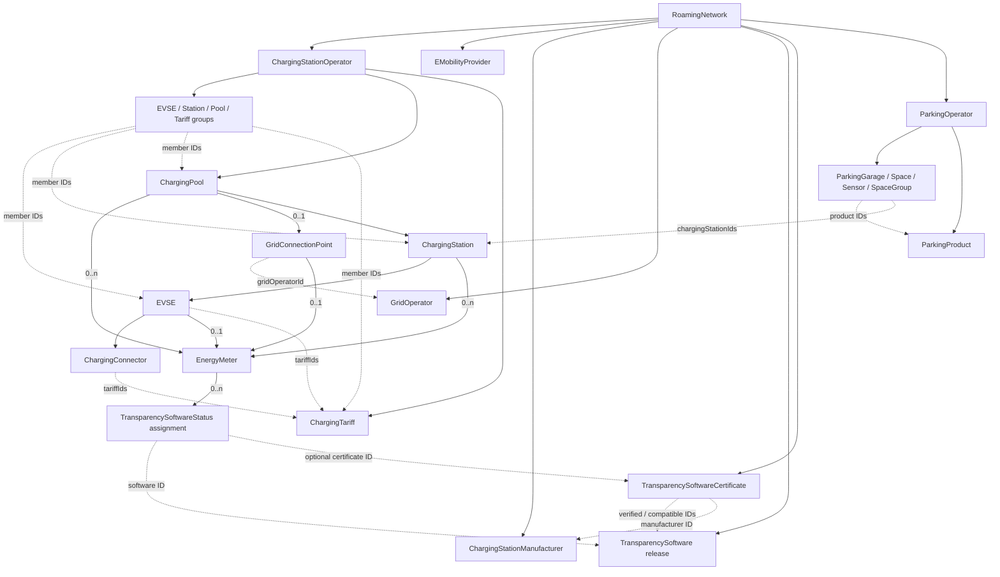

# WWCP Point-of-Interest

WWCP POI models static charging-infrastructure data as an immutable, versioned dataset.
Current statuses, measurements and forecasts remain mutable runtime data within the entities.
It is a spin-off from **WWCP-Core** and a .NET 10 library for applications that import,
maintain, exchange and synchronize charging-infrastructure data.

The starting point is a `RoamingNetwork`. Its operators own charging pools, stations,
EVSEs, connectors, tariffs and four kinds of groups. E-mobility providers, manufacturers,
grid operators and parking operators belong to the same network. Parking operators own their
parking garages, spaces, sensors, space groups and parking products. Network registries also own
transparency software releases and their model/version-specific approval or compatibility documents.

Instead of repeatedly transferring a complete dataset for every update, an application
can describe changes as an ordered **ChangeSet**. Applying that batch returns a new network
version. Each ChangeSet carries canonical JSON and CBOR SHA-256 identifiers of both its
expected source and expected result. The receiver checks both before accepting the new
version. The previous version remains available, and unchanged immutable data is shared.

`RoamingNetworkHistory` retains these versions as deterministic commits, including their original
batches and ordered parents. It publishes a new head against the expected previous commit ID and
can persist/recover the complete static history as a CBOR archive. Equal peer commit signatures
authenticate ancestry without changing the commit ID. Bounded incremental JSON/CBOR pages
exchange missing ancestry atomically. A separate preview/explicit adoption API selects retained
descendants, including merges reached through a second parent, while carrying local runtime lifetimes.
New replicas can bootstrap a frozen checkpoint and complete history through bounded, resumable
JSON/CBOR fragments. Validation previews precede explicit activation into a separate history.
After a lost activation acknowledgement, an explicit recovery mode reopens only the exact
manifest-bound destination archive with fresh trust checks and local runtime.
Administrators can also publish full static snapshot links inside the same chain. Each preserves
the parent's data ETags and local runtime, advances the history revision and carries its own
descriptions, metadata, deterministic identity and equal peer signatures.
New replicas can start at an explicitly authorized signed snapshot, retain the original chain ID
and replay later commits. Their announcements distinguish a trusted snapshot boundary from
complete ancestry, and incremental pages reference the locally retained anchor without repeating its full state.
Administrators can review an explicit retention plan, archive the complete preceding history and
prune active replay at a signed snapshot. Branch/merge dependencies are protected, the original
chain and local runtime head stay unchanged, and receipts distinguish archived from unknown IDs.
An immutable local archive catalog locates those frozen source bytes by digest after files move.
Verified retrieval returns a separate history with original identities and fresh local runtime.
Administrators can review temporary files left by interrupted writes and explicitly clean the
unchanged inventory under its archive/staging writer lease, with partial progress reported on failure.
Separate Release measurements cover static hashing, runtime derivation, retained archives,
bootstrap and cold lookup. Digest reuse and indexed location deduplication reduce repeated work.
JSON/CBOR archives now write directly to streams; persistence and retention hash/write them without
retaining a complete archive buffer, and bootstrap freezes bounded fragments during encoding.
Prepared POI/ChangeSet JSON/indexes and schema paths, full archive rewriting/replay and hierarchy
materialization still have whole-history/graph costs. See [streaming contracts and measurements](docs/STREAMING-ARCHIVES.md).
The [individual encoder baseline](docs/ENCODING-COSTS.md) separated 17 operations across
680 measured samples and identified repeated child hashing as a substantial tagged-document cost.
The [first follow-up](docs/TAGGED-DOCUMENT-OPTIMIZATION.md) removed redundant subtree copies.
The [bounded child ETag cache](docs/CHILD-ETAG-CACHE.md) now reuses immutable child digest pairs
within each complete static snapshot context. Pure snapshot revisions share it; changed maps
start fresh. Runtime views stay current; the same data and export options keep their preceding
bytes and static identities.
The cache package measured 76.4% less repeated JSON document allocation and 48.5% less complete
snapshot CBOR allocation at 512 EVSEs, with about 504 KiB of retained cache memory; cold allocation
rose slightly. The [direct POI CBOR encoder](docs/DIRECT-POI-CBOR.md) now removes complete CBOR
value/native-ETag trees while preserving exact numbers, SI values and static-v2 bytes. Canonical
JSON and complete value output buffers remain. At 512 EVSEs complete snapshot CBOR allocation
falls a further **40.9% (35.22 → 20.83 MiB)** and streamed CBOR archives **40.7%** against the
cache build. Bytes and identities match; timings and process memory remain workload-dependent.
The [direct ChangeSet encoder](docs/DIRECT-CHANGESET-CBOR.md) now emits ordered signed batches
without complete CBOR/conversion trees, preserving numeric spelling, SI text and all peer envelopes.
Matched measurements include 1/64/512/2,048 operations and one/four real signatures.
At 2,048 operations with four signatures, complete batch CBOR allocation falls **33.4%
(15.75 -> 10.48 MiB)** with identical bytes and identities; JSON/index/output buffers remain.
[Direct snapshot payload emission](docs/DIRECT-ARCHIVE-PAYLOAD.md) now removes complete POI CBOR
output buffers from all four archive profiles. A preflight preserves standalone/remaining tag-depth
rules before each payload starts; temporary-file replacement and static/signature bytes remain exact.
[Bounded preflight reuse](docs/PREFLIGHT-ALLOCATION.md) now decodes names once, reuses cleared
map sets, proves the validated ETag tuple shape and shares successful SI scalar trees within each
payload call. At 512 EVSEs streamed CBOR allocation changes **74.87 -> 66.03 MiB (-11.8%)**.
The earlier buffering build used 62.96 MiB; all measured outputs/identities remain exact.
[Direct ChangeSet archive payloads](docs/DIRECT-ARCHIVE-CHANGESET.md) now remove per-batch CBOR
output buffers in all four archive profiles. Preflight and bounded exact scalar reuse preserve
signed numeric/SI spelling, native ETags, equal peers and atomic failure/retry contracts.
At 2,048 operations/four peers, streamed signed-archive allocation changes
**32.27 -> 31.90 MiB (-1.1%)**, with identical output counts/digests.
Preflight adds overhead for small batches: streamed history-64 changes 7.04 -> 7.39 MiB (+4.9%).
Prepared JSON/index/schema paths and replay remain costs; these runs establish no general speedup.
The [archive recovery baseline](docs/ARCHIVE-RECOVERY-COSTS.md) separates input scanning,
CBOR trees, immutable models, signature checks and branch replay across all four profiles.
Across 98 workers / 490 samples, the preceding build's 512-EVSE complete CBOR recovery allocates
1687.92 MiB; isolated tree parsing uses 12.76 MiB, model construction 999.36 MiB and prepared-model
restore 667.08 MiB. Stages are non-additive; model processing and replay need separate improvements.
[Indexed CBOR recovery](docs/INDEXED-ARCHIVES.md) now validates the whole input before trust,
indexes its fields/commit parts, and removes the complete archive CBOR tree. Boundary profiles
privately freeze pending commit bytes against callback mutation while preserving lazy model timing.
Bootstrap checks deterministic encoding directly. Static identities and all equal peers stay exact.
At 512 EVSEs complete CBOR recovery allocation changes **1687.92 -> 1688.50 MiB (+0.03%)**.
Removing the archive tree does not remove the larger model/replay costs. All measured input bytes,
heads, branch states and peer envelopes match; time and sampled memory results remain descriptive.
The indexed-reader verification passed **257 targeted and 1,869 full cases**, including 78 new indexed-reader
cases, with zero failures and one ordinary worker skipped. The matched comparison uses an exact
210-sample subset of the preceding baseline and 210 fresh after samples with unchanged C# harness.
Resident input, individual part trees, private boundary bytes and retained branch states still
consume memory. [Borrowed CBOR input streams](docs/ARCHIVE-INPUT-STREAMS.md) now support synchronous
and async capture from non-seekable sources, short reads, exact early byte limits and cancellation.
Private memory spills to an owned file with read-only mapping; shared reader leases exclude explicit
orphan maintenance. The source stays open, read cancellation cannot poison later history operations,
and no complete managed file-input copy is required. Wire profiles and identities stay unchanged.
The input package adds **160 cases; all 511 focused / 2,029 full Release tests pass**, with zero
failures and one ordinary worker skipped. Fresh 210-sample same-build controls
measure 1687.96/1690.63/1688.77 MiB of cumulative allocation at 512 EVSEs for span/memory/file
input. Model/replay costs dominate; these figures establish no universal time or total-memory gain.
[Mapped recovery integration](docs/MAPPED-ARCHIVE-RECOVERY.md) now removes complete managed input
arrays from persistent opening and both cold archive APIs. Bootstrap uses bounded private capture,
checks exact manifest-bound bytes and closes its input before durable installation. Optional recovery
cancellation preserves staging, releases leases and leaves later history operations usable. Model/replay
preparation remained the next candidate at that point; the later package below addresses its repeated subtree copies.
The integration adds **157 cases; all 947 focused / 2,186 full Release tests pass**, with zero
failures and one ordinary worker skipped. Fixed interoperability references are unchanged.
The [132-sample measurements](docs/performance/mapped-recovery-summary.md) bind exact inputs and
results. At 512 EVSEs mapped file recovery changes cumulative allocation 1689.30 -> 1688.66 MiB
(-0.038%); other shapes include small increases. Model/replay preparation remains the larger cost.

[Private model preparation](docs/MODEL-PREPARATION.md) now copies caller JSON once at each import,
completion or representation-binding entry point and reuses its private descendants. Existing node
validation, normalization, exact static JSON/CBOR/signature content, eager/lazy recovery timing,
fresh trust and local runtime remain unchanged. No persistent cache or mutable JSON tree is retained.
The package adds **88 cases; all 1,942 interoperability / 2,274 full Release tests pass**,
with zero failures and one ordinary worker skipped. Fixed reference files remain unchanged.
[Matched measurements](docs/performance/model-preparation-summary.md) compare the same prepared
archives and preserved C# harness binary before/after, separating model preparation, prepared-model
restore and complete CBOR recovery across **84 workers / 252 samples**. At 512 EVSEs complete
recovery allocation changes **1688.51 -> 1571.37 MiB (-6.94%)**; all seven shapes use fewer
cumulative allocations, while timings include increases. These measurements describe that preceding package.

[Bounded canonical preparation](docs/CANONICAL-PREPARATION.md) now reuses unsigned commit/ChangeSet
bytes during synchronous recovery and peer verification. Admission is limited to 64 entries, 1 MiB
per value and 4 MiB of canonical bytes; every scope clears on return or failure. Every peer, current
key and authority policy is still checked. Original IDs/signature bytes, numeric/SI spelling,
public-array detachment, eager/lazy errors, runtime and atomic publication remain exact.
The package adds **106 cases; all 2,048 interoperability / 2,380 full Release tests pass**.
[Matched four-stage measurements](docs/performance/canonical-preparation-summary.md) cover
**112 workers / 336 samples** with identical inputs, outputs, harness and dependencies. Complete
CBOR recovery allocation falls **0.40–7.36%** across these shapes; at 2,048 operations/four peers
it changes **1581.07 -> 1524.67 MiB (-3.57%)**. Individual stages include small allocation increases,
and elapsed times are mostly higher on the shared desktop; no general speedup is established.
The subsequent parser-cancellation package below adds owned-loop checks; larger production workloads
remain follow-ups. These measurements describe that preceding package.

[Root/head snapshot reconstruction](docs/SNAPSHOT-RECONSTRUCTION.md) retains an existing immutable
snapshot only after complete model parsing and an exact property/child/version comparison. Differences
use the previous completion/capture path. Separate histories still create independent runtime objects;
a private root-only head can reuse its newly validated root model. Every peer and current authority
check, existing error timing and atomic publication remain intact. The package adds **86 cases**;
that package passed **2,134 interoperability / 2,466 full Release tests**, with zero failures and one ordinary
worker skipped. Fixed reference files remain unchanged. Verification and matched measurements
are recorded in the linked package evidence. [The matched comparison](docs/performance/snapshot-reconstruction-summary.md)
uses **336 samples**, including the preceding after-series as its before control. Complete CBOR
recovery allocation falls **1.54–7.69%** in these seven shapes; at 512 EVSEs it changes
**1561.29 -> 1494.32 MiB (-4.29%)**. Prepared-model restore falls **2.61–12.19%**. Full-recovery
timings are lower in this series, while model/signature controls include small allocation changes
and collected retained memory is mixed; no general throughput or memory bound follows.

[Immutable signature-envelope copies](docs/SIGNATURE-COPIES.md) now retain the validated commit
identity when only peer arrays change. Batch replacement requires exact unsigned-content proof;
independent arrays or changed content use the complete constructor. Scoped canonical entries can
be shared within the existing bounds; no persistent payload/key/trust cache is added. Every
current peer check, original ID/preimage, atomic envelope union and local runtime remains intact.
The package adds **103 tests**; all **2,237 interoperability / 2,569 full Release cases pass**,
with zero failures and one ordinary worker skipped. Fixed references remain unchanged.
The [direct matched copy/signing comparison](docs/performance/signature-copies-summary.md)
records **240 samples** using the same new harness binary on both sides. It measures sixteen
copies per call; batch metadata cloning, transport and trust checks stay outside those samples.
At 512 EVSEs, sixteen snapshot signature copies allocate **84.7071 -> 0.0015 MiB**;
real commit signing allocates **44.71–48.93% less** across the four shapes. Independent byte and
cryptographic checks are excluded from measured copy costs. End-to-end recovery and production
concurrency remain separate measurements.

[Cooperative parser cancellation](docs/PARSER-CANCELLATION.md) now checks the existing recovery
token inside owned syntax/limit loops and around each commit/receipt/model/replay step. Checks use
an explicit per-call context; returned histories retain no parser token or observer. Existing errors,
trust order, input ownership, scope release and atomic installation remain intact. Individual Styx,
model, crypto and bulk-copy calls remain synchronous; no cancellation-latency bound follows.
The package adds **270 cases**; all **2,507 interoperability / 2,839 full Release tests pass**,
with zero failures and one ordinary worker skipped. Fixed references remain unchanged.
[Matched successful-read measurements](docs/performance/parser-cancellation-summary.md) compare
default-token controls and active-token borrowed-stream recovery across **72 workers / 216 samples**
with exact common inputs/results and the same new harness/dependencies.

The preceding [domain recovery baseline](docs/DOMAIN-RECOVERY-WORKLOADS.md) adds shared grid/software/
approval catalogs, meters on every supported owner, nested tariffs, parking relations and an
explicit two-parent merge. Eight deterministic 16/64-EVSE shapes cover all four profiles with
two original Ed25519 peers per commit/batch. Four stages separate model construction, prepared
replay and complete CBOR/JSON recovery across **64 fresh workers / 192 samples**. Each stage
checks exact input bytes, retained branch states, shared reference instances and fresh runtime.
These richer inputs establish a new baseline. Production and all 32 references remain unchanged;
the six old simple-workload input controls still match. [Results](docs/performance/domain-recovery-summary.md)
guide the next model/replay improvement. At 64 EVSEs, complete CBOR recovery allocates
**621–1,027 MiB per call** across these profiles; the collected additional retained-history heap
is about **3.25–3.99 MiB**. Cumulative allocation and retained RAM are different measures.
The package adds **81 cases**; all **2,588 interoperability / 2,920 full Release tests pass**,
including bootstrap rejection/retry and atomic invalid reference/peer edits.

The preceding [validation projection package](docs/VALIDATION-PROJECTION.md) reuses successful temporary
ancestors and one station view for each fixed immutable map. Ordinary parsers, reference checks,
failure order, fresh peer trust and independent runtime remain. A separate tariff-group ID bug
is corrected to `*TG`, with matching text length/empty flags and format-independent ordering.
The package adds **71 cases**; all **2,659 interoperability / 2,991 full Release tests pass**.
[Matched measurements](docs/performance/validation-projection-summary.md) retain the exact rich
archives, branches, original peers and C# harness/dependencies. At 64 EVSEs, CBOR cumulative
allocation falls **33.66–42.18%** to **408.86–634.18 MiB/call**.
Elapsed-time medians are mixed, including increases for the smaller workloads. Every stage,
timing and collected heap delta is reported; these synthetic results give no production capacity
or constant-memory bound.

The [normalized map preparation package](docs/SNAPSHOT-MAP-PREPARATION.md) completes immutable
property/child-map/root-catalog reuse after full validation and exact normalization. Binding
reads stable typed IDs directly. Fresh runtime, every reference/current peer check, exact failures,
canonical content and atomic publication remain. **53 new / 2,712 interoperability / 3,044 full
Release tests pass**, with unchanged reference artifacts. With the same rich inputs/harness,
[matched measurements](docs/performance/snapshot-map-preparation-summary.md) reduce 64-EVSE CBOR
cumulative allocation a further **16.63–19.38%** to **329.63–528.71 MiB/call**.
Every stage, time and collected heap delta is reported; larger production scaling remains separate.

## Documentation

| Document | Contents |
| --- | --- |
| [Normalized snapshot maps](docs/SNAPSHOT-MAP-PREPARATION.md) | Exact normalized property/child-map/catalog reuse, typed binding IDs and matched recovery costs |
| [Temporary validation projections](docs/VALIDATION-PROJECTION.md) | Per-map ancestor/station view reuse, exact errors/runtime/trust, tariff-group ID correction and matched rich recovery costs |
| [Domain recovery workloads](docs/DOMAIN-RECOVERY-WORKLOADS.md) | Shared catalogs, meter/tariff/parking graphs, signed branch merge, exact recovery controls and four-stage baseline |
| [Parser cancellation](docs/PARSER-CANCELLATION.md) | Explicit per-call checks, exact diagnostics/trust order, cleanup/retry and matched successful-read overhead |
| [Immutable signature copies](docs/SIGNATURE-COPIES.md) | Validated ID reuse, exact unsigned batch proof, bounded aliases, fresh peer trust and direct copy/signing measurements |
| [Root/head reconstruction](docs/SNAPSHOT-RECONSTRUCTION.md) | Exact immutable snapshot reuse after full validation, normalization fallback and independent runtime |
| [Bounded canonical preparation](docs/CANONICAL-PREPARATION.md) | Scoped unsigned-byte reuse, fresh peer trust, exact signature envelopes and matched recovery measurements |
| [Private model preparation](docs/MODEL-PREPARATION.md) | Owned subtree reuse, unchanged validation/trust, frozen algorithm comparisons and matched model/replay measurements |
| [Mapped file recovery](docs/MAPPED-ARCHIVE-RECOVERY.md) | Persistent/cold mapping, bounded bootstrap capture, cancellation, lease release and activation retry |
| [Architecture and implementation](docs/ARCHITECTURE.md) | Data model, immutable storage, copy-on-write, validation, concurrency and source organization |
| [Using ChangeSets](docs/CHANGESETS.md) | Before/after ETags, operations, preconditions, revisions, errors and practical examples |
| [Domain model decisions](docs/DOMAIN-MODEL.md) | Shared operators/software/certificates, model/version evidence, parking relationships and value boundaries |
| [Domain model verification](docs/VERIFICATION-DOMAIN-MODEL.md) | Executed static-v2 model, merge, runtime and full-suite evidence |
| [Owned graph and references](docs/GRAPH.md) | Ownership collections, groups, manufacturers, parking, reference validation and deletion |
| [Nested element operations](docs/ELEMENT-OPERATIONS.md) | IDs, structured owner paths, individual collection edits and merge behavior |
| [Runtime updates](docs/RUNTIME.md) | Scoped status instructions, preconditions, history retention and static head publication |
| [Interoperability profile and references](docs/INTEROPERABILITY.md) | Static-v2 byte contracts, fixed JSON/CBOR/signature vectors and replica/recovery workflows |
| [ETags and CBOR](docs/ETAGS-CBOR.md) | Immutability audit, canonical content identifiers, metrological CBOR and roundtrips |
| [ChangeSet CBOR](docs/CHANGESET-CBOR.md) | Complete binary exchange preserving signed values, paths and all peer signatures |
| [Direct ChangeSet CBOR encoding](docs/DIRECT-CHANGESET-CBOR.md) | Exact signed scalar reuse, sorted definite output, long-batch/multiple-peer measurements, 55 new cases and 1,308-case regression |
| [Commit history and atomic heads](docs/HISTORY.md) | Typed commit IDs, ancestry, publication, duplicate delivery, signatures and archive recovery |
| [Full snapshot links](docs/SNAPSHOTS.md) | Admin-controlled full states, unchanged static data, revision rules, signatures and versioned exchange |
| [Authorized snapshot boundaries](docs/SNAPSHOT-BOUNDARIES.md) | Fresh replicas without older ancestry, explicit trust, partial archives, bounded bootstrap and suffix replication |
| [History archival and pruning](docs/RETENTION.md) | Review plans, protected branches/bases, cold archives, atomic installation, unchanged runtime and pruning receipts |
| [Cold archive discovery](docs/COLD-ARCHIVES.md) | Immutable digest/path catalog, moved files, structured candidate diagnostics, current trust and explicit older-receipt traversal |
| [Archive orphan maintenance](docs/ARCHIVE-MAINTENANCE.md) | Immutable inventory, protected installed files, writer leases, stale reviews and explicit cleanup with partial progress |
| [Scaling measurements and improvements](docs/SCALING.md) | Reproducible Release workloads, raw before/after evidence, CPU/allocation/memory/byte measures, digest reuse and indexed catalog construction |
| [Streaming archives and persistence](docs/STREAMING-ARCHIVES.md) | Borrowed JSON/CBOR streams, atomic file output, incremental retention hashes, frozen bootstrap fragments and static-v2 before/after evidence |
| [Tagged document optimization](docs/TAGGED-DOCUMENT-OPTIMIZATION.md) | Static subtree reuse before attaching ETags, matching 680-sample before/after results and 149/1,174-case reruns |
| [Bounded child ETag cache](docs/CHILD-ETAG-CACHE.md) | Immutable snapshot contexts, admission/lifetime bounds, cold/warm/retention measurements, 20 new cases and 1,194-case regression |
| [Direct POI CBOR encoding](docs/DIRECT-POI-CBOR.md) | Sorted definite Styx output without complete CBOR trees, matched 400-sample reports, 59 new cases and 1,253-case regression |
| [Direct archive ChangeSet payloads](docs/DIRECT-ARCHIVE-CHANGESET.md) | Batch buffer removal, exact signed scalar reuse, depth/atomicity contracts, paired long signed archives and 214 new cases |
| [Bounded archive preflight reuse](docs/PREFLIGHT-ALLOCATION.md) | Per-call name/scalar reuse, ETag shape proof, matched archive/bootstrap controls, 71 new cases and 1,519-case regression |
| [Direct archive POI payloads](docs/DIRECT-ARCHIVE-PAYLOAD.md) | Snapshot buffer removal, preflight depth/failure contracts, paired archive/bootstrap controls and 140 new cases |
| [Individual encoder costs](docs/ENCODING-COSTS.md) | Historical static-v2 snapshot/ChangeSet stages, direct stream versus buffered output and 680 measured samples |
| [Streaming verification](docs/VERIFICATION-STREAMING.md) | 149 stream/encoding/bootstrap cases, existing crash reruns, full 1,174-case Release result and evidence limits |
| [Borrowed CBOR input streams](docs/ARCHIVE-INPUT-STREAMS.md) | Sync/async non-seekable input, bounded memory/file capture, mapped replay, cancellation, shared maintenance leases and 160 new cases |
| [Indexed CBOR recovery](docs/INDEXED-ARCHIVES.md) | Validated ranges, syntax-before-trust, preserved callback/model timing, 78 new cases and matched 210-sample recovery/control reports |
| [Archive decoding and replay costs](docs/ARCHIVE-RECOVERY-COSTS.md) | Seven measured reader stages, all four profiles, retained-state costs, 58 recovery contracts and incremental reader requirements |
| [Local archive recovery limits](docs/ARCHIVE-LIMITS.md) | Byte/commit/receipt/catalog budgets, streaming preflight, structured rejection and 60 boundary cases |
| [Snapshot and retention crash recovery](docs/CRASH-RECOVERY.md) | Actual process exits, original signed identities, cold digests, consistent catalogs and explicit retry |
| [Bootstrap crash recovery](docs/BOOTSTRAP-CRASH-RECOVERY.md) | Manifest/chunk/activation exits, verified prefixes, lost acknowledgements, exact destination recovery and fresh trust |
| [Snapshot and retention verification](docs/VERIFICATION-SNAPSHOTS-RETENTION.md) | 76 targeted cases, fixed byte/signature references, failure/recovery evidence and remaining limits |
| [Incremental replication](docs/REPLICATION.md) | Retained-tip announcements, bounded commit pages, atomic import and explicit head adoption |
| [Bootstrap new replicas](docs/BOOTSTRAP.md) | Frozen archive fragments, local limits, disk staging, restart and explicit validated activation |
| [Integrating retained branches](docs/MERGING.md) | Three-way comparison, best common ancestors, structured conflicts and explicit merge commits |
| [JSON contracts](docs/JSON.md) | Network snapshots, ChangeSet JSON, reference resolution, precision and explicit units |
| [Greenfield model](docs/GREENFIELD.md) | Removed format variants, typed quantities and remaining dependency boundaries |
| [Grid connections](docs/GRIDCONNECTIONS.md) | Pool energy meters, grid connection points, operators, electrical ratings and location identifiers |
| [Signatures and trust](docs/SIGNATURES.md) | Signing/verification, equal peer signatures, commit descriptions/metadata and trust policy |
| [Domain-specific ChangeSet details](WWCP_POI/ChangeSets/README.md) | Tariffs, transparency software, energy meters and storage APIs |
| [Tests](WWCP_POI_Tests/README.md) | NUnit coverage, wire conventions and test commands |
| [Development roadmap](docs/ROADMAP.md) | Completed corrections, type coverage and remaining steps towards distributed commit exchange |

## Charging-infrastructure hierarchy



Solid arrows show ownership; dotted arrows show references.

An EVSE represents the individually addressable charging unit. A connector describes a
socket outlet or cable connection belonging to that EVSE. Connector IDs are local to their EVSE.

Addresses, coordinates, opening hours, brands, licenses, electrical values, energy mixes and
energy meters provide additional POI data. Pools and stations can directly own multiple energy meters,
for example with `role: "grid"` at its electricity uplink and `role: "pv"` at a photovoltaic
connection. An EVSE can additionally own one energy meter. A meter owns legal-status assignments
that reference network-owned software releases and optionally a certificate document. The same
release or document can be used by many meters without duplicating its description.

A pool can additionally have one grid connection point. It always references a grid operator
and can own one meter, independently of the pool's direct meters. Optional connection data
includes voltage level, agreed import/export powers and market/metering-location identifiers.

Every connection point resolves `gridOperatorId` to the same network registry entry in that
version. Operator edits update that shared description, and operational status is stored once
on the registered operator. Derived network versions retain independent runtime schedules.
See [domain decisions](docs/DOMAIN-MODEL.md) and [graph boundaries](docs/GRAPH.md#content-identifiers-and-runtime).

**Static profile change:** `wwcp-poi-static-v2` introduces central software/certificate catalogs,
operator ID references and parking products/relationships. Earlier tagged exports and archives
are rejected. Rebuild exports, ETags, batches and signatures against the new contract; the fixed
JSON/CBOR/signature references have been regenerated. The dedicated model fixture passes
**73 cases**, including reference recreation and independent runtime. Its complete suite passed
**1,025 tests**, with zero failures and one child worker skipped in the ordinary runner. This
[model verification](docs/VERIFICATION-DOMAIN-MODEL.md) predates the streaming package. The later
[streaming verification](docs/VERIFICATION-STREAMING.md) adds 149 passing cases and reruns the
complete suite: **1,174 passed**, zero failures, one ordinary worker skipped. The subsequent
[child-cache verification](docs/CHILD-ETAG-CACHE.md) adds 20 cases and passes **1,194**.

## What is implemented

- JSON and CBOR parsing/serialization of the nested network hierarchy, providers, tariffs and support values.
- Typed immutable ETags over canonical JSON and deterministic CBOR SHA-256 POI content.
- Bounded reuse of immutable child ETag pairs within unchanged complete static snapshot contexts.
- Direct deterministic POI and signed ChangeSet CBOR output without complete intermediate transport trees.
- Explicit `wwcp-poi-static-v2` transport declarations, bound into commit identity/signatures.
- Published byte/digest/signature/merge/archive references with automated replica and crash-recovery coverage.
- Current operational/admin statuses, timestamps and custom data in network snapshots.
- Sealed infrastructure, support and group types with immutable POI data and mutable runtime statuses.
- Immutable entity storage with persistent dictionaries and sets.
- Atomic, ordered `Add`, `Remove`, `UpdateProperty` and explicit property-removal operations.
- Addressed nested Add/Remove/Replace/property edits with immutable owner paths and element IDs.
- Mandatory before/after JSON and CBOR ETag checks, revision checks and optional expected-old-value checks.
- ChangeSet preparation that computes both expected states before exchange or signing.
- `TryMerge` previews compatible batches from a common source and prepares their merge only on explicit request.
- Validation of entity IDs, ownership, editable fields and indexed tariff/group/parking references.
- Lazy domain hierarchies with independent runtime schedules for each network version.
- Canonical ChangeSet signing/verification with Styx, equal peer signatures and a verifier per signature.
- Immutable multilingual commit descriptions and arbitrary JSON metadata, covered by every signature.
- Deterministic ChangeSet CBOR exchange preserving signed values, peer signatures and native ETag digest bytes.
- Versioned JSON/CBOR reloads retaining valid optional-property presence and explicit nulls.
- Deterministic typed commit IDs binding ordered ancestry, resulting state and unsigned batch content.
- Atomic expected-head publication, retained branches and conflicting batch-ID/duplicate detection.
- Equal peer commit signatures binding ancestry, separate from existing batch signatures.
- Validated immutable commit identity reuse for peer-envelope copies, with exact unsigned batch proof and fresh policy checks.
- Static JSON/CBOR history archives and file persistence with writer leases and replay-based recovery.
- Scoped runtime delivery through the same history gate as static head publication.
- Three-way integration of retained/published branches with structured base/left/right conflicts.
- Explicit conflict resolution and fresh unsigned merge commits with authenticated audit metadata.
- Bounded incremental JSON/CBOR commit exchange, including all merge parents and atomic page import.
- Explicit expected-head adoption with previews, divergence notices and conservative local runtime retention.
- Bounded bootstrap fragments with frozen manifests, disk receipts, restart, complete validation and explicit activation.
- Direct `WriteJSON(Stream)` / `WriteCBOR(Stream)` archive output, atomic streamed persistence and incremental retention hashing.
- Bootstrap capture into private bounded fragments and `RoamingNetworkBootstrapSource.WriteArchive(Stream)` for frozen CBOR output.
- NUnit coverage for JSON roundtrips, conflicts, storage sharing and schema validation.

The “git for charging data” idea now includes cryptographic POI content identities and
ChangeSets binding source and result states, signed descriptions/metadata and multiple peer
signatures, retained ancestry and recoverable head publication. Numeric revisions count along
the first-parent chain; static ETags distinguish data at the same revision, and commit IDs bind
that data to ordered operations, metadata and history. The history merge API integrates already-published
branches against a retained ancestor and prepares explicit resolutions as a fresh commit. Additional
parents recorded by the generic commit API remain explicit ancestry claims. Recursive virtual merge
bases, rebase, resumable validation during input capture and an HTTP synchronization service remain future work.
The transport-independent incremental exchange/adoption contract has dedicated JSON/CBOR,
atomic failure, runtime lifetime, concurrency and persistence/recovery coverage. Peer signatures
remain separate from commit identity.

[Snapshot commits](docs/SNAPSHOTS.md) now add administrator-selected full static states within the
existing chain, followed by ordinary ChangeSets. JSON/CBOR archives, incremental pages and resumable
full-history bootstrap include them through explicit versioned profiles. [Authorized snapshot boundaries](docs/SNAPSHOT-BOUNDARIES.md)
now support separate replicas without earlier ancestry, with mandatory signature/boundary policies
and versioned partial archives/transfer. [Explicit archival/pruning](docs/RETENTION.md) now adds reviewed
plans, dependency blockers, durable cold archives, unchanged heads and persisted receipt catalogs;
creating a snapshot or exporting a partial history retains all source commits.

[Local recovery limits](docs/ARCHIVE-LIMITS.md) now bound JSON/CBOR archive bytes, retained commits,
pruning receipts and aggregate catalog IDs before document materialization and replay. Persistent
reopening, digest-checked cold retrieval and bootstrap final validation use the same local budgets.
Limit rejection provides structured diagnostics and preserves active history, disk and runtime.

The static-v2 domain-model run on **2026-10-08 passed 1,025 tests**, with zero failures and one
skipped child worker. [Domain-model verification](docs/VERIFICATION-DOMAIN-MODEL.md) records the
73 new cases and the complete run before streaming changes. The streaming follow-up now adds
149 passing cases and reruns existing persistence/crash fixtures; its complete Release run passes
**1,174 tests**, zero failures and one skipped worker. See [streaming verification](docs/VERIFICATION-STREAMING.md).
The earlier [child-cache package](docs/CHILD-ETAG-CACHE.md) adds 20 cases and passes **1,194**.
The earlier snapshot/retention baseline passed 952 tests with one skipped child-process worker.
[Snapshot/retention verification](docs/VERIFICATION-SNAPSHOTS-RETENTION.md) adds 76 passing cases
and fixed JSON/CBOR/signature regression references. Both manifests and all companion artifacts
now use the static-v2 content profile.
The archive-limit package adds 60 passing cases for exact/over-limit recovery, catalog growth,
malformed input and bootstrap activation, including dishonest manifest counts.
The [snapshot/retention crash package](docs/CRASH-RECOVERY.md) adds 26 passing cases: 22 actual child
exits across complete and previously pruned histories, plus four cold-stage exception/lease cases.
Recovery accepts exact old/new bytes, rechecks both peer signatures, starts fresh runtime and either
retries the original operation or identifies its completed snapshot/receipt without duplication.
The [bootstrap crash package](docs/BOOTSTRAP-CRASH-RECOVERY.md) adds 89 passing cases, including 36
actual child exits across all four archive profiles. Verified staging prefixes resume after receipt
exits, and explicit activation recovery reopens an exact installed destination after acknowledgement
loss. Different/advanced archives, changed peers, revoked trust and held leases leave disk unchanged.
The [cold archive discovery package](docs/COLD-ARCHIVES.md) adds 98 passing cases for immutable
location catalogs, moved/duplicate files, exact digests, receipt membership, current trust, local
limits and explicitly retrieving still earlier histories without changing the active replica.
The [archive maintenance package](docs/ARCHIVE-MAINTENANCE.md) adds 94 passing cases for bounded
inventory, stale-review rejection, explicit temporary-file deletion, protected data, partial failures,
links/leases and five actual process exits followed by cleanup and original-operation retry.
Independent peer interoperability, exhaustive graph cases and power-loss simulation remain open.

## Quick start

The following example imports one EVSE, changes its maximum power and retains the original version:

```csharp
using System.Text.Json;
using cloud.charging.open.protocols.WWCP.POI;

var network = RoamingNetwork.Parse("""
    {
      "@id": "network-a",
      "name": { "en": "Example network" },
      "chargingStationOperators": [
        {
          "@id": "DE*ABC",
          "name": { "en": "Example operator" },
          "chargingPools": [
            {
              "@id": "DE*ABC*P1",
              "chargingStations": [
                {
                  "@id": "DE*ABC*S1",
                  "EVSEs": [
                    {
                      "@id": "DE*ABC*E1",
                      "currentType": [ "DC" ],
                      "maxPower": "100 kW",
                      "socketOutlets": [ { "@id": "1", "type": "CCS" } ]
                    }
                  ]
                }
              ]
            }
          ]
        }
      ]
    }
    """);

var original = network.DataSnapshot;
var oldPower = original.GetEntity(InfrastructureEntityType.EVSE, "DE*ABC*E1")
                       .Properties["maxPower"];

var changeSet = original.CreateChangeSet(
    id: "change-42",
    createdAt: DateTimeOffset.UtcNow,
    changes: [
        RoamingNetworkChange.UpdateProperty(
            entityType: "EVSE",
            entityId: "DE*ABC*E1",
            propertyName: "maxPower",
            oldValue: oldPower,
            newValue: JsonSerializer.SerializeToElement("150 kW"))
    ]);

var next = network.ApplyChangeSet(changeSet);

// Both sides of the transition are checked automatically by ApplyChangeSet.
Console.WriteLine(changeSet.BeforeETags[0]); // json:sha256:hex:...
Console.WriteLine(changeSet.AfterETags[0]);  // json:sha256:hex:...

Console.WriteLine(network.Revision); // 0
Console.WriteLine(next.Revision);    // 1

var json = next.ToJSONSnapshot().ToString();
var restored = RoamingNetwork.Parse(json);
```

For static persistence use `next.DataSnapshot.ToCBOR(IncludeVersionMetadata: true)` and
`RoamingNetworkDataSnapshot.ParseCBOR(...)`, or the ETag-validating JSON
`RoamingNetworkDataSnapshot.Parse(...)`. An unversioned import starts at revision zero.
Include version metadata to continue applying batches after reload.

ChangeSets now have their own binary transport:

```csharp
var bytes = changeSet.ToCBOR();
var received = RoamingNetworkChangeSet.ParseCBOR(bytes);
var replicaNext = replica.ApplyChangeSet(received); // verifier required when signed
```

To retain the transition and publish its head atomically:

```csharp
using var history = new RoamingNetworkHistory(network);
var source = history.Head;
var commit = history.PrepareCommit(source.Id, changeSet);
if (!history.TryPublish(source.Id, commit, out var result))
    throw new InvalidOperationException($"{result.Outcome}: {result.Error}");

Console.WriteLine(result.Head.Id); // Deterministic commit identity, including ancestry.
var archive = history.ToCBOR();   // Static checkpoint, original commits/peers and head.
using var recoveredHistory = RoamingNetworkHistory.ParseCBOR(archive);
```

Use `CreatePersistent(path, network)` / `Open(path)` for integrated CBOR file persistence and
recovery. Signed batches/commits require configured verifiers; authorization can require keys or
quorum. `history.WriteJSON(destination)` and `history.WriteCBOR(destination)` write the exact
archives to a borrowed writable stream, including non-seekable streams. They leave it open and
unflushed; a failed caller-owned output can contain a partial archive. Integrated persistence
streams into its flushed temporary file before replacement. Route runtime status instructions
through `history.ApplyRuntimeUpdate(...)` to share the publication gate. See
[history and atomic heads](docs/HISTORY.md) and [streaming contracts](docs/STREAMING-ARCHIVES.md).

Signed batches keep all signatures and their v2 signing bytes. Native metrological readings,
exact JSON-number spelling and optional payload presence are described in
[ChangeSet CBOR](docs/CHANGESET-CBOR.md).

Static hashes and complete exports read the stored snapshot properties directly. Valid explicit
`null` differs from an absent optional property; both survive reload and old-value checks.
Managed creation/change timestamps receive initial defaults once, and owned graph collections
export as ID-sorted arrays, including `[]`. This corrects the previous Domain-projection-based
hash input: re-export snapshots and prepare/sign batches against the current ETags.

Power values use explicit SI units. Use `ToJSONSnapshot()` for versioned persistence with
current statuses. Static POI changes use ChangeSets; constructors and parsers create the initial
immutable hierarchy. Public static setters and in-place Add/Remove/UpdateWith factory APIs have
been removed, which is a breaking API change.

`Status`, `AdminStatus`, their histories, real-time measurements and forecasts still live inside
the entities and remain mutable. Updating them directly does not change the POI revision or its
creation/change timestamps. A derived network receives independent runtime schedules captured
when `ApplyChangeSet()` runs. `DataSnapshot` contains only static data; `ToJSONSnapshot()`
overlays the current runtime statuses on that version. Static ChangeSets reject runtime fields,
including statuses embedded in meter and connection-point replacements. Matching nested
identities under the same owner retain independent copies of their current histories.

Use `ApplyRuntimeUpdate()` for scoped status/admin-status instructions with an explicit timestamp,
optional expected current status and optional static ETags. It updates the existing runtime
schedule without changing the static snapshot, revision, timestamps or ETags. Direct domain status
setters remain available. See [runtime updates](docs/RUNTIME.md) for targeting and publication rules.

`ImmutableI18NString` and `ImmutableOpeningTimes` are local immutable replacements for mutable
Illias values. Collections are detached on input; mutable nested dependency values are copied
on input and access. Energy meters expose immutable static data and their own mutable runtime
statuses. Dependency `IEntity` text access returns detached copies, and `IInternalData` mutation
of static data is rejected. `InternalData` is mutable application runtime context.

`ChargingCable`, `EnergyMeter`, `GridOperator`, `ParkingOperator`, `TransparencySoftware` and its
certificate status follow the same static-data boundary. The local `ChargingStationManufacturer`
fork stores immutable multilingual values and `ImmutableCryptoKeyInfo` documents. Parking children
are immutable as well. EVSE, station, pool and tariff groups freeze membership; `WithMembers`,
`WithMember` and `WithoutMember` return new groups. `ChargingPoolGroup` now groups actual pools.
The ChangeSet graph includes these groups, manufacturers, grid/parking operators and parking
children as independently addressed nodes. JSON/CBOR network imports resolve group and parking
references automatically. The persistent `References` index rejects dangling or out-of-scope links
and prevents deletion of referenced members. See [graph ownership](docs/GRAPH.md).

Nested owned values support `AddElement`, `RemoveElement`, `ReplaceElement`,
`UpdateElementProperty` and `RemoveElementProperty`, with a typed `ElementPath`. Meters, brands, licenses, group membership
and parking/tariff references can be changed individually. Optional singletons use their
owner/property slot. See [element operations](docs/ELEMENT-OPERATIONS.md).

`RemoveProperty`/`RemoveElementProperty` delete existing optional keys completely, preserving
absence instead of writing a present JSON null. Remaining domain data and references are validated.

Pool and station `MaxCurrent`, `MaxPower` and `MaxCapacity` use immutable Styx `Ampere`, `Watt`
and `WattHour` quantities supplied through their constructors. They roundtrip as SI strings such
as `"125 A"`, `"250 kW"` and `"20 kWh"`, participate in both ETags and support `UpdateProperty`.
Null clears an optional limit; zero is retained; negative limits and numeric/unitless JSON are rejected.
Their real-time values and forecasts use the same quantity types but remain mutable runtime data.

## Merge concurrent ChangeSets

Two batches prepared against the same snapshot can be checked together. Both must match its
network, revision and `BeforeETags`; their individual `AfterETags` and any signatures are checked
as well. `TryMerge` defaults to a preview: success returns a notice and no merged batch.

```csharp
// left and right were both prepared against original.
if (original.TryMerge(left, right, out _, out var preview))
    Console.WriteLine(preview.Message); // Compatible; explicit merge preparation is required.

// Call this after the application/user explicitly chooses to merge.
if (original.TryMerge(left, right, out var merged, out var report,
                      merge: true, mergedChangeSetId: "merge-43"))
{
    var combined = network.ApplyChangeSet(merged!);
    // combined.Revision == original.Revision + 1
    // merged.BeforeETags identify original; merged.AfterETags identify combined.
}
else
{
    foreach (var issue in report.Issues)
        Console.WriteLine(issue.Message);
}
```

The check executes both batch orders on unpublished immutable maps, preserving the operations
and their old-value checks. Both orders must be valid and yield the same complete static data.
Runtime updates are outside this merge. Different properties of one entity can merge;
competing replacements, subtree deletion versus modification and failed reference/old-value
checks are reported. Explicit element operations can merge disjoint collection edits and distinct
properties of a nested object. `UpdateProperty` still replaces its complete value. The check is
conservative: it does not rewrite preconditions, deduplicate operations or choose a winning value.

The merged batch contains the left operations followed by the right operations. Its timestamp
defaults to the later input timestamp, or uses an explicitly supplied `createdAt`. That single
timestamp drives changed ancestors and omitted metadata defaults. Original signatures are
verified via `verifySignature` and are not copied; sign the new batch separately if required.
`network.TryMerge(...)` delegates to its static `DataSnapshot`. Applying to the common source
produces one successor. Applications coordinate publication of their current head and retain
branch successors as needed. See [merge details](docs/CHANGESETS.md#merging-concurrent-batches).

For retained branches, including an already-published left tip, use the history's state comparison:

```csharp
if (history.TryMerge(history.Head.Id, retainedRight.Id, out _, out var preview))
    Console.WriteLine(preview.Message); // Preview does not create a commit.

if (history.TryMerge(history.Head.Id, retainedRight.Id, out var prepared, out var report,
                     merge: true, mergedChangeSetId: "integrate-44") && prepared is not null)
{
    // Sign the fresh batch/commit as required, then publish against its exact first parent.
    history.TryPublish(prepared.Parents[0], prepared, out var publication);
}
```

`resolveConflict:` accepts explicit base/left/right/removal/custom-value choices. Reports include
stable scoped paths and all three JSON values; multiple best ancestors require explicit selection.
The prepared batch targets the left state and records ancestor/tips/resolutions in signed metadata.
It rechecks ownership/references and uses addressed element edits for supported collections.
Missing or out-of-scope references return `Reference` conflicts with the consumer in `Entity`,
the affected `PropertyName` and typed target in `RelatedEntity`. All currently affected consumers
and targets are reported. Whole-subtree choices are revalidated immediately, so repaired issues
drop out and repeated invalid choices terminate. History merge replays original first-parent operations
to distinguish removed/reintroduced graph and nested objects even when their IDs, `created` and final
payloads are reused. Structural conflicts expose typed `BaseLifetime`, `LeftLifetime` and `RightLifetime`
origins. Selecting a different lifetime generates Remove/Add and records the selected origins in signed
merge metadata. Creation/owner changes remain structural choices; connectors retain their EVSE scope.
Criss-cross histories require an explicit best-ancestor choice.
Recreating a referenced target can prepare explicit temporary detachment/restoration through the
normal operation validator. Preview reports expose complete `PlannedOperations` and typed
`ReferenceTransitions`, including actual field values and operation indices. These steps are part
of the signed merge batch and require explicit preparation/publication. Remaining domain/dependency
failures still return conflicts without a partial plan.
See [three-way integration](docs/MERGING.md) for preparation, signing and boundaries.

## Exchange missing commits and adopt a retained head

The receiver announces all retained branch tips. The sender returns bounded original commits
in parent-before-child order, including both sides of a merge. Import validates an entire page
before retaining it and preserves the receiver's current head and runtime. Keep the requested tip
fixed and refresh the receiver announcement between pages:

```csharp
var target = sender.GetReplicationState().Head;
var expected = receiver.Head.Id;
RoamingNetworkCommitPack page;
do
{
    if (!sender.TryCreateCommitPack(receiver.GetReplicationState(), target, out var outgoing, out var export))
        throw new InvalidOperationException(export.Error);
    page = RoamingNetworkCommitPack.ParseCBOR(outgoing.ToCBOR());
    if (!receiver.TryImportCommitPack(page, out var import))
        throw new InvalidOperationException(import.Error);
}
while (!page.Complete);

if (!receiver.TryAdoptHead(expected, target, out var preview))
    throw new InvalidOperationException(preview.Error);
if (preview.Outcome == RoamingNetworkHeadAdoptionOutcome.AdoptionAvailable &&
    !receiver.TryAdoptHead(expected, target, out var adopted, adopt: true))
    throw new InvalidOperationException(adopted.Error);
```

`TryAdoptHead` previews by default. A merge whose second parent is the receiver's current head
can be selected without creating another commit or changing its signatures. Divergent tips return
`Diverged` and require explicit `TryMerge`; ancestors never rewind the head. Runtime survives only
where its lifetime can be proved, and uncertain branch lifetimes start with domain defaults.
Different checkpoints return `CheckpointMismatch` and require separate explicit archive bootstrap.
See [replication](docs/REPLICATION.md) for wire profiles, limits, outcomes and runtime policy.

## Bootstrap a new replica

`CreateBootstrap()` freezes the original checkpoint, head, retained branches and peer signatures.
Its manifest binds the complete deterministic CBOR archive and ordered fragment digests. JSON
transports binary fragments as explicitly labelled Base64; CBOR uses native byte strings.

```csharp
var source = sender.CreateBootstrap(chunkBytes: 64 * 1024);
var manifest = RoamingNetworkBootstrapManifest.ParseCBOR(source.Manifest.ToCBOR());
var expectedManifest = manifest.Id; // Retain independently from the staging directory.
using var receiver = RoamingNetworkBootstrapReceiver.Create(stagingDirectory, manifest);
while (receiver.NextChunk < manifest.ChunkCount)
{
    var chunk = RoamingNetworkBootstrapChunk.ParseCBOR(source.CreateChunk(receiver.NextChunk).ToCBOR());
    if (!receiver.TryAcceptChunk(chunk, out var receipt))
        throw new InvalidOperationException(receipt.Error);
}

if (!receiver.TryActivate(expectedManifest, out _, out var preview,
    verifyBatchSignature: VerifyBatch, verifyCommitSignature: VerifyCommit,
    authorizeCommit: AuthorizeCommit, authorizeBootstrap: AuthorizeBootstrap))
    throw new InvalidOperationException(preview.Error);
if (!receiver.TryActivate(expectedManifest, out var replica, out var activation,
    activate: true, archivePath: newArchivePath,
    verifyBatchSignature: VerifyBatch, verifyCommitSignature: VerifyCommit,
    authorizeCommit: AuthorizeCommit, authorizeBootstrap: AuthorizeBootstrap))
    throw new InvalidOperationException(activation.Error);
// Explicitly select replica in the application, and dispose it when finished.
```

Reopen an interrupted transfer with `Open(stagingDirectory, expectedManifest)` and request its
`NextChunk` from the same frozen source. Receipts are flushed and installed before acknowledgement;
reopening verifies them again. Preview/activation checks profiles, all digests, original signatures,
authorization and replay of every branch. Existing histories/archives are never replaced by bootstrap.
The new history starts with fresh local runtime and can continue incremental exchange immediately.
Authenticate the selected manifest/channel or pin its identity and expected head in application policy.

If the process exited after installing the destination but before returning acknowledgement, explicitly
retry activation with `recoverExistingArchive: true`:

```csharp
if (!receiver.TryActivate(expectedManifest, out var recoveredReplica, out var recovery,
    activate: true, archivePath: newArchivePath,
    verifyBatchSignature: VerifyBatch, verifyCommitSignature: VerifyCommit,
    authorizeCommit: AuthorizeCommit, authorizeBootstrap: AuthorizeBootstrap,
    authorizeSnapshotBoundary: AcceptApprovedChainAndAnchor,
    recoverExistingArchive: true))
    throw new InvalidOperationException(recovery.Error);
// ActivationRecovered identifies an exact already installed archive; Activated creates an absent one.
// The caller explicitly selects recoveredReplica and owns its writer lease until disposal.
```

Existing recovery requires identical full archive bytes and fresh replay under the destination lease.
An advanced head, changed peer array or alternate CBOR representation is rejected. Staging is retained
and no existing destination is rewritten. See [bootstrap crash recovery](docs/BOOTSTRAP-CRASH-RECOVERY.md)
for manifest/chunk exit behavior, outcomes and practical limits.

`RoamingNetworkBootstrapLimits` bounds raw archive, chunk/count/commit, pruning receipts, aggregate
catalog IDs and encoded message sizes. `HistoryLimits` also checks actual archive containers before
decoding/replay. A final limit rejection returns `LimitExceeded` with `LimitViolation`.
Source encoding now freezes private bounded fragments directly and hashes them incrementally;
`source.WriteArchive(destination)` emits their exact CBOR bytes. The source still retains the full
payload across those fragments. Snapshot payloads emit directly after preflight; ChangeSets retain
complete value buffers. Final decoding/
replay still materializes a complete archive and retained states; fragment bounds do not bound
total memory or replay work. See [bootstrap](docs/BOOTSTRAP.md) and
[streaming contracts](docs/STREAMING-ARCHIVES.md) for limits and evidence.

Direct archive recovery uses the same local budgets:

```csharp
var archiveLimits = new RoamingNetworkHistoryLimits(
    maxArchiveBytes: 64 * 1024 * 1024, maxCommits: 10000,
    maxRetentionReceipts: 128, maxCatalogCommitIds: 100000);
using var recovered = RoamingNetworkHistory.ParseCBOR(
    archiveBytes, verifyBatchSignature: VerifyBatchPeer,
    verifyCommitSignature: VerifyCommitPeer,
    authorizeSnapshotBoundary: AcceptApprovedChainAndAnchor,
    limits: archiveLimits);
```

`Parse`, `Open` and `ReadColdArchive` also accept `limits`. Defaults are 256 MiB, 100,000 retained
commits including the root, 4,096 receipts and 1,000,000 catalog-ID entries across both receipt arrays.
JSON counts UTF-8 bytes; known file length is checked before read-only mapping. Limit failures throw
`RoamingNetworkHistoryLimitException` with immutable `Violation.Kind`, `Maximum` and `Observed`.
See [archive limits](docs/ARCHIVE-LIMITS.md) for counting, rejection guarantees and replay costs.

## Find a moved cold archive

Pruning receipts identify source archive bytes by hash and contain no storage paths. Register
current local locations in an immutable catalog and request a separately verified old history:

```csharp
var receipt = history.LookupCommit(oldCommitId).Receipt
    ?? throw new InvalidOperationException("No archived history is recorded for this commit.");
var catalog = new RoamingNetworkColdArchiveCatalog([
    new(receipt.SourceArchiveETag, previousArchivePath),
    new(receipt.SourceArchiveETag, movedArchivePath)
]);
if (!RoamingNetworkHistory.TryReadColdArchive(receipt, catalog, out var oldHistory, out var retrieval,
    verifyBatchSignature: VerifyBatchPeer, verifyCommitSignature: VerifyCommitPeer,
    authorizeCommit: AcceptCommit, authorizeSnapshotBoundary: AcceptApprovedChainAndAnchor,
    requestedCommit: oldCommitId, authorizeReceipt: AcceptReceiptFromTrustedArchive))
    throw new InvalidOperationException(retrieval.Error);
using (oldHistory!)
{
    var oldState = oldHistory!.GetSnapshot(oldCommitId);
}
```

Candidate failures carry typed path/digest/read/limit diagnostics. The first digest match must pass
fresh trust, full replay and receipt membership checks; a trust failure ends the attempt. Multiple
identical copies follow registration order. No source files, active head, runtime or receipts are
changed. `CommitNotRetained` distinguishes an unknown ID from an earlier archived ID and supplies
its older receipt for an explicit further call. See [cold archive retrieval](docs/COLD-ARCHIVES.md)
for all outcomes, budgets, ownership and the 98 targeted tests.

## Review and clean interrupted temporary writes

Close the selected archive/receiver writer before maintenance. Inspection captures recognized
installed files and exact GUID temporary siblings under the corresponding writer lease:

```csharp
if (!RoamingNetworkArchiveMaintenance.TryInspectArchive(archivePath, out var plan, out var review))
    throw new InvalidOperationException(review.Error);
Console.WriteLine(plan!.ToJSON());
if (!RoamingNetworkArchiveMaintenance.TryExecute(plan, out var preview))
    throw new InvalidOperationException(preview.Error);
// Default: verify the unchanged inventory without deleting files.

// After explicit selection of this review:
if (!RoamingNetworkArchiveMaintenance.TryExecute(plan, out var cleanup, cleanup: true))
    throw new InvalidOperationException(cleanup.Error);
```

`TryInspectBootstrap(stagingDirectory, ...)` covers manifest/chunk writes. A stale recognized
inventory is rejected before deletion. Mid-cleanup errors report exact `RemovedFiles` and the
failing path; partial progress requires a fresh review. Installed data, coordination leases and
unrelated files stay protected. Limits bound direct entries/files and streamed hash bytes.
See [maintenance contracts and evidence](docs/ARCHIVE-MAINTENANCE.md).

## Sign ChangeSets with descriptions and metadata

```csharp
using org.GraphDefined.Vanaheimr.Illias;

var signed = changeSet
    .WithDescription("de", "Maximalleistung angepasst")
    .WithDescription("en", "Updated maximum power")
    .WithMetadata("acme:ticketId", "INC-4711")
    .WithMetadata("acme:approval", new { department = "operations", approved = true })
    .Sign(alicePrivateKey, "acme:alice", COSEAlgorithm.Ed25519)
    .Sign(bobPrivateKey,   "acme:bob",   COSEAlgorithm.Ed25519);

// trustedKeys maps authorized application key IDs to their public keys.
var next = network.ApplyChangeSet(signed, VerifySignature: (batch, signature) =>
    trustedKeys.TryGetValue(signature.KeyId, out var key) &&
    batch.VerifySignature(signature, key, signature.KeyId, out _));
```

`Signatures` is an immutable array of equal peers. `Sign` appends; `TrySign` returns an error
instead of throwing. `VerifySignature` checks one peer and `VerifySignatures` checks all peers
with an application key resolver. Signing accepts Bouncy Castle keys or Styx `COSEKey` objects.
Every supplied signature must pass the Apply/Merge callback. Applications resolve trusted keys
and enforce their signer policy; unsigned batches remain accepted by the core applier.

The versioned `wwcp-poi-changeset-json-v2` profile signs the header, operations and their full
element ownership paths, both ETag arrays,
descriptions and metadata using Styx canonical JSON. It also binds each peer's profile, algorithm,
key ID and Base64 encoding. Signatures themselves are excluded so further peers can independently
sign the same content. Descriptions and metadata do not change POI state ETags. Editing either
returns an unsigned copy; existing signatures cannot be retained over changed content.
See [the complete signing profile](docs/SIGNATURES.md).
**Signing profile change:** v2 includes `ElementPath` on every signed operation. Built-in
verification does not accept signatures from the previous profile; those batches need new
signatures. The signing envelope remains v2; the current static JSON/CBOR content profile is
`wwcp-poi-static-v2`, as described above.

## Build and tests

Install the .NET 10 SDK. The current project references sibling source repositories:

```text
parent/
  WWCP_POI/
    WWCP_POI/WWCP_POI.csproj
    WWCP_POI_Tests/WWCP_POI_Tests.csproj
  WWCP_Core/
    WWCP_CoreData/WWCP_CoreData.csproj
  Hermod/
    Hermod/Hermod.csproj
  Styx/
    Styx/Styx.csproj
```

Their contents must be compatible with the project references; this checkout is not a
standalone NuGet-only build. Timestamp restoration uses the local immutable metadata base;
canonical JSON, deterministic CBOR and metrological tag support use Styx. The retained
[dependency patch](patches/README.md) documents the earlier external timestamp helper.

Run from this repository's root:

```powershell
dotnet build WWCP_POI/WWCP_POI.csproj
dotnet test WWCP_POI_Tests/WWCP_POI_Tests.csproj
```

The library targets `net10.0`, with nullable reference types and implicit usings enabled.
POI documents use Newtonsoft.Json; immutable storage and ChangeSet payloads use System.Text.Json.
The tests use NUnit. The latest [normalized map preparation package](docs/SNAPSHOT-MAP-PREPARATION.md) adds **53 cases**.
The final Release run on **2026-10-10 UTC passed 3,044 tests**, including **2,712 interoperability cases**,
with zero failures and one ordinary worker skipped. Every owned kind, exact normalized property/child
and catalog sharing, ordinary errors/retry, direct binding identities and all rich retained states
are covered. Fixed JSON/CBOR/signature references remain unchanged. See the
[current execution/source/binary bindings](docs/verification/snapshot-map-preparation-results.json).
The preceding [validation projection package](docs/VALIDATION-PROJECTION.md) added 71 cases and passed
2,659 interoperability / 2,991 full cases, including all groups, exact projection/merge order and runtime.
The preceding [domain recovery package](docs/DOMAIN-RECOVERY-WORKLOADS.md) added 81 cases and passed
2,588 interoperability / 2,920 full cases with shared catalogs, nested tariffs/parking and all profiles.
The preceding [parser-cancellation package](docs/PARSER-CANCELLATION.md) added 270 cases and passed
2,507 interoperability / 2,839 full cases, preserving diagnostic/budget/trust order and token release.
The preceding [signature-copy package](docs/SIGNATURE-COPIES.md) added 103 cases and passed
2,237 interoperability / 2,569 full tests with exact unsigned/signing bytes and fresh atomic peer unions.
The earlier [input-stream package](docs/ARCHIVE-INPUT-STREAMS.md) added 160 cases and passed
2,029 full / 511 focused recovery/limits/maintenance/persistence/bootstrap/boundary cases.
The preceding [indexed recovery](docs/INDEXED-ARCHIVES.md) passed 1,869 full / 257 focused cases
and added 78 cases; fixed reference bytes remain unchanged.
The preceding [recovery baseline](docs/ARCHIVE-RECOVERY-COSTS.md) passed 1,791 full / 179 focused
cases and added 58 contracts without changing production.
The preceding [direct archive ChangeSet verification](docs/DIRECT-ARCHIVE-CHANGESET.md)
includes 214 new cases and all earlier preflight/encoder/cache/stream cases (708 focused).
The earlier [child-cache result](docs/CHILD-ETAG-CACHE.md) remains a separate historical baseline.
[Streaming verification](docs/VERIFICATION-STREAMING.md)
records the 149 new cases, the existing crash reruns and the complete execution. The earlier
[1,025-case model run](docs/VERIFICATION-DOMAIN-MODEL.md) remains a separate historical baseline.
Stream tests cover all four archive profiles, fixed/standalone bytes, ownership, partial errors,
reentrancy, gated concurrency, atomic codec failures, retention and frozen bootstrap boundaries.
The **73 new model cases**
cover shared registry instances, JSON/CBOR/cultures, certificate coverage, ordered operations,
atomic failures, parking relationships, reference recreation and second-parent adoption.
The child-process worker executes separately in the crash tests. Both explicit reference generators are
excluded from ordinary runs. The **61 replication/adoption cases** cover exact count/byte bounds,
multi-page JSON/CBOR exchange, atomic rollback of states/peers/batch IDs, signed merge adoption,
local runtime lifetimes, expected-head races, gated runtime delivery and persistence/recovery.
The suite also covers fixed cryptographic references, domain JSON and immutable storage.
The **32 bootstrap cases** cover bounded JSON/CBOR fragments, restart, corruption, failed receipts,
full trust/replay validation, preview/activation, fresh runtime and incremental continuation.
The **34 structural merge cases** cover deletion/recreation/addition/owner conflicts, precise
reference diagnostics and choices, connector scopes, signed resolution recovery, criss-cross
ancestor selection and resolver reentry/exceptions. The referenced-replacement case now expects a
prepared temporary reference plan and passes in the new full run. Recreated-EVSE adoption explicitly
resolves ReplaceModify before checking its runtime reset. The **76 snapshot/boundary/retention cases**
cover original signed identities, metadata and native CBOR, fresh boundary authority, bounded suffix
exchange, reviewed branch/merge protections, cold archive failure/retry, repeated catalog recovery,
concurrent execution/runtime and fixed regression references under three cultures.
The **60 archive-limit cases** cover all history profiles, both formats, exact/over-limit bytes and
containers, aggregate catalogs, bounded file reads and bootstrap rejection without state changes.
The **26 snapshot/retention crash cases** cover three snapshot write points, four cold and three active
pruning write points, matching existing cold destinations, original peers, root/catalog/digest recovery,
fresh trust/runtime, unchanged live runtime during retry and signed continuation after reopening.
The **89 bootstrap crash/recovery cases** cover 36 real manifest/chunk/activation exits across all
archive profiles, verified-prefix restart, duplicate receipt acknowledgement, preserved orphans,
explicit exact-destination recovery, lease/revocation/error handling and signed continuation.
The **98 cold archive cases** cover immutable bounded local catalogs, moved files and multiple
copies, location fallback, frozen digests, fresh policies, receipt/source membership, exact limits,
unknown IDs and explicit retrieval through earlier receipts while preserving active history/runtime.
The **94 archive maintenance cases** cover immutable bounded review, explicit deletion, changed
inventories/installed files, unrelated data, links and directory guards, writer/read leases,
partial errors, exact budget rechecks and five real process exits with successful original retry.
See the [profile and reference vectors](docs/INTEROPERABILITY.md) and [test coverage](WWCP_POI_Tests/README.md).

## License

The source files carry the GNU Affero General Public License, version 3.0 notice.

## POI content identifiers and CBOR

`network.ETags` is an `ImmutableArray<ETag>`, containing JSON then CBOR identifiers. Each
`readonly struct ETag` holds typed `Format`, `Algorithm` and immutable `Digest` bytes.
`ToString()` displays `json:sha256:hex:<hex>` or `cbor:sha256:hex:<hex>`. The digests use
Styx canonical JSON and deterministic CBOR with metrological extensions. Both describe the full
static POI hierarchy, including static timestamps and owned children. Dynamic statuses, measurements,
revision metadata and derived ETags are excluded. The fixed profile is `POIContentProfile.Id` (`wwcp-poi-static-v2`), declared as `contentProfile`
on tagged POI transports. Commit/archive headers require `ContentProfile`; commit identities and
ancestry signatures bind it. These declarations are excluded from static state hash inputs.
Complete tagged imports reject missing/unsupported declarations. Servers using this profile can compare
the corresponding identifiers to check content agreement.

The first field identifies the **hashed representation**, independently of the transport format.
JSON writes the JSON ETag as `["json", "sha256", "hex", "<64 lowercase hex digits>"]` and the CBOR
ETag as `["cbor", "sha256", "hex", "<64 lowercase hex digits>"]`. CBOR transports both identifiers
using native byte strings: `["json", "sha256", h'<32 JSON digest bytes>']` and
`["cbor", "sha256", h'<32 CBOR digest bytes>']`, respectively.
System.Text.Json and Newtonsoft.Json use the same structured JSON contract. Packed ETag strings
are a display form; wire parsers require the tuple arrays.
The explicit textual encoding supports `hex` (the default) and standard padded `base64`.
`tag.ToJSON(ETagDigestEncoding.Base64)` or
`network.ToJSONWithETags(DigestEncoding: ETagDigestEncoding.Base64)` selects Base64 output.
Both decode to the same immutable digest bytes and compare equally. Encoding is a transport
choice, so neither ETag equality nor the canonical state hashes change. Native CBOR stays binary.

```csharp
// Preserve the static version's revision when transferring it to another replica.
var bytes = network.ToCBOR(IncludeVersionMetadata: true);
var replica = RoamingNetwork.ParseCBOR(bytes);

var batch = network.CreateChangeSet("change-43", DateTimeOffset.UtcNow, [/* operations */]);
var received = RoamingNetworkChangeSet.ParseCBOR(batch.ToCBOR());
var next = replica.ApplyChangeSet(received);
```

The default `ToCBOR()` exports static content without revision bookkeeping; parsing it starts
an unversioned network at revision zero. Use the version-preserving form above to continue a
ChangeSet chain. Add `IncludeRuntime: true` to export current statuses as well. The same independent
flags exist on `ToJSONWithETags()`. A `DataSnapshot` has no runtime state and rejects
`IncludeRuntime: true`; use a domain network for that export.

`BeforeETags` and `AfterETags` are required `ImmutableArray<ETag>` values containing both identifiers.
The applier checks the target, revision and source ETags, verifies every peer signature, applies all
operations locally, updates timestamps and then checks the result ETags. Any mismatch rejects
the whole batch and leaves the source unchanged. `CreateChangeSet` validates and computes the
result on immutable maps without publishing it. `Sign` appends a cryptographic peer signature
after preparation and commit-metadata edits; `WithSignature` appends an external envelope.
The canonical signing profile binds both ETag arrays, operations, descriptions and metadata.

**Breaking contract change:** constructing or deserializing a ChangeSet requires both typed arrays
and their structured wire entries. Default/uninitialized ETags are rejected.
Use `CreateChangeSet` for local preparation or pass trusted expected identifiers to its constructor.
Runtime updates retain POI ETags; static ChangeSets reject operational status fields.
Empty batches advance revision and touch the root; unchanged content
can still have the same ETags when the timestamp is also unchanged.

Hash verification traverses the complete stored static hierarchy. Snapshot identifiers are
computed lazily and cached; the immutable storage update continues to share unchanged entries.
See [ETags and CBOR](docs/ETAGS-CBOR.md) for the complete profile and
[ChangeSets](docs/CHANGESETS.md) for preparation, validation order and errors.
