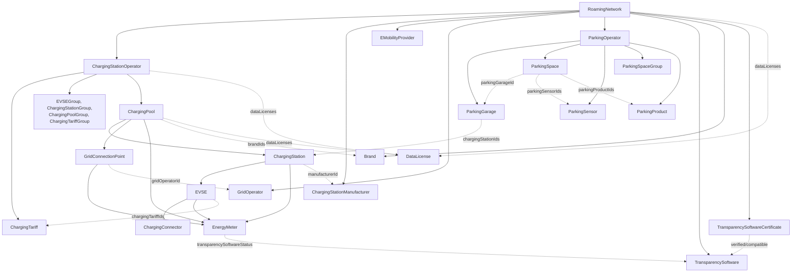

# WWCP POI

WWCP/POI is the *"git of EV infrastructure information sharing"*. It synchronizes points of interest data within
e-mobility as immutable, versioned data sets between servers and servers and (smartphone) clients.

- **Static data is immutable.** A roaming network with everything it embeds is one version,
  named by its ETags. A change set leads from one version to the next; nothing is changed in place.
- **Dynamic data is kept strictly apart.** Admin status, status and energy status are
  not content: they have no ETags, change without a new version and are shared by all versions
  of their entity.
- **WebSocket first.** Followers subscribe to commits and status updates over one WebSocket
  for fast, low-latency sync; HTTP serves the same reads.
- **JSON and CBOR.** Every representation exists in both, with the same keys and values;
  ETags exist for canonical JSON and canonical CBOR.

## Data


```mermaid
flowchart TD
    RoamingNetwork --> ChargingStationOperator
    RoamingNetwork --> ChargingStationManufacturer
    RoamingNetwork --> EMobilityProvider
    RoamingNetwork --> GridOperator
    RoamingNetwork --> ParkingOperator
    RoamingNetwork --> TransparencySoftware
    RoamingNetwork --> Brand
    RoamingNetwork --> TransparencySoftwareCertificate
    ParkingOperator --> ParkingGarage
    ParkingOperator --> ParkingSpace
    ParkingOperator --> ParkingSensor
    ParkingOperator --> ParkingSpaceGroup
    ParkingOperator --> ParkingProduct
    ChargingStationOperator --> ChargingTariff
    ChargingStationOperator --> Groups["EVSEGroup, ChargingStationGroup,<br/>ChargingPoolGroup, ChargingTariffGroup"]
    ChargingStationOperator --> ChargingPool
    ChargingPool --> ChargingStation
    ChargingPool --> GridConnectionPoint
    ChargingStation --> EVSE
    EVSE --> ChargingConnector
    ChargingPool --> EnergyMeter
    GridConnectionPoint --> EnergyMeter
    ChargingStation --> EnergyMeter
    EVSE --> EnergyMeter
    ChargingStation -. manufacturerId .-> ChargingStationManufacturer
    GridConnectionPoint -. gridOperatorId .-> GridOperator
    ParkingSpace -. parkingGarageId .-> ParkingGarage
    ParkingSpace -. parkingSensorIds .-> ParkingSensor
    ParkingGarage -. chargingStationIds .-> ChargingStation
    ParkingSpace -. parkingProductIds .-> ParkingProduct
    EVSE -. chargingTariffIds .-> ChargingTariff
    ChargingPool -. brandIds .-> Brand
    EnergyMeter -. transparencySoftwareStatus .-> TransparencySoftware
    TransparencySoftwareCertificate -. verified/compatible .-> TransparencySoftware
    RoamingNetwork -. dataLicenses .-> DataLicense
    ChargingStationOperator -. dataLicenses .-> DataLicense
    ChargingPool -. dataLicenses .-> DataLicense
```

Solid lines embed completely (`chargingStationOperators`, `chargingStationManufacturers`, `eMobilityProviders`,
`gridOperators`, `parkingOperators`, `brands`, `transparencySoftware`, `transparencySoftwareCertificates`, `chargingTariffs`,
`EVSEGroups`, `chargingStationGroups`, `chargingPoolGroups`, `chargingTariffGroups`, `chargingPools`, `chargingStations`,
`EVSEs`, `chargingConnectors`, `energyMeters`, `parkingGarages`, `parkingSpaces`, `parkingSensors`, `parkingSpaceGroups`,
`parkingProducts`), each 0..n
in the order of their ids; a pool has 0..1 `gridConnectionPoint`, a grid connection point and an EVSE each 0..1 `energyMeter`.
Dotted lines are references, which must exist in the network.
A pool, station, EVSE, tariff or group belongs to the operator its id names; ids are unique within the operator.
Energy meter, parking garage, space, sensor, space group and product ids are unique within the network;
parking product ids compare case-sensitively.

- **Content:** everything in the JSON and CBOR representations, completely, in a fixed order:
  children and licenses embedded, `created`, `lastChange` and `customData` included,
  timestamps to the millisecond. CBOR uses the keys and values of JSON.
- **EVSE:** `currentTypes`, `chargingModes` (arrays of names), `maxVoltage` (V), `maxCurrent` (A),
  `maxPower` (W), `physicalReference` and `chargingConnectors` (`{@id, type, lockable?}`).
- **Grid connection point:** a description without status: `gridOperatorId`, `voltageLevel`, `connectionType`,
  `nominalVoltage` (V), `nominalFrequency` (Hz), `contractedImport/ExportPower` (W),
  `contractedImport/ExportApparentPower` (VA), `connectionAgreementId`, `networkLocationId`,
  `marketLocationIds`, `meteringLocationIds`. Missing values are unknown; active power must not
  exceed apparent power.
- **Energy meter:** `role` (e.g. `grid`, `pv`, `battery`), `manufacturer`, `model`, their URLs,
  `serialNumber`, `hardwareVersion`, `firmwareVersion`; with admin status and status.
- **Parking:** a parking operator owns its garages, spaces and sensors directly. A space may name a
  `parkingGarageId` and `parkingSensorIds` of the same operator; garages, spaces and sensors may name
  `chargingStationIds` of the network. All have admin status and status. Parking products (`minDuration`,
  `stopParkingAfterTime` in s, without status and timestamps) are named by `parkingProductIds` of garages,
  spaces and space groups of the same operator; they offer, they do not calculate prices.
- **Charging tariff:** as in OCPI: `currency` (ISO 4217), `tariffURL` and `elements`, each with
  `priceComponents` (`{type, price, vat?, stepSize?}`, `type` one of `ENERGY`, `FLAT`, `MAX_CURRENT`,
  `MIN_CURRENT`, `PARKING_TIME`, `TIME`; `stepSize` in Wh, A or s) and optional `restrictions`
  (`startTime`/`endTime` as `HH:mm`, `startDate`/`endDate` as `yyyy-MM-dd`, `min/maxEnergy` (Wh),
  `min/maxCurrent` (A), `min/maxPower` (W), `min/maxDuration` (s), `daysOfWeek`). EVSEs name
  `chargingTariffIds` of their operator.
- **Brands:** embedded in the network, so that operators can share them, without status and timestamps:
  `name`, `description`, `logo`, `homepage`. Charging pools, stations and EVSEs name `brandIds`.
- **Opening times:** `openingTimes` of charging pools, charging stations and parking garages, as Styx's
  `OpeningTimes` write them: `24/7`, `regularOpenings` (`[{ "monday": [{ "begin": "07:00", "end": "21:00" }] }]`),
  `exceptionalOpenings`/`exceptionalClosings` (`["begin -> end"]`), `freeText`. Without regular openings it is 24/7.
- **Energy mix:** `energyMix` of charging pools and charging tariffs: `energySources` and `environmentalImpacts`
  (`[]` means unknown), `supplierName`, `productName`, `additionalRemarks`.
- **Images:** `images` of charging pools, stations, EVSEs and parking garages, in their given order:
  `url`, `category` (e.g. `LOCATION`, `CHARGER`), `type`, `width`, `height`, `thumbnail`; a URL only once.
- **Groups:** EVSE, charging station, charging pool and charging tariff groups name members of their
  operator (`EVSEIds`, `chargingStationIds`, `chargingPoolIds`, `chargingTariffIds`), the first three
  optionally a `chargingTariffId`; parking space groups name `parkingSpaceIds`. Groups may overlap and
  have admin status and status.
- **Transparency software:** releases (`TransparencySoftware`, one per version) and their certificates
  are embedded in the network, without status and timestamps. A certificate names the releases it
  verifies or finds compatible, and optionally a manufacturer. An energy meter's `transparencySoftwareStatus`
  assigns releases with their `legalStatus`, at most one entry per release; a given `certificateId` must cover it.
- **ETags:** SHA-256, SHA-384 or SHA-512 over canonical JSON or canonical CBOR.
  They identify a version; `CalcETags()` and `ValidateETags(…)`.
- **Runtime:** admin status and status are not content and have no ETags. Each entity keeps them
  typed in its status schedules (history and planned status), shared by all its versions:
  a change set takes them along, with the internal data. New entities are operational and
  available since their creation.
- **Energy status:** EVSEs and charging stations also have an energy status, `{used, available, storedEnergy?}`
  in W, W and Wh, kept the same way; there is none until one is reported. Its schedule keeps the last ten.

## Change sets

A change set is an ordered list of changes against one version, named by its before ETags,
leading to the version named by its after ETags.

```csharp
var gef = new ChargingStationOperator(ChargingStationOperator_Id.Parse("DE*GEF"),
                                      I18NString.Create(Languages.en, "GraphDefined"));

var rn1 = new RoamingNetwork(RoamingNetwork_Id.Parse("rn1"),
                             DataSource:                "v1",
                             ChargingStationOperators:  [ gef ]);

var newOperator = new ChargingStationOperator(ChargingStationOperator_Id.Parse("DE*NEW"));

var cs  = rn1.CreateChangeSet([
              RoamingNetworkChange.UpdateProperty(rn1, "dataSource", null, "v2"),             // the network
              RoamingNetworkChange.Add           (newOperator),                               // a new operator
              RoamingNetworkChange.UpdateProperty(gef, "telephone",  null, "+49 30 7654321")  // the operator DE*GEF
          ]);

var rn2 = rn1.ApplyChangeSet(cs);   // rn1 stays as it was
```

- **Changes:** `UpdateProperty`/`RemoveProperty` of every entity's own properties, not of its children;
  `Add`/`Remove` of operators, manufacturers, e-mobility providers, grid operators, parking operators, brands,
  transparency software releases and certificates, pools, tariffs, groups, stations (`Add(station, poolId)`),
  EVSEs (`Add(evse, stationId)`) and parking garages, spaces, sensors and space groups
  (`Add(space, parkingOperatorId)`). Grid connection points and energy meters
  are properties of what embeds them (`gridConnectionPoint`, `energyMeters`, `energyMeter`).
  Every reference must exist; a referenced entity can not be removed. The overload by the entity's
  type names it: a change is data, `{entityType, entityId, propertyName, oldValue, newValue}`, applied
  to the entity with that id in the version it is applied to.
- **Old values:** `CreateChangeSet` gives every change the value it finds; JSON `null` means
  "expected absent". A change finding another value conflicts.
- **Timestamps:** a change set sets `lastChange` to its `CreatedAt`, so its after ETags are deterministic.
- **Rebase:** `rn2.TryRebase(cs, …)` prepares a change set of an older version again, unless it conflicts.
- **Signatures:** `Sign(…)` and `VerifySignature(…)` over canonical JSON (COSE algorithms of Styx);
  a signed change set is applied only with a verifier.
- **Wire:** JSON and CBOR; `RoamingNetworkChangeSetLimits` bound bytes, depth, changes and signatures.

## History and sync

One leading server orders all changes; the other servers follow it.

```csharp
var leader = RoamingNetworkHistory.Start(rn1);
var result = leader.Publish(cs, Rebase: true);          // Published, AlreadyPublished, HeadMoved, Refused

RoamingNetworkHistory.TryFromSnapshot(leader.ToSnapshotJSON(), out var follower, out _);
leader.TryGetCommitsSince(follower!.Head.Commit.Id, out var commits, out _);
follower.TryAppend(commits!, out _, out _);
```

- **Commits:** a change set, its parent, its revision and the ETags of the result.
  The id is the SHA-256 of the commit's canonical JSON without signatures; it is checked when read.
- **Followers** start from a snapshot and append commits; each must follow the head and lead to its ETags.
- **Snapshot:** now and complete, for the first sync: `{timestamp, commit, roamingNetwork, runtimeStatus}`.
  `TryFromSnapshot` checks the commit id, recomputes the ETags of the network and takes the runtime status
  as the leader's; changes follow as commits since. `runtimeStatus=false` leaves the status out.
- **Announcements:** `OnCommitAnnouncement` tells of every commit a history takes, in order:
  timestamp, commit id, parent ids, revision, description.
- **Runtime status:** `history.RuntimeStatus` sets and reads the status of the head's entities by name,
  `TryUpdate(kind, entityType, entityId, value, timestamp, …)`: an older timestamp is `Outdated`,
  the same value `Unchanged`, a later one than now `Scheduled`. `OnStatusUpdate` tells of every change,
  also of one set at the entity, and of a planned status when it is due. A status update of the leader,
  `TryUpdate(statusUpdate, …)`, is taken with its timestamp.

`POI_API` serves a history in JSON, or in CBOR for `Accept: application/cbor` (also as request body):

| Request | Returns |
|---|---|
| `GET ~/roamingNetworks/{id}/history/head` | metadata of the head commit |
| `GET ~/roamingNetworks/{id}/history/snapshot?runtimeStatus=false` | head commit, complete network and its runtime status |
| `GET ~/roamingNetworks/{id}/history/commitInfos?since={commitId}&max={n}` | metadata of the commits since |
| `GET ~/roamingNetworks/{id}/history/commits?since={commitId}&max={n}` | complete commits since |
| `GET ~/roamingNetworks/{id}/history/commits/{commitId}` | one commit |
| `COMMIT ~/roamingNetworks/{id}/history/changeSets?expectedHead={commitId}&rebase=true` | 201 published, 200 already published, 409 head moved, 422 refused |

Submitting is refused unless `AuthorizeChangeSetSubmission` decides who may submit what;
signed change sets need `VerifyChangeSetSignature`.

### WebSocket

`GET ~/roamingNetworks/{id}/history/ws` upgrades to a WebSocket with OCPP-J frames,
JSON in text frames, CBOR in binary frames; every request is answered in its own format.

```
[2, "42", "commitInfos", { "since": "9f3c…", "max": 10 }]    request
[3, "42", { "commitInfos": [ … ] }]                          response
[4, "42", "NotFound", "The commit … is unknown here!", {}]   request error
```

- **Actions:** `head`, `snapshot`, `commitInfos`, `commits`, `commit {commitId}`,
  `commitChangeSet {changeSet, expectedHead?, rebase?}` → `{status, …}`, `runtimeStatus`.
- **Subscriptions:** `topics` lists them, `subscribe`/`unsubscribe {topics: […]}` change them:
  `commitAnnouncements`, `commits` (complete; above `MaxPushedCommitSize` only announced), `adminStatusUpdates`,
  `statusUpdates`, `energyStatusUpdates`. Pushes are sends, `[6, "p1", action, payload]`,
  in the format of the last `subscribe`. They end with the connection; a client that falls more than
  `MaxQueuedPushes` pushes or `MaxQueuedPushBytes` behind is disconnected and catches up after reconnecting.
- **Async:** requests are processed concurrently, up to `MaxConcurrentRequests` per connection;
  answers come when ready and are matched by their id. A connection's requests are cancelled when it closes.
- **setStatus** `{kind, entityType, entityId, value, timestamp?, dataSource?}` → `{result, description?, current?}`,
  allowed as `AuthorizeStatusUpdate` decides (refused without it); set it at the leader, followers take it from there.
  `kind` is `adminStatus`, `status` or `energyStatus`, whose `value` is an object `{used, available, storedEnergy?}`.
  Status updates come often, e.g. within a minute as the AFIR asks: send them as one batch.
- **Batches:** messages of the same action aggregate. A request `{batch: [p1, p2, …]}` runs per payload,
  in order, and is answered with `{batch: [r1, {error: {code, description, details}}, …]}`, up to `MaxBatchSize`.
  Pushes of the same action that wait together go out as one `{batch: […]}`, up to the `maxBatchSize`
  of `subscribe` (1 turns it off); `PushCoalescingDelay` lets more gather.
- **Errors:** the codes of OCPP-J plus `NotFound`; an unreadable frame is answered on id `"-1"`.
- **Access:** open like the HTTP reads, unless `AuthenticateWebSocketClient` is set;
  `commitChangeSet` asks `AuthorizeChangeSetSubmission` with the upgrade request.

### Follower

`RoamingNetworkFollower` keeps a history in sync with the leader over its WebSocket:

```csharp
await using var follower = new RoamingNetworkFollower(new Uri("wss://leader/roamingNetworks/rn1/history/ws"));
await follower.StartAsync();                     // returns once caught up for the first time

var current = follower.History!.Head.RoamingNetwork;         // the current version

await follower.CommitChangeSetAsync(current.CreateChangeSet([  // to the leader; it comes back as a commit
          RoamingNetworkChange.UpdateProperty(current, "dataSource", null, "v3")
      ]));
```

- **Sync:** subscribe first, then a snapshot (when it has no history yet), the commits since its head,
  and the runtime status. Pushed commits are appended; an announced, missed or too large one makes it catch up.
- **Reconnect:** a broken connection is opened again with growing delays, and it catches up.
  A head the leader does not know starts it again from a snapshot (`OnHistoryReplaced`).
- **Options:** complete commits or announcements, status or not, credentials via `ConfigureWebSocket`,
  signature verifier, limits.

## Submodules

| Directory | What it is |
|---|---|
| `WWCP_POI2` | Shared lower layer: identifications, status values, predefined strings, energy information, transparency software |
| `WWCP_POI3` | Roaming networks with their operators, pools, stations, EVSEs, tariffs, groups, manufacturers, e-mobility providers, grid operators, energy meters, transparency software and parking; change sets, history, sync |
| `old` | The earlier implementation, for reference only; not developed further |


## Open

- Persistence and retention of histories
- Finer subscription filters
- A WebSocket endpoint in Hermod without a TCP server behind it
- Commits signed by the leader
- Further entities: as the use cases need them

## Tests

```bash
dotnet test WWCP_POI3_Tests/WWCP_POI3_Tests.csproj
```

## Funding

This Open Source project is partially funded by the [NGI Zero Commons Fund](https://nlnet.nl/commonsfund/) as part of our [EVQI project](https://nlnet.nl/project/EVQI/).

We also appreciate any additional funding and long-term support for the Chargy family, for example via [GitHub Sponsors](https://github.com/sponsors/GraphDefined), as it helps us keep the project sustainable, independent and useful for the entire e-mobility community.

<center>
  
</center>
