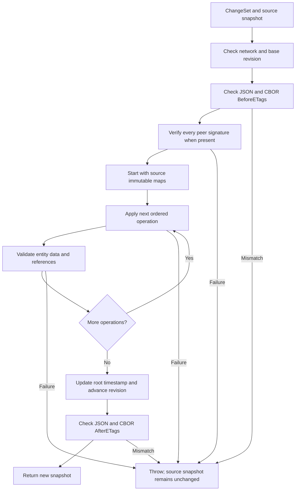

# Architecture and implementation

[Repository overview](../README.md) · [ChangeSets](CHANGESETS.md) · [JSON](JSON.md) · [Signatures](SIGNATURES.md)

## 1. Purpose and scope

WWCP POI provides an in-process data model for charging infrastructure, domain JSON parsers
and versioned updates. Applications can load a network, retain a stable view of it and derive
new versions from discrete batches of changes.

The library provides the data structures and update semantics. The application supplies
persistence, a transport protocol, selection of the current version, access control and trusted
verification keys. The library supplies canonical signing and cryptographic verification helpers.
There is currently no database, distributed consensus mechanism or synchronization
service implemented by this repository.

## 2. Entity nodes and nested values

The immutable graph has eight node types:

| Node type | Parent | Child JSON field |
| --- | --- | --- |
| `RoamingNetwork` | None | Root |
| `ChargingStationOperator` | `RoamingNetwork` | `chargingStationOperators` |
| `EMobilityProvider` | `RoamingNetwork` | `eMobilityProviders` |
| `ChargingPool` | `ChargingStationOperator` | `chargingPools` |
| `ChargingStation` | `ChargingPool` | `chargingStations` |
| `EVSE` | `ChargingStation` | `EVSEs` |
| `ChargingConnector` | `EVSE` | `socketOutlets` |
| `ChargingTariff` | `ChargingStationOperator` | `chargingTariffs` |

Each `InfrastructureEntitySnapshot` contains:

- `Key`: the entity's type, domain ID and optional connector scope.
- `Parent`: an optional parent key.
- `Properties`: an `ImmutableDictionary<String, JsonElement>` of its own JSON properties.
- `Children`: an `ImmutableHashSet<InfrastructureEntityKey>` of immediate child keys.

Child arrays are separated from the properties during import. A station node therefore does not
contain copies of every EVSE document; it contains their keys. JSON export reconstructs the nesting.

Supported metrological properties are normalized at import and property update to invariant
unit-bearing strings. Numbers, unitless strings and alternative field names are rejected;
equivalent unit representations also normalize before ChangeSet precondition comparisons.

A `RoamingNetworkDataSnapshot` contains the root key, the entity map, a revision, the latest
applied ChangeSet ID and the reverse tariff-reference index.

Brands, licenses, addresses, coordinates, energy mixes, price components, tariff restrictions,
cables, energy meters, grid connection points and transparency software/status are nested property values. They are not
independent ChangeSet node types. Updating one replaces the corresponding property of its owner.

### Identity

`InfrastructureEntityKey` uses domain-aware identity comparison. Equivalent case and separator
forms are normalized for comparison where the corresponding domain ID supports that equivalence.
The stored JSON keeps the parsed ID's wire spelling.

Connector IDs are local. Connector `1` under EVSE `DE*ABC*E1` and connector `1` under
`DE*ABC*E2` have different keys. Connector operations and lookups must supply the EVSE scope.

## 3. Two representations

| Representation | Role | Mutability |
| --- | --- | --- |
| The eight sealed domain entity classes | Domain API, constructors, JSON import and runtime status handling | Immutable static data; mutable runtime state |
| `RoamingNetworkDataSnapshot` | Authoritative versioned data after capture | Immutable |

On a network without a captured snapshot, the first access to `DataSnapshot` serializes its
current nested POI data and imports that representation into immutable storage. Accessing
`Revision` or applying a ChangeSet also triggers this capture. A newly captured network starts
at revision zero. Parsing a versioned snapshot with a `revision` restores its immutable version
during parsing.

Static properties and parent links cannot be reassigned after construction. Collection inputs are
materialized and detached; public static collections use immutable arrays or detached enumerations.
Names, descriptions and arrival instructions use the local `ImmutableI18NString`; opening hours
use `ImmutableOpeningTimes`. Mutable nested dependency values, such as addresses, licenses and
cryptographic public keys, are copied on input and access so that their mutation cannot alter
entity POI data. Energy meters have immutable static data and mutable runtime schedules; owners
retain their meter instance so callers can update those schedules directly.

The local `AImmutableInternalData` and `AImmutableEMobilityEntity` replace mutable dependency bases
for these classes. Dependency `IEntity.Name`/`Description` access yields detached text copies.
`IInternalData` static setters and mutation commands throw `InvalidOperationException`.
`InternalData` is mutable application runtime context, outside the POI immutability contract.

Constructors and parsers create the initial hierarchy. Static updates use ChangeSets. The old
public setters and in-place Add/Remove/GetOrCreate/UpdateWith APIs are removed. Supplying children
to a constructor creates independent children with parent links to the new object; input objects
are not reattached.

After `RoamingNetwork.ApplyChangeSet()`, the returned network initially contains the root
projection and its authoritative new snapshot. Accessing its hierarchy collections materializes
a complete fresh hierarchy lazily. Child parent links refer to that returned network.
Status schedules and runtime measurements are captured at derivation time and restored into the
new hierarchy. Subsequent runtime updates in either version do not alter the other version's
schedules. Explicit status ChangeSet operations and added/replaced subtrees retain their batch values.

`Status`, `AdminStatus`, status histories, `LastStatusUpdate`, real-time electrical measurements,
forecasts and status aggregation delegates remain mutable within the entities. Direct runtime
updates do not alter `Created`, `LastChangeDate`, the POI revision or captured immutable storage.

`ToJSON()` serializes domain objects with expansion/filter controls. `ToJSONSnapshot()` exports
the authoritative static version with current runtime statuses. A runtime `Removed` status does
not remove a POI node from that export. `DataSnapshot.ToJSON()` and `WriteTo()` export the frozen
baseline, including status values captured or explicitly changed by a ChangeSet.

### Support types and immutable groups

The immutable API also covers `ChargingCable`, `EnergyMeter`, `GridOperator`, `ParkingOperator`,
`TransparencySoftware` and `TransparencySoftwareStatus`. The latter describes a persisted legal
certificate value; its name does not make it a mutable operational schedule. Parking garages,
spaces and sensors also have immutable static fields and collections. Grid/parking operator
contact values and data licenses are supplied through their constructors.

`ChargingStation.EnergyMeters` holds zero or more directly owned meters in an immutable array,
replacing the former single `UpstreamEnergyMeter` property. Constructor inputs are detached,
and cloning a station into a new pool also clones its meters and their runtime histories.
Each meter has an optional immutable `Role` string (for example `grid`, `pv`, `battery`),
normalized to lowercase. Membership and role edits use the station's `energyMeters` ChangeSet
property. Current meter operational/admin statuses are exported by `ToJSONSnapshot()` and are
captured independently when deriving a network version, unless that array is explicitly replaced.
An EVSE's optional meter remains separate from the station's direct meters.

`ChargingPool.EnergyMeters` now uses the same detached immutable array and JSON/ChangeSet
contract as station meters. A pool also owns zero or one `GridConnectionPoint`, an immutable
description with a mandatory `GridOperator` reference and zero or one meter. Its operator and
meter are cloned with independent runtime histories when copying a pool; the operator's network
reference points to the owning network version. A different network ID is rejected.
Snapshots include the referenced operator's complete supported data, allowing reconstruction
without an external lookup. The connection point remains a nested owner property in the eight-node
graph. It carries optional electrical ratings and location/contract identifiers, documented in
[Grid connections](GRIDCONNECTIONS.md). Explicit replacement of `gridConnectionPoint` or
`energyMeters` keeps supplied statuses; unrelated ChangeSets preserve current runtime histories.

`ChargingStationManufacturer` is a local fork of the WWCP-Core type. Its texts use
`ImmutableI18NString`; its keys are detached `ImmutableCryptoKeyInfo` documents rather than a
mutable crypto wallet. `WithCryptoKey()` returns a new manufacturer.
Key documents and manufacturer JSON omit private keys by default. A key's
`ToJSON(IncludePrivateKey: true)` explicitly exports the complete captured key document.

`EVSEGroup`, `ChargingStationGroup`, `ChargingPoolGroup` and `ChargingTariffGroup` use immutable
member dictionaries and immutable allowed-ID sets. Constructors freeze their inputs and evaluate
selection predicates once. Membership enumeration does not reevaluate predicates against changing
runtime statuses. `WithMembers()`, `WithMember()` and `WithoutMember()` create new groups with
independent group status schedules; the member entities retain their own runtime state. These
methods preserve group identity and creation time, and record a new change timestamp.
`ChargingPoolGroup` now holds pools and pool IDs; its station and EVSE views are derived from them.
Groups reject members and tariff configurations belonging to a different operator.

These conversions do not extend `InfrastructureEntityType`. The versioned graph retains its
eight node types. Meters, cables and transparency information remain owner properties; manufacturer,
grid/parking operator and group instances are standalone APIs, without new graph Add/Remove
operations. Constructor/With APIs support their immutable construction and replacement.

The local `RuntimeStatusSchedule` fork retains the existing mutable schedule behavior and lets
derivation restore the original history capacities without replacing schedules or losing their
event subscriptions. Captured versions own independent schedules, including pool/station/EVSE
meters and the operators/meters referenced by grid connection points.

## 4. Copy-on-write and structural sharing

The entity map, property maps, child sets and tariff-reference maps use persistent
`ImmutableDictionary` / `ImmutableHashSet` collections. Deriving a new collection reuses
unchanged internal branches. Existing snapshots continue to reference their original collections.

For a property update:

1. Replace the selected `JsonElement` in the entity's property map.
2. Create a new snapshot object for that entity.
3. Validate its new document against its ancestor context.
4. Update its and its ancestors' `lastChange` values.
5. Reuse unrelated entity objects, property values and unaffected collection branches.

For example, a `maxPower` update on an EVSE replaces five entity entries:
the EVSE, its station, pool, operator and root network. Its connectors, sibling EVSEs and
other branches remain shared. A tariff price change replaces the tariff and its ancestors;
the station hierarchy remains shared.

ChangeSet constructors clone incoming JSON payloads so they do not depend on the lifetime of an
external `JsonDocument`. Imported property values likewise own their JSON storage. Mutating a
`JObject` returned by an export cannot mutate a stored `JsonElement`.

Replacing a large nested property, such as an energy meter or a tariff's entire `elements` array,
processes that complete property value. Sharing occurs at entity/property boundaries, not as a
general-purpose persistent editor inside arbitrary JSON arrays.

## 5. Applying a ChangeSet

The implementation works on local references to immutable maps. Every operation sees the
results of preceding operations in the same batch. If any operation fails, no new snapshot is
returned and the source maps remain unchanged. Intermediate versions become unreachable.

Every batch requires `BeforeETags` and `AfterETags`, each containing JSON then CBOR SHA-256
identifiers of the complete canonical static POI content. These properties and POI `ETags` are
`ImmutableArray<ETag>` values. The readonly `ETag` struct has typed format/algorithm and immutable
digest bytes; equality compares content. JSON writes `[format, algorithm, encoding, encodedDigest]`,
while CBOR writes `[format, algorithm, digestBytes]` with a native 32-byte byte string.
JSON supports explicit `hex` (default) and standard padded `base64`, decoded to the same bytes.
Transport encoding is not stored in the ETag value and does not affect state identity.
`ToString()` supplies the readable colon-separated form. Default values are rejected.
The source must match before any
operations; the candidate must match after managed timestamp updates and before it is returned.
Content failures are batch-level errors. Runtime status values and revision bookkeeping are
outside the digest, while static timestamps and owned POI values participate.

`CreateChangeSet` on a snapshot or network prepares an unsigned batch using the same operation
engine on unpublished immutable maps. It computes both expected states and returns only the
bound batch. Add immutable multilingual `Description` and JSON `Metadata`, then `Sign`/`TrySign`
append equal peer signatures using Styx. The canonical JSON v1 signature input covers all batch
fields and each peer's algorithm/key ID/profile/encoding; the `Signatures` array is excluded.
Changing descriptions/metadata clears all signatures on the new copy without changing POI ETags.
Every peer must pass a trusted-key verification callback before operations. Expected ETags in
a received batch are preserved; the receiver recomputes actual identifiers and compares both.

`Add` imports a whole supplied subtree, reserves each ID before importing descendants,
attaches the new root to its parent, validates imported nodes and registers tariff assignments.

`Remove` checks the optional expected document, removes assignments belonging to the subtree,
checks that removed tariffs have no remaining consumers, removes the subtree and updates its parent.

`UpdateProperty` checks the field allowlist and optional expected value, replaces the field,
validates the changed node and updates the reverse index if `tariffIds` changed.

A successful batch advances the revision exactly once, even if it contains no operations.
The source version is never promoted automatically to a global current version.

Atomicity here covers snapshot storage. External effects performed by a verifier or other
application code are outside that transaction.

## 6. Validation layers

| Layer | Implemented checks |
| --- | --- |
| ChangeSet/operation construction and deserialization | Required identifiers; nonnegative base revision; required well-formed before/after JSON and CBOR ETag arrays; initialized changes/signatures without null entries; immutable descriptions and cloned JSON metadata; required Description/Metadata/Signatures wire fields; unknown top-level batch/envelope fields rejected; valid operation kind; required/forbidden payloads; parent type/ID pair; defined JSON values |
| Batch entry | Target network identity; exact base revision; revision overflow; both source ETags; verification of every peer signature when present |
| Signing / built-in signature verification | Fixed Styx canonical JSON v1 profile; all operations/descriptions/metadata and peer algorithm/key ID/profile/encoding bound; no duplicate JSON member names; supported asymmetric algorithms/keys; canonical Base64; trusted expected key ID |
| Hierarchy import | Domain ID syntax and duplicates; payload ID; parent reference; supported fields; nested child ownership |
| Property update | Editable field allowlist; existence of the target; supplied parent; optional old value |
| Domain parsing | Scalar types, nested JSON shape, electrical/location/tariff data and other rules implemented by the individual parsers |
| Referential integrity | Tariff exists, belongs to the same operator, has no duplicate assignments and is not deleted while still referenced |
| Candidate publication | Both result ETags after all operations and timestamp updates |

`InfrastructureChangeSchema` is the authoritative allowlist and relationship definition.
IDs, child arrays, ancestry and managed revision/timestamp fields are not editable properties.
A parser's support for a field does not automatically make it ChangeSet-editable.

Domain validation reconstructs the affected node and only its ancestor chain through the regular
POI parsers. It does not materialize the whole network to validate a scalar change. Subtree additions
validate each imported node. Tariff-reference validation additionally consults the immutable graph.

Errors from collection parsers retain paths such as `chargingStations[0].EVSEs[1]`.
Operation failures are wrapped in `RoamingNetworkChangeSetException`, with the batch ID and a
zero-based operation index. Batch-level failures have no operation index.

Validation has a defined scope. A well-formed certificate string is not proof of certificate
authenticity; an extensible legal-status label is not a legal approval; a parsed ID is not evidence
that the sender owns that entity. See [signatures and trust](SIGNATURES.md).

## 7. Timestamps and status

Existing creation timestamps remain unchanged by updates. Modified entities and their ancestors
receive the batch's `CreatedAt` as `lastChange`; the root is touched even for an empty batch.
Connectors have no independent managed entity timestamps.

New entities receive default metadata where omitted. Supplied metadata is parsed and validated.
Nested POI additions/replacements also receive deterministic creation/change defaults from the
batch timestamp, preserving supplied values and using an existing counterpart if one is missing.
Canonical result generation therefore does not introduce local-clock metadata on a replica.
The applier does not require `CreatedAt` to be newer than the preceding version's timestamp;
it is a caller-supplied timestamp, not a monotonic clock enforced by the library.

Status changes carry their own `value` and `timestamp`. Those timestamps are normalized to UTC.
A future status timestamp can be a scheduled value in the runtime model rather than the
currently effective status.

Nested values such as an energy meter are not independently touched by an EVSE property update.
Supply their desired metadata in the replacement value. The owning EVSE and its ancestors are
updated automatically.

Snapshot import restores persisted timestamps directly, avoiding ordinary mutation notifications
overwriting them with the current deserialization time. This uses the local
`AImmutableInternalData.RestoreTimestamps` method through the immutable entity base.

## 8. Tariff-reference index

`TariffReferences` maps tariff keys to the EVSE/connector keys using them. Capture builds it once;
later changes update only affected assignments and subtrees.

An added tariff must precede assignments to it in the batch. A removed tariff must follow the
removal or replacement of all assignments to it. Removing an operator removes its tariffs and
infrastructure consumers together.

The reverse index avoids scanning the complete station hierarchy for every tariff removal.
It does not represent provider-specific commercial tariff agreements.

## 9. Cost and concurrency

| Work | Scope |
| --- | --- |
| Initial capture | Whole serialized hierarchy and reference-index construction |
| Scalar property update | Changed property, affected entity/ancestor entries, domain validation and persistent-map operations |
| Before/after ETag calculation | Complete canonical POI projection and both encodings; lazily cached per immutable snapshot |
| `CreateChangeSet()` | Local validated map update plus calculation of source/result identifiers |
| `Sign()` / signature verification | Canonical complete operation/metadata payload plus cryptographic work per peer; does not hash the entire infrastructure again |
| `TryMerge()` | Two checked input applications, two combined candidate executions and a comparison of all stored entities/properties; explicit preparation also hashes the combined result |
| Nested property replacement | Whole replacement property plus the affected entity/ancestors |
| Subtree addition | All imported nodes, their validation and assignments |
| Subtree removal | Removed descendants, their assignments and affected ancestors |
| `GetEntity()` | Immutable-map lookup |
| `GetEntityJSON()` | Selected entity and its descendants |
| `WriteTo()` / complete export | Whole snapshot |
| `RoamingNetwork.ApplyChangeSet()` runtime capture | Source hierarchy and its status histories/forecasts, in addition to immutable storage updates |
| First hierarchy access on a derived network | Complete domain hierarchy and restoration of captured runtime state |

`WriteTo(Utf8JsonWriter, IncludeETags: false)` avoids building a complete intermediate `JObject` hierarchy. Exporting
with `ToJSONSnapshot()` allocates a complete JSON document. Projection materialization also has
a whole-hierarchy cost. `RoamingNetwork.ApplyChangeSet()` also visits the source hierarchy to
isolate runtime state. `RoamingNetworkDataSnapshot.ApplyChangeSet()` operates directly on immutable
storage without that runtime capture; its mandatory content checks still traverse complete POI
data on first ETag calculation. Hashing reconstructs the full canonical domain projection, even
though operation validation itself reconstructs only affected nodes. Prefer immutable lookups
for large-data processing.

Retaining previous snapshots retains shared data and any older values that are still reachable.
Applications decide how many versions to retain. There are no measured throughput, memory-budget
or million-entity capacity guarantees supplied by these tests.

Immutable snapshots can be read and used to derive independent versions concurrently. Capture and
domain hierarchy materialization use a per-network lock. Concurrent runtime updates across
entities are not made transactional by that lock; applications needing a coherent runtime view
must coordinate those updates with export/derivation.

Two ChangeSets based on the same revision can independently produce two successors with the same
numeric revision. The application must coordinate publication of its current head and resolve
divergence. Mandatory `BeforeETags` distinguish different static contents at the same revision.
`TryMerge` on their common source checks both batches and requires both combined execution orders
to produce the same complete stored content, including frozen runtime fields. Default calls return
a notice only; explicit preparation creates a new unsigned ChangeSet with combined result ETags.
Application creates one successor of that source. No head is published automatically and input
signatures are not inherited. Properties remain atomic replacements; conflicts and unchanged
old-value preconditions are reported for caller resolution. See [merging](CHANGESETS.md#merging-concurrent-batches).
Content-equivalent versions share identifiers even if their histories differ; commit ancestry,
history persistence and global head publication remain application responsibilities.

## 10. Source organization and extending the model

| Location | Responsibility |
| --- | --- |
| [Entities](../WWCP_POI/Entities) | Domain classes and their per-type JSON parsers |
| [Serialization](../WWCP_POI/Serialization) | Shared value parsing, metadata and reference resolvers |
| [ChangeSet records](../WWCP_POI/ChangeSets/RoamingNetworkChangeSet.cs) | Immutable batches, operations and signature envelope |
| [Signing](../WWCP_POI/ChangeSets/RoamingNetworkChangeSet.Signing.cs) | Canonical signing input, Styx asymmetric signing and equal peer verification |
| [Snapshot storage](../WWCP_POI/ChangeSets/RoamingNetworkDataSnapshot.cs) | Immutable maps, lookup and initial capture |
| [Changes](../WWCP_POI/ChangeSets/RoamingNetworkDataSnapshot.Changes.cs) | Batch checks and operation application |
| [Merge](../WWCP_POI/ChangeSets/RoamingNetworkDataSnapshot.Merge.cs) | Common-source validation, two-order comparison and explicit unsigned merge preparation |
| [Merge report](../WWCP_POI/ChangeSets/RoamingNetworkChangeSetMergeResult.cs) | Immutable merge status, notices and structured issues |
| [Import](../WWCP_POI/ChangeSets/RoamingNetworkDataSnapshot.Import.cs) | Hierarchy import and timestamp normalization |
| [Validation](../WWCP_POI/ChangeSets/RoamingNetworkDataSnapshot.Validation.cs) | Small domain projections for validation |
| [Tariff references](../WWCP_POI/ChangeSets/RoamingNetworkDataSnapshot.TariffReferences.cs) | Reverse assignment index |
| [JSON export](../WWCP_POI/ChangeSets/RoamingNetworkDataSnapshot.Json.cs) | Property JSON and direct nested writing |
| [RoamingNetwork integration](../WWCP_POI/ChangeSets/RoamingNetwork.CopyOnWrite.cs) | Public API and lazy domain projection |
| [Schema](../WWCP_POI/ChangeSets/InfrastructureChangeSchema.cs) | Relationships, identity and editable properties |

When adding a property, update its domain parser/serializer, snapshot metadata handling when
needed, and the ChangeSet allowlist. When adding a node type, also define identity, ownership,
import/export nesting and the validation projection. Referenced nodes may require a reverse index.

Add coverage for the JSON contract, malformed input, ownership, old-value checks, rollback and
sharing of unrelated data. The [test documentation](../WWCP_POI_Tests/README.md) describes existing
coverage, including a 1,000-EVSE sharing test. That test verifies which entries are replaced;
it is not a performance benchmark.

## Canonical content representations

The immutability audit and `IImmutablePOI` contract also cover the remaining support values
and parking-space groups. Derived ETags are generated from the complete static domain projection;
runtime Removed statuses never filter its owned membership. ETags are not editable snapshot
properties. JSON and CBOR share their domain validation and metrological schema.
See [ETags and CBOR](ETAGS-CBOR.md) for the audited types and encoding profile.
