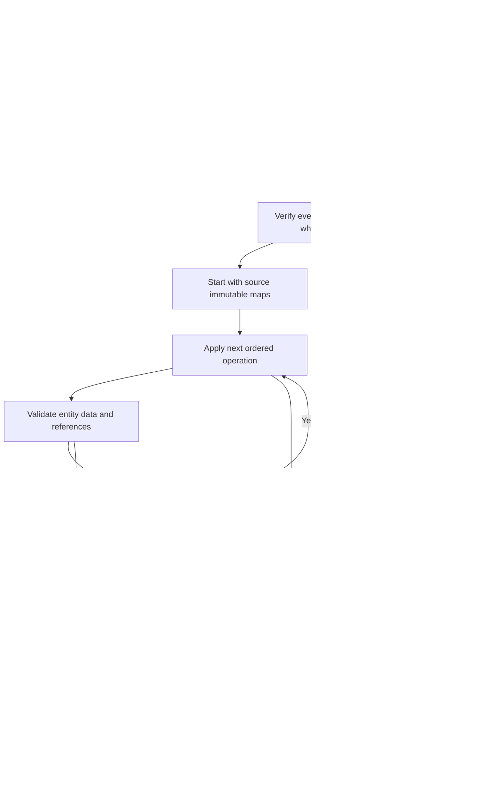

# Architecture and implementation

[Repository overview](../README.md) · [ChangeSets](CHANGESETS.md) · [JSON](JSON.md) · [Signatures](SIGNATURES.md)

## 1. Purpose and scope

WWCP POI provides an in-process data model for charging infrastructure, domain JSON parsers
and versioned updates. Applications can load a network, retain a stable view of it and derive
new versions from discrete batches of changes.

The library provides the data structures and update semantics. The application supplies
persistence, a transport protocol, selection of the current version, access control and trusted
verification keys. The library supplies canonical signing and cryptographic verification helpers.
There is currently no database, distributed consensus mechanism or synchronization
service implemented by this repository.

## 2. Entity nodes and nested values

The immutable graph has 22 node types; see [ownership and references](GRAPH.md):

| Node type | Parent | Child JSON field |
| --- | --- | --- |
| `RoamingNetwork` | None | Root |
| `ChargingStationOperator` | `RoamingNetwork` | `chargingStationOperators` |
| `EMobilityProvider` | `RoamingNetwork` | `eMobilityProviders` |
| `ChargingPool` | `ChargingStationOperator` | `chargingPools` |
| `ChargingStation` | `ChargingPool` | `chargingStations` |
| `EVSE` | `ChargingStation` | `EVSEs` |
| `ChargingConnector` | `EVSE` | `socketOutlets` |
| `ChargingTariff` | `ChargingStationOperator` | `chargingTariffs` |
| `EVSEGroup` | `ChargingStationOperator` | `EVSEGroups` |
| `ChargingStationGroup` | `ChargingStationOperator` | `chargingStationGroups` |
| `ChargingPoolGroup` | `ChargingStationOperator` | `chargingPoolGroups` |
| `ChargingTariffGroup` | `ChargingStationOperator` | `chargingTariffGroups` |
| `ChargingStationManufacturer` | `RoamingNetwork` | `chargingStationManufacturers` |
| `GridOperator` | `RoamingNetwork` | `gridOperators` |
| `ParkingOperator` | `RoamingNetwork` | `parkingOperators` |
| `TransparencySoftware` | `RoamingNetwork` | `transparencySoftware` |
| `TransparencySoftwareCertificate` | `RoamingNetwork` | `transparencySoftwareCertificates` |
| `ParkingProduct` | `ParkingOperator` | `parkingProducts` |
| `ParkingGarage`, `ParkingSpace`, `ParkingSensor`, `ParkingSpaceGroup` | `ParkingOperator` | `parkingGarages`, `parkingSpaces`, `parkingSensors`, `parkingSpaceGroups` |

Each `InfrastructureEntitySnapshot` contains:

- `Key`: the entity's type, domain ID and optional connector scope.
- `Parent`: an optional parent key.
- `Properties`: an `ImmutableDictionary<String, JsonElement>` of its own JSON properties.
- `Children`: an `ImmutableHashSet<InfrastructureEntityKey>` of immediate child keys.

Child arrays are separated from the properties during import. A station node therefore does not
contain copies of every EVSE document; it contains their keys. JSON export reconstructs the nesting.

Canonical JSON/CBOR content and complete versioned exports use these stored properties directly.
Valid optional absence/null distinctions survive reload and precondition checks. Managed timestamps
are initialized once during import; owned relations export as sorted arrays including `[]`.
Lazy domain materialization retains static serialization documents and overlays runtime data only
when requested. This additional domain-side storage is independent of persistent-map sharing.

Supported metrological properties are normalized at import and property update to invariant
unit-bearing strings. Numbers, unitless strings and alternative field names are rejected;
equivalent unit representations also normalize before ChangeSet precondition comparisons.

A `RoamingNetworkDataSnapshot` contains the root key, the entity map, a revision, the latest
applied ChangeSet ID and the persistent reverse entity-reference index. TariffReferences exposes its tariff subset.

Brands, licenses, addresses, coordinates, energy mixes, price components, tariff restrictions,
cables, energy meters, grid connection points and meter transparency assignments are nested
property values. Software releases and certificate documents have independent network-owned
graph identities; tariff substructures remain values without IDs. Supported nested relations use addressed element operations or explicit whole-property replacement.

### Identity

`InfrastructureEntityKey` uses domain-aware identity comparison. Equivalent case and separator
forms are normalized for comparison where the corresponding domain ID supports that equivalence.
The stored JSON keeps the parsed ID's wire spelling.

Operator, EVSE, station, pool, tariff, group and grid operator IDs follow ISO 15118-2 Annex H and
the IDACS ID format: the `*` separators are optional on input (`DEABCE1` equals `DE*ABC*E1`), and
the domain IDs always write them. The obsolete DIN SPEC 91286 forms (`+49*822`, `822`) are rejected.

Connector IDs are local. Connector `1` under EVSE `DE*ABC*E1` and connector `1` under
`DE*ABC*E2` have different keys. Connector operations and lookups must supply the EVSE scope.

## 3. Two representations

| Representation | Role | Mutability |
| --- | --- | --- |
| The sealed domain entity classes | Domain API, constructors, JSON import and runtime status handling | Immutable static data; mutable runtime state |
| `RoamingNetworkDataSnapshot` | Authoritative versioned data after capture | Immutable |

On a network without a captured snapshot, the first access to `DataSnapshot` serializes its
current nested POI data and imports that representation into immutable storage. Accessing
`Revision` or applying a ChangeSet also triggers this capture. A newly captured network starts
at revision zero. Every network import captures immutable storage during parsing, using supplied
revision metadata or revision zero. Only initial managed timestamps and owned collection defaults
are filled from the parsed projection; optional static property presence remains the supplied content.

Static properties and parent links cannot be reassigned after construction. Collection inputs are
materialized and detached; public static collections use immutable arrays or detached enumerations.
Names, descriptions and arrival instructions use Styx's `ImmutableI18NString`; opening hours
use its `ImmutableOpeningTimes`. Both are values inside an entity, covered by its ETags, and
carry no ETags of their own. Mutable nested dependency values, such as addresses, licenses and
cryptographic public keys, are copied on input and access so that their mutation cannot alter
entity POI data. Energy meters have immutable static data and mutable runtime schedules; owners
retain their meter instance so callers can update those schedules directly.

The local `AImmutableInternalData` and `AImmutableEMobilityEntity` replace mutable dependency bases
for these classes. Dependency `IEntity.Name`/`Description` access yields detached text copies.
`IInternalData` static setters and mutation commands throw `InvalidOperationException`.
`InternalData` is mutable application runtime context, outside the POI immutability contract.

Constructors and parsers create the initial hierarchy. Static updates use ChangeSets. The old
public setters and in-place Add/Remove/GetOrCreate/UpdateWith APIs are removed. Supplying children
to a constructor creates independent children with parent links to the new object; input objects
are not reattached.

After `RoamingNetwork.ApplyChangeSet()`, the returned network initially contains the root
projection and its authoritative new snapshot. Accessing its hierarchy collections materializes
a complete fresh hierarchy lazily. Child parent links refer to that returned network.
Status schedules and runtime measurements are captured at derivation time and restored into the
new hierarchy. Subsequent runtime updates in either version do not alter the other version's
schedules. Static property replacements preserve nested histories by owner and child identity.
New identities and removed/readded owner subtrees start with domain runtime defaults. Static
ChangeSets reject runtime fields; status instructions use the separate [runtime API](RUNTIME.md).

`Status`, `AdminStatus`, status histories, `LastStatusUpdate`, real-time electrical measurements,
forecasts and status aggregation delegates remain mutable within the entities. Direct runtime
updates do not alter `Created`, `LastChangeDate`, the POI revision or captured immutable storage.

Pool/station electrical limits are constructor-supplied, readonly Styx quantities: `Ampere`
for `MaxCurrent`, `Watt` for `MaxPower` and `WattHour` for `MaxCapacity`. Their nullable values
roundtrip through JSON/CBOR, participate in static ETags and are editable through ChangeSets.
Constructors reject negative limits. Operational values and forecasts use timestamped quantities
of the same dimensions, remain mutable and are copied independently when deriving a version.

`ToJSON()` serializes domain objects with expansion/filter controls. `ToJSONSnapshot()` exports
the authoritative static version with current runtime statuses. A runtime `Removed` status does
not remove a POI node from that export. `DataSnapshot.ToJSON()` and `WriteTo()` export only the
static version and revision metadata. Operational statuses and measurements never enter that storage.

### Support types and immutable groups

The immutable API also covers `ChargingCable`, `EnergyMeter`, `GridOperator`, `ParkingOperator`,
`TransparencySoftware`, `TransparencySoftwareCertificate` and `TransparencySoftwareStatus`.
The latter is an immutable legal-status assignment linking the catalog release to an optional
model/version-specific certificate document; it has no mutable operational schedule. Parking garages,
spaces and sensors also have immutable static fields and collections. Grid/parking operator
contact values and data licenses are supplied through their constructors.

`ChargingStation.EnergyMeters` holds zero or more directly owned meters in an immutable array,
replacing the former single `UpstreamEnergyMeter` property. Constructor inputs are detached,
and cloning a station into a new pool also clones its meters and their runtime histories.
Each meter has an optional immutable `Role` string (for example `grid`, `pv`, `battery`),
normalized to lowercase. Membership and role edits use the station's `energyMeters` ChangeSet
property. Current meter operational/admin statuses are exported by `ToJSONSnapshot()` and are
captured independently when deriving a network version, including replacements retaining the same
owner and meter ID. Runtime fields are rejected in static replacement payloads.
An EVSE's optional meter remains separate from the station's direct meters.

`ChargingPool.EnergyMeters` uses the same detached immutable array and JSON/ChangeSet contract
as station meters. A pool also owns zero or one immutable `GridConnectionPoint` with a mandatory
`gridOperatorId` and zero or one meter. The operator must exist in the network registry. Every
point resolves the canonical operator instance in that version, so its description and runtime
are shared across points. A derived network owns a fresh registry instance and independent
operator schedules; its points resolve that instance. Point meters are cloned independently.

Complete snapshots own the operator document once in `gridOperators`. Standalone point parsing
requires network context to resolve the ID. The point remains a nested pool property with
optional electrical ratings and location/contract identifiers; see [Grid connections](GRIDCONNECTIONS.md).
Static property replacement preserves point-meter runtime when ownership and identity match.
Changing the point ID resets its meter lifetime; it does not reset the referenced operator.

Network software and certificate catalogs are parsed before meters. Assignments retain shared
immutable descriptions, and indexed IDs protect referenced nodes from deletion. Certificate
updates also revalidate the software coverage of consuming assignments. Parking products belong
to the parking operator; space-to-garage links and group membership are references within that
operator. Product offers are a union without inferred pricing rules. See [domain decisions](DOMAIN-MODEL.md).

`ChargingStationManufacturer` is a local fork of the WWCP-Core type. Its texts use
`ImmutableI18NString`; its keys are detached `ImmutableCryptoKeyInfo` documents rather than a
mutable crypto wallet. `WithCryptoKey()` returns a new manufacturer.
Key documents and manufacturer JSON omit private keys by default. A key's
`ToJSON(IncludePrivateKey: true)` explicitly exports the complete captured key document.

`EVSEGroup`, `ChargingStationGroup`, `ChargingPoolGroup` and `ChargingTariffGroup` use immutable
member dictionaries and immutable allowed-ID sets. Constructors freeze their inputs and evaluate
selection predicates once. Membership enumeration does not reevaluate predicates against changing
runtime statuses. `WithMembers()`, `WithMember()` and `WithoutMember()` create new groups with
independent group status schedules; the member entities retain their own runtime state. These
methods preserve group identity and creation time, and record a new change timestamp.
`ChargingPoolGroup` now holds pools and pool IDs; its station and EVSE views are derived from them.
Groups reject members and tariff configurations belonging to a different operator.

Groups, manufacturers, network grid/parking operators and parking children have independent
`InfrastructureEntityType` entries, static node operations and ownership/import paths. Group
member references and parking links are validated and indexed. Collections are populated during
construction/import and remain immutable at the public boundary; static registration uses graph
`Add`. Network parsing resolves infrastructure before groups and parking references. See
[graph integration](GRAPH.md) for fields, scopes and supported reference operations.

Meters, cables and legal-status assignments remain owner properties. Nested supported relations
have addressed element operations with structured paths and per-element/property preconditions.
Tariff value arrays and meter assignment arrays retain explicit whole-property replacement.
Software releases/certificates use graph operations; their identified reference arrays support
element operations. Grid operator descriptions use graph operations on the registry entry.

The local `RuntimeStatusSchedule` fork retains the existing mutable schedule behavior and lets
derivation restore the original history capacities without replacing schedules or losing their
event subscriptions. Captured versions own independent schedules, including pool/station/EVSE
meters, connection-point meters and the network registry of grid operators.

Status schedule enumeration copies the entries while holding the schedule's mutation lock,
then enumerates that detached copy. Concurrent inserts cannot invalidate an active enumerator.
This supplies a coherent view of one history; it does not make runtime capture across entities
transactional.

## 4. Copy-on-write and structural sharing

The entity map, property maps, child sets and tariff-reference maps use persistent
`ImmutableDictionary` / `ImmutableHashSet` collections. Deriving a new collection reuses
unchanged internal branches. Existing snapshots continue to reference their original collections.

For a property update:

1. Replace the selected `JsonElement` in the entity's property map.
2. Create a new snapshot object for that entity.
3. Validate its new document against its ancestor context.
4. Update its and its ancestors' `lastChange` values.
5. Reuse unrelated entity objects, property values and unaffected collection branches.

For example, a `maxPower` update on an EVSE replaces five entity entries:
the EVSE, its station, pool, operator and root network. Its connectors, sibling EVSEs and
other branches remain shared. A tariff price change replaces the tariff and its ancestors;
the station hierarchy remains shared.

ChangeSet constructors clone incoming JSON payloads so they do not depend on the lifetime of an
external `JsonDocument`. Imported property values likewise own their JSON storage. Mutating a
`JObject` returned by an export cannot mutate a stored `JsonElement`.

Replacing a large nested property, such as an energy meter or a tariff's entire `elements` array,
processes that complete property value. Sharing occurs at entity/property boundaries, not as a
general-purpose persistent editor inside arbitrary JSON arrays.

## 5. Applying a ChangeSet

The implementation works on local references to immutable maps. Every operation sees the
results of preceding operations in the same batch. If any operation fails, no new snapshot is
returned and the source maps remain unchanged. Intermediate versions become unreachable.

Every batch requires `BeforeETags` and `AfterETags`, each containing JSON then CBOR SHA-256
identifiers of the complete canonical static POI content. These properties and POI `ETags` are
`ImmutableArray<ETag>` values. The readonly `ETag` struct has typed format/algorithm and immutable
digest bytes; equality compares content. JSON writes `[format, algorithm, encoding, encodedDigest]`,
while CBOR writes `[format, algorithm, digestBytes]` with a native 32-byte byte string.
JSON supports explicit `hex` (default) and standard padded `base64`, decoded to the same bytes.
Transport encoding is not stored in the ETag value and does not affect state identity.
`ToString()` supplies the readable colon-separated form. Default values are rejected.
The source must match before any
operations; the candidate must match after managed timestamp updates and before it is returned.
Content failures are batch-level errors. Runtime status values and revision bookkeeping are
outside the digest, while static timestamps and owned POI values participate.

`CreateChangeSet` on a snapshot or network prepares an unsigned batch using the same operation
engine on unpublished immutable maps. It computes both expected states and returns only the
bound batch. Add immutable multilingual `Description` and JSON `Metadata`, then `Sign`/`TrySign`
append equal peer signatures using Styx. The canonical JSON v2 signature input covers all batch
fields and each peer's algorithm/key ID/profile/encoding; the `Signatures` array is excluded.
Changing descriptions/metadata clears all signatures on the new copy without changing POI ETags.
Every peer must pass a trusted-key verification callback before operations. Expected ETags in
a received batch are preserved; the receiver recomputes actual identifiers and compares both.

`Add` imports a whole supplied subtree, reserves each ID before importing descendants,
attaches the new root to its parent, validates imported nodes and registers tariff assignments.

`Remove` checks the optional expected document, removes assignments belonging to the subtree,
checks that removed tariffs have no remaining consumers, removes the subtree and updates its parent.

`UpdateProperty` checks the field allowlist and optional expected value, replaces the field,
validates the changed node and updates the reverse index if `tariffIds` changed.

A successful batch advances the revision exactly once, even if it contains no operations.
The source version is never promoted automatically to a global current version.

Atomicity here covers snapshot storage. External effects performed by a verifier or other
application code are outside that transaction.

## 6. Validation layers

| Layer | Implemented checks |
| --- | --- |
| ChangeSet/operation construction and deserialization | Required identifiers; nonnegative base revision; required well-formed before/after JSON and CBOR ETag arrays; initialized changes/signatures without null entries; immutable descriptions and cloned JSON metadata; required Description/Metadata/Signatures wire fields; unknown top-level batch/envelope fields rejected; valid operation kind; required/forbidden payloads; parent type/ID pair; defined JSON values |
| Batch entry | Target network identity; exact base revision; revision overflow; both source ETags; verification of every peer signature when present |
| Signing / built-in signature verification | Fixed Styx canonical JSON v2 profile; all operation ownership paths, descriptions/metadata and peer algorithm/key ID/profile/encoding bound; no duplicate JSON member names; supported asymmetric algorithms/keys; canonical Base64; trusted expected key ID |
| Hierarchy import | Domain ID syntax and duplicates; payload ID; parent reference; supported fields; nested child ownership |
| Property update | Editable field allowlist; existence of the target; supplied parent; optional old value |
| Domain parsing | Scalar types, nested JSON shape, electrical/location/tariff data and other rules implemented by the individual parsers |
| Referential integrity | Tariff exists, belongs to the same operator, has no duplicate assignments and is not deleted while still referenced |
| Candidate publication | Both result ETags after all operations and timestamp updates |

`InfrastructureChangeSchema` is the authoritative allowlist and relationship definition.
IDs, child arrays, ancestry and managed revision/timestamp fields are not editable properties.
A parser's support for a field does not automatically make it ChangeSet-editable.

Infrastructure validation reconstructs the affected node and its ancestor chain through the regular
POI parsers. Group validation additionally resolves its operator's infrastructure/tariffs; parking
validation reconstructs station context and owned parking children. These cases can visit larger
subtrees. Subtree additions validate every imported node. Indexed references consult immutable
storage, and removal rejects any surviving external consumer.

Errors from collection parsers retain paths such as `chargingStations[0].EVSEs[1]`.
Operation failures are wrapped in `RoamingNetworkChangeSetException`, with the batch ID and a
zero-based operation index. Batch-level failures have no operation index.

Validation has a defined scope. A well-formed approval/compatibility document is not proof of
its authenticity; an extensible legal-status label is not a legal approval; a parsed ID is not evidence
that the sender owns that entity. See [signatures and trust](SIGNATURES.md).

## 7. Timestamps and status

Existing creation timestamps remain unchanged by updates. Modified entities and their ancestors
receive the batch's `CreatedAt` as `lastChange`; the root is touched even for an empty batch.
Connectors have no independent managed entity timestamps.

New entities receive default metadata where omitted. Supplied metadata is parsed and validated.
Nested POI additions/replacements also receive deterministic creation/change defaults from the
batch timestamp, preserving supplied values and using an existing counterpart if one is missing.
Canonical result generation therefore does not introduce local-clock metadata on a replica.
The applier does not require `CreatedAt` to be newer than the preceding version's timestamp;
it is a caller-supplied timestamp, not a monotonic clock enforced by the library.

Status changes carry their own `value` and `timestamp`. Those timestamps are normalized to UTC.
A future status timestamp can be a scheduled value in the runtime model rather than the
currently effective status.

Nested values such as an energy meter are not independently touched by an EVSE property update.
Supply their desired metadata in the replacement value. The owning EVSE and its ancestors are
updated automatically.

Snapshot import restores persisted timestamps directly, avoiding ordinary mutation notifications
overwriting them with the current deserialization time. This uses the local
`AImmutableInternalData.RestoreTimestamps` method through the immutable entity base.

## 8. Tariff-reference index

`TariffReferences` maps tariff keys to the EVSE/connector keys using them. Capture builds it once;
later changes update only affected assignments and subtrees.

An added tariff must precede assignments to it in the batch. A removed tariff must follow the
removal or replacement of all assignments to it. Removing an operator removes its tariffs and
infrastructure consumers together.

The reverse index avoids scanning the complete station hierarchy for every tariff removal.
It does not represent provider-specific commercial tariff agreements.

## 9. Cost and concurrency

| Work | Scope |
| --- | --- |
| Initial capture | Whole serialized hierarchy and reference-index construction |
| Scalar property update | Changed property, entity/ancestor entries and validation; group/parking validation can resolve larger context |
| Before/after ETag calculation | Complete stored static hierarchy and both canonical encodings; lazily cached per immutable snapshot |
| `CreateChangeSet()` | Local validated map update plus calculation of source/result identifiers |
| `Sign()` / signature verification | Canonical complete operation/metadata payload plus cryptographic work per peer; does not hash the entire infrastructure again |
| `TryMerge()` | Two checked input applications, two combined candidate executions and a comparison of all stored entities/properties; explicit preparation also hashes the combined result |
| Nested property replacement | Whole replacement property plus the affected entity/ancestors |
| Subtree addition | All imported nodes, their validation and assignments |
| Subtree removal | Removed descendants, their assignments and affected ancestors |
| `GetEntity()` | Immutable-map lookup |
| `GetEntityJSON()` | Selected entity and its descendants |
| `WriteTo()` / complete export | Whole snapshot |
| `RoamingNetwork.ApplyChangeSet()` runtime capture | Source hierarchy and its status histories/forecasts, in addition to immutable storage updates |
| First hierarchy access on a derived network | Complete domain hierarchy and restoration of captured runtime state |

`WriteTo(Utf8JsonWriter, IncludeETags: false)` avoids building a complete intermediate `JObject` hierarchy. Exporting
with `ToJSONSnapshot()` allocates a complete JSON document. Projection materialization also has
a whole-hierarchy cost. `RoamingNetwork.ApplyChangeSet()` also visits the source hierarchy to
isolate runtime state. `RoamingNetworkDataSnapshot.ApplyChangeSet()` operates directly on immutable
storage without that runtime capture; its mandatory content checks still traverse complete POI
data on first ETag calculation. Hashing reconstructs the full canonical domain projection, even
though operation validation itself reconstructs only affected nodes. Prefer immutable lookups
for large-data processing.

Retaining previous snapshots retains shared data and any older values that are still reachable.
Applications decide how many versions to retain. There are no measured throughput, memory-budget
or million-entity capacity guarantees supplied by these tests.
Separate [Release measurements](SCALING.md) now cover 16/128/512-EVSE synthetic workloads,
retained branches/snapshots, repeated pruning and larger local location catalogs. They record
elapsed/CPU/allocation, approximate memory peaks and archive/transfer bytes; they supply local
before/after evidence rather than general capacity guarantees. Root exports reuse the immutable
snapshot's digest pair, snapshot-only revisions share it, and one pair computation reuses canonical
JSON bytes for CBOR conversion. Full encoded archives are not cached per retained version.
The [individual encoder baseline](ENCODING-COSTS.md) now isolates tagged snapshot/ChangeSet
stages and borrowed versus buffered archive outputs over 680 samples. Tagged document construction
was the largest isolated snapshot allocation stage in that historical baseline.
[The subsequent optimization](TAGGED-DOCUMENT-OPTIMIZATION.md)
now hashes prepared static subtrees before attaching declarations, removing redundant copies/passes
while preserving bytes and the runtime projection. The [direct POI CBOR encoder](DIRECT-POI-CBOR.md)
then removes complete CBOR/native-ETag trees. It sorts encoded keys before Styx emission, retaining
canonical JSON bytes, a compact JSON index and complete value output buffers. Archive value
validation at the remaining outer depth and full replay/materialization retain their contracts.

Immutable snapshots can be read and used to derive independent versions concurrently. Capture and
domain hierarchy materialization use a per-network lock. Concurrent runtime updates across
entities are not made transactional by that lock; applications needing a coherent runtime view
must coordinate those updates with export/derivation. `ApplyRuntimeUpdate()` resolves targets
under the network lock and checks an optional expected current status under its schedule lock.
`RoamingNetworkHistory` serializes scoped runtime delivery with static head publication through
one gate. Applications using the domain APIs directly must coordinate those operations themselves;
retaining references to older versions does not redirect subsequent updates. See
[runtime publication](RUNTIME.md#publication-and-concurrency).

Two ChangeSets based on the same revision can independently produce two successors with the same
numeric revision. Revisions count along the first-parent chain. History publication compares the
expected typed commit ID and candidate's first parent with the current head; applications still
resolve divergence. Mandatory `BeforeETags` distinguish static contents at the same revision.
`TryMerge` on their common source checks both batches and requires both combined execution orders
to produce the same complete static content. Runtime updates are outside this merge. Default calls return
a notice only; explicit preparation creates a new unsigned ChangeSet with combined result ETags.
Application creates one successor of that source. No head is published automatically and input
signatures are not inherited. Whole-property operations remain atomic replacements; conflicts and unchanged
old-value preconditions are reported for caller resolution. Explicit element operations permit
independent ID-based collection edits and distinct nested property changes without replacing
their complete owner collection. See [merging](CHANGESETS.md#merging-concurrent-batches).
Content-equivalent versions share static identifiers even if their histories differ. The separate
`wwcp-poi-commit-json-v1` identity binds ordered ancestry, state tags, revision and unsigned batch
content. Equal batch/commit peer signatures are retained outside this identity. Static JSON/CBOR
history archives preserve a checkpoint, original commits and head; recovery replays every branch.
File-backed publication streams into a sibling temporary file and flushes/replaces the archive
before changing the in-memory head. `WriteJSON(Stream)` / `WriteCBOR(Stream)` borrow a writable
destination and hold the gate; reentrant gated mutations reject and caller-owned failed output
can be partial. A pooled buffer emits existing JSON field order; CBOR maps sort encoded text keys
and emit definite counts with Styx leaf codecs. POI payloads preflight standalone/remaining
depth rules and emit directly; [ChangeSets](DIRECT-ARCHIVE-CHANGESET.md) do the same with exact
signed scalar preflight/reuse. Retention hashes/counts output incrementally.
See [direct POI archive payloads](DIRECT-ARCHIVE-PAYLOAD.md). See [streaming archives](STREAMING-ARCHIVES.md). Global
replica coordination and archive rollback policy remain application work.
See [commit history](HISTORY.md) for identity, signatures, leases and durability boundaries.

`RoamingNetworkHistory.TryMerge` compares retained base/left/right static states, including known
ID-based nested relations, and prepares a delta against the left tip. Compatible identical writes
collapse once. Structured conflicts support explicit branch/removal/custom choices; the combined
graph and scheduled operations pass normal ownership/reference/domain validation. The new unsigned
commit records both parents and authenticated audit metadata without inheriting input signatures.
Preparation remains separate from publication and excludes runtime. See [three-way integration](MERGING.md).

Merge candidate validation first checks ownership, then collects all currently missing/out-of-scope
references using the normal operation validator's rules, then projects domain objects. Reference
conflicts identify consumer, property and typed target; ordinary schema/order failures retain
`InvalidResult`. A whole-subtree resolution is followed by complete revalidation before remaining
issues are processed; repeated unresolved addresses terminate without loops. Accepted decisions
retain chronological audit order and related target identities. Tests exercise structural changes,
scoped connectors, group/parking constraints, criss-cross bases and gated resolver reentry/failure.

Incremental replication announces the retained DAG frontier and exports the requested ancestry
minus acknowledged ancestry in count/byte-bounded JSON/CBOR pages. Import validates into temporary
immutable maps and persists once before retaining a whole page. A separate expected-head adoption
API previews descendants across all parents and explicitly selects the original retained commit.
First-parent adoption replays batches with local runtime; secondary-parent adoption derives the
validated target and transfers only lifetimes proven on both first-parent branches. Divergence
requires explicit merge. See [replication contracts and limits](REPLICATION.md).

Bootstrap captures a frozen static CBOR archive and a manifest binding its checkpoint/head, counts,
complete digest and ordered fragment digests. Bounded JSON/CBOR fragments are installed as flushed
disk receipts under a staging writer lease; reopening verifies the ordered prefix. Complete profile,
hash, trust and all-branch replay checks precede preview/explicit activation into a new history.
No current head is switched by staging. Runtime is initialized locally; original signed envelopes
are retained. Source encoding now freezes bounded fragments as they are emitted; their total
payload remains retained. POI and ChangeSet archive payloads emit directly after preflight;
prepared JSON/index/schema paths and final decoding/replay still materialize complete values. Transfer bounds do not bound total memory or replay work. See [bootstrap](BOOTSTRAP.md).

## 10. Source organization and extending the model

| Location | Responsibility |
| --- | --- |
| [Entities](../WWCP_POI/Entities) | Domain classes and their per-type JSON parsers |
| [Serialization](../WWCP_POI/Serialization) | Shared value parsing, metadata and reference resolvers |
| [ChangeSet records](../WWCP_POI/ChangeSets/RoamingNetworkChangeSet.cs) | Immutable batches, operations and signature envelope |
| [Signing](../WWCP_POI/ChangeSets/RoamingNetworkChangeSet.Signing.cs) | Canonical signing input, Styx asymmetric signing and equal peer verification |
| [History](../WWCP_POI/History) | Typed commit identity, ancestry signing, retained branches, atomic head gate and archive recovery |
| [History replication](../WWCP_POI/History/RoamingNetworkHistory.Replication.cs) | Retained frontier, bounded original commit pages and atomic import |
| [Head adoption](../WWCP_POI/History/RoamingNetworkHistory.Adoption.cs) | Expected-head preview/selection across all parents and local lifetime policy |
| [Bootstrap integration](../WWCP_POI/History/RoamingNetworkHistory.Bootstrap.cs) | Frozen archive export, manifest checks, complete replay and new archive activation |
| [Bootstrap receiver](../WWCP_POI/History/RoamingNetworkBootstrapReceiver.cs) | Bounded staging, flushed receipts, restart, current trust validation and explicit activation |
| [Bootstrap manifest](../WWCP_POI/History/RoamingNetworkBootstrapManifest.cs) | Immutable transfer identity, counts/digests, receiver limits and exact JSON/CBOR contracts |
| [Bootstrap fragments](../WWCP_POI/History/RoamingNetworkBootstrapChunk.cs) | Frozen source session and detached bounded binary fragment codecs |
| [History merge](../WWCP_POI/History/RoamingNetworkHistory.Merge.cs) | Best common ancestors, structured resolution and explicit integration commits |
| [State merge planner](../WWCP_POI/History/POIThreeWayMerge.cs) | Static comparison, addressed delta synthesis and dependency scheduling |
| [Snapshot storage](../WWCP_POI/ChangeSets/RoamingNetworkDataSnapshot.cs) | Immutable maps, lookup and initial capture |
| [Changes](../WWCP_POI/ChangeSets/RoamingNetworkDataSnapshot.Changes.cs) | Batch checks and operation application |
| [Element paths](../WWCP_POI/ChangeSets/POIElementPathSegment.cs) | Immutable schema-property/element-ID ownership steps |
| [Element schema](../WWCP_POI/ChangeSets/POIElementSchema.cs) | Supported relations, identity scopes, editable fields and quantity normalization |
| [Element operations](../WWCP_POI/ChangeSets/RoamingNetworkDataSnapshot.Elements.cs) | Targeted edits, precondition reads, deterministic collections and domain validation |
| [Merge](../WWCP_POI/ChangeSets/RoamingNetworkDataSnapshot.Merge.cs) | Common-source validation, two-order comparison and explicit unsigned merge preparation |
| [Merge report](../WWCP_POI/ChangeSets/RoamingNetworkChangeSetMergeResult.cs) | Immutable merge status, notices and structured issues |
| [Import](../WWCP_POI/ChangeSets/RoamingNetworkDataSnapshot.Import.cs) | Hierarchy import and timestamp normalization |
| [Validation](../WWCP_POI/ChangeSets/RoamingNetworkDataSnapshot.Validation.cs) | Small domain projections for validation |
| [Entity references](../WWCP_POI/ChangeSets/RoamingNetworkDataSnapshot.References.cs) | Reverse graph reference index |
| [Static content profile](../WWCP_POI/Serialization/POIContentProfile.cs) | Fixed static-v2 declaration and unsupported-profile rejection |
| [JSON export](../WWCP_POI/ChangeSets/RoamingNetworkDataSnapshot.Json.cs) | Property JSON and direct nested writing |
| [RoamingNetwork integration](../WWCP_POI/ChangeSets/RoamingNetwork.CopyOnWrite.cs) | Public API and lazy domain projection |
| [Runtime retention](../WWCP_POI/ChangeSets/RoamingNetwork.RuntimeState.cs) | Independent schedules/measurements and preservation by owner/identity |
| [Runtime lifetimes](../WWCP_POI/ChangeSets/RoamingNetwork.RuntimeLifetime.cs) | Detect clearing/removal/replacement before a child identity is reused |
| [Runtime instructions](../WWCP_POI/Runtime/RoamingNetworkRuntimeUpdate.cs) | Immutable status instruction, explicit timestamps and preconditions |
| [Runtime targets](../WWCP_POI/Runtime/POIRuntimeTarget.cs) | Scoped entity, meter and connection-point addresses |
| [Runtime application](../WWCP_POI/Runtime/RoamingNetwork.RuntimeUpdates.cs) | Target resolution and typed schedule updates |
| [Schema](../WWCP_POI/ChangeSets/InfrastructureChangeSchema.cs) | Relationships, identity and editable properties |

When adding a property, update its domain parser/serializer, snapshot metadata handling when
needed, and the ChangeSet allowlist. When adding a node type, also define identity, ownership,
import/export nesting and the validation projection. Referenced nodes may require a reverse index.

Add coverage for the JSON contract, malformed input, ownership, old-value checks, rollback and
sharing of unrelated data. The [test documentation](../WWCP_POI_Tests/README.md) describes existing
coverage, including a 1,000-EVSE sharing test. That test verifies which entries are replaced;
it is not a performance benchmark.

## Canonical content representations

Administrator-controlled [snapshot commits](SNAPSHOTS.md) retain a full static state inside the
original history chain. The static map and reference index are shared while the history revision
advances; static ETags, last applied batch ID, POI timestamps and entity lifetimes remain unchanged.
Publication and adoption derive independent local runtime using the existing capture mechanism.
Archive recovery and bootstrap initialize fresh runtime. Snapshot envelopes have separate identity,
signature and exchange profiles, without changing ordinary commit preimages.

[Boundary histories](SNAPSHOT-BOUNDARIES.md) retain the original checkpoint claim separately from
their signed local snapshot root. Only that root may have an external parent; all suffix commits
require complete local parents. Traversal, ordering, first-parent replay and lifetime baselines stop
at the root explicitly. Fresh signature/boundary policies govern entry and recovery. Partial archives
include the full root once, while incremental pages resolve its ID and peer envelopes locally.

[Explicit retention](RETENTION.md) previews the full protected DAG closure and binds archive content
including peers. Cold backup publication and digest verification precede active archive replacement.
Retained maps, batch IDs, root policy and receipt catalog install under the gate without replacing
the live head/network. History-v4 and manifest-v4 carry unsigned receipt bookkeeping; removed IDs
use a hash-only lookup index, while cold archive replay supplies original historical evidence.

The immutability audit and `IImmutablePOI` contract also cover the remaining support values
and parking-space groups. Derived ETags are generated from the complete static domain projection;
runtime Removed statuses never filter its owned membership. ETags are not editable snapshot
properties. JSON and CBOR share their domain validation and metrological schema.
See [ETags and CBOR](ETAGS-CBOR.md) for the audited types and encoding profile, and
[interoperability](INTEROPERABILITY.md) for static-v2 rules, fixed bytes and executed workflow tests.
The profile declaration is transport metadata; commits bind it explicitly into their identity.
Unchanged reference sets preserve the reverse-index root. The cached tariff subset shares identity
when that root is shared, rather than rebuilding the subset on every access.
An internal archive write observer, exposed only to the friend test assembly, provides reproducible
failure/process-exit stages around persistence. It is not an application extension API.

The later [bounded child ETag cache](CHILD-ETAG-CACHE.md) reuses immutable child digest pairs within
a complete static snapshot context. Pure snapshot revisions share it; changed maps start fresh.
Explicit entry/key/payload limits preserve the admitted traversal prefix. Runtime and transport
views stay fresh; managed overhead and total retained-version memory are reported separately.
Cold/warm and exact-output verification preserve static-v2 bytes and identities.

The subsequent [direct ChangeSet CBOR encoder](DIRECT-CHANGESET-CBOR.md) removes complete
batch/native-header-ETag trees while retaining the exact v2 scalar/signing rules and decoder.
Matched long batches/multiple-peer results and 55 new cases accompany 283 focused / 1,308 full
Release passes. Complete per-value JSON/output buffers and archive depth validation remain costs.

The later [direct POI archive payload package](DIRECT-ARCHIVE-PAYLOAD.md) removes complete
checkpoint/snapshot CBOR output buffers after preflight preserving standalone/remaining reader
depth rules. That build retained canonical JSON/index, ChangeSet buffers, full archive rewriting
and decoding/replay costs. Its 140 new cases, 423 focused and 1,448 full Release cases pass; earlier evidence
above remains historical, and the new paired reports bind their own source/assembly fingerprints.

## Later bounded POI archive preflight reuse

[The preflight reuse package](PREFLIGHT-ALLOCATION.md) retains all pre-payload semantic/depth and
atomicity contracts while decoding names once, pooling cleared bounded name sets, proving validated
native ETag tuple shape and reusing bounded successful SI scalar trees within one payload call.
All 494 focused / 1,519 full Release cases pass, including 71 new budget/depth/context/retry cases.
Matching 80-worker/400-sample reports preserve every output and inventory; streamed 512-EVSE
allocation changes 74.87 -> 66.03 MiB (-11.8%). Earlier measurements/counts remain historical.
That build retained complete JSON/index and batch buffers, graph preparation and decoding/replay costs.

## Later direct ChangeSet archive emission

[The ChangeSet archive package](DIRECT-ARCHIVE-CHANGESET.md) removes complete per-batch CBOR
output buffers after preflight preserving original exact signed scalars, native root ETags,
both depth rules, equal peers and atomic failure/retry contracts. A bounded per-call scalar
context reuses successful codec results while rechecking every occurrence's ownership/depth.
All 708 focused / 1,733 full Release cases pass, including 214 new cases. Two matched series
each contain 48 workers/240 samples per side and retain all output counts/digests/inventories.
At 2,048 operations/four peers streamed signed-archive allocation changes
32.27 -> 31.90 MiB (-1.1%). Earlier costs/counts remain historical; complete batch CBOR
output buffers are now absent from borrowed archive output. Prepared POI/ChangeSet JSON/index,
schema paths, metadata trees, public buffered results, fragment totals and replay remain costs.

### Subsequent archive reader measurements

The [recovery baseline](ARCHIVE-RECOVERY-COSTS.md) separates seven reader stages across all four
profiles, with 98 workers / 490 calls and exact recovered heads, branch states, peers and runtime.
It adds 58 contract cases; all 179 focused / 1,791 full Release cases pass without production or
reference changes. Full-input syntax/duplicate/EOF checks precede trust; v3/v4 suffix models
retain their existing lazy callback timing. That build preceded the subsequent indexed reader. Prepared models and retained branch states still consume memory;
stage medians and collected process-heap deltas establish no total-memory or throughput bound.

### Indexed CBOR archive recovery

The [indexed reader](INDEXED-ARCHIVES.md) validates the complete resident input before trust,
then reads envelope/model slices without constructing a complete archive CBOR tree. Boundary
suffix bytes are privately frozen before callbacks; eager v1/v2 and lazy v3/v4 model timing,
all equal peers, deterministic bootstrap and fresh runtime remain unchanged. The package adds
78 cases; 257 focused / 1,869 full cases pass. Matched complete-CBOR, JSON and prepared-model
restore reports use the exact 210-sample baseline subset and 210 fresh after samples with the
unchanged C# harness. Resident input, private suffix bytes, individual trees and retained states
remain. The subsequent [input-stream package](ARCHIVE-INPUT-STREAMS.md) implements borrowed
sync/async non-seekable capture with bounded memory/file bytes, mapped recovery and cancellation.
Shared reader leases permit concurrency and exclude explicit orphan maintenance. Earlier
measurements remain historical; the new package compares fresh same-build span/memory/file inputs.

The subsequent [mapped recovery package](MAPPED-ARCHIVE-RECOVERY.md) applies scoped file input
to persistent opening and both cold APIs, and bounded capture to bootstrap preview/activation.
Input views close before new installation and persistent return. Exact digest/manifest bytes,
current trust, atomic retry, known-length diagnostics and recovery cancellation are covered;
model/replay costs, mapped pages and retained states remain. Earlier results are historical.

### Subsequent private model/replay preparation

The [model preparation package](MODEL-PREPARATION.md) removes recursive deep copies of descendants
already owned by a private import/completion/binding traversal. Entry-point and projected-value
copies remain; all normalization/validation order, exact bytes/peers, current trust, eager/lazy
recovery and fresh runtime are preserved. No persistent cache is added. Frozen prior algorithms
and atomic failures/retries are covered by 88 new cases; all 1,942 interoperability / 2,274 full
Release cases pass. Matched preparation/restore/full-CBOR reports bind the unchanged harness binary,
dependencies, exact inputs and results. Earlier measurements remain historical. Canonicalization,
cryptography, individual trees, root/head reconstruction and retained branch states remain costs.

### Subsequent bounded canonical identity/signature preparation

The [canonical preparation package](CANONICAL-PREPARATION.md) reuses successful immutable unsigned
bytes within synchronous recovery/peer verification, with 64-entry/1-MiB-value/4-MiB-byte admission
bounds. Every outer scope releases its entries. Original numeric/SI/identity/signature bytes,
public array ownership, eager/lazy errors, all current peer/policy checks, runtime and atomic
publication remain exact. It adds 106 cases; all 2,048 interoperability / 2,380 full Release cases
pass with unchanged fixed artifacts. Four-stage matched reports bind the unchanged harness,
dependencies, inputs and results across 112 workers / 336 samples. Individual signature-only
calls retain the preceding pipeline as a control; actual recovery joins scoped preparation.
Earlier measurements remain historical. Root/head reconstruction, cryptography, individual
model trees, retained versions and wider production/concurrency measurements remain work.

### Subsequent exact root/head snapshot reuse

[Root/head reconstruction](SNAPSHOT-RECONSTRUCTION.md) now conditionally retains an immutable
snapshot after the complete domain parser, references, metadata and representation completion.
Every stored property byte, child and version must match; different spellings/defaults use the
existing capture path. Separate histories keep independent runtime objects; a private root-only
head can keep its freshly validated root model. Every peer/current policy, eager/lazy error timing,
cancellation and atomic publication remain intact. No persistent model or trust cache is added.
The package adds 86 cases and matched model/signature/restore/full-recovery measurements with
unchanged prepared inputs, outputs, C# harness and dependencies. Earlier results remain historical.

### Subsequent immutable signature-envelope copies

[Signature copies](SIGNATURE-COPIES.md) retain the already validated commit identity when only
peer arrays change. Embedded batch replacements need exact unsigned-content proof; changed
content and independent parses retain the complete constructor. Existing scoped canonical bytes
can be shared within the same conservative bounds, with detached public arrays and full release.
Every current peer policy, atomic duplicate/pack union and independent runtime remains intact.
The package adds 103 cases and direct matched copy/signing measurements; recovery measurements
above remain historical and establish no copy-package end-to-end speedup.

### Subsequent cooperative parser cancellation

[Parser cancellation](PARSER-CANCELLATION.md) passes the existing recovery token explicitly through
owned syntax/budget/canonical loops and around each commit/receipt/model/root/replay/head step.
There is no ambient token or retained parser context. Exact preceding diagnostics, eager/lazy
trust timing, input ownership, scope release, late token clearing and atomic installation remain.
Individual Styx/model/crypto calls and copies remain synchronous; no cancellation latency bound
is claimed. It adds 270 cases; all 2,507 interoperability / 2,839 full Release tests pass with
unchanged fixed references. Matched default/active-token successful reads use 72 workers/216 samples,
the same new harness/dependencies and exact prepared inputs/results. Earlier measurements remain
historical. Broader shared-reference/tariff/parking workloads are measured in the subsequent package below.

### Subsequent domain recovery baseline

[Shared-reference, tariff and parking workloads](DOMAIN-RECOVERY-WORKLOADS.md) add eight
deterministic 16/64-EVSE shapes with all four profiles, shared catalogs, meters, nested values,
targeted membership edits and one signed two-parent merge. Model/restore/full CBOR/JSON stages
use 64 fresh workers/192 samples with exact input/head/branch/peer and independent-runtime checks.
Production/dependency/reference bytes remain unchanged; six old simple-workload controls still
match. The new baseline measures richer data and is separate from historical performance reports.
81 new cases and all 2,588 interoperability / 2,920 full Release tests pass, including current
bootstrap trust rejection/retry and atomic invalid reference/value/additional-peer edits.

### Subsequent temporary validation projection reuse

[Validation projections](VALIDATION-PROJECTION.md) reuse successful ancestors and one station
view per fixed immutable map. Every ordinary parser/reference/trust check and failure order
remains; failed values are uncached and runtime stays private to the pass. The separate tariff
group text/length/empty-flag correction preserves ordering across equivalent operator formats.
71 new cases and all 2,659 interoperability / 2,991 full Release cases pass with unchanged
fixed references. The exact rich baseline/harness/dependencies support matched recovery
measurements; earlier performance reports remain historical. Normalized immutable map
preparation is completed below; larger catalogs and production concurrency remain work.

### Subsequent normalized immutable map preparation

[Normalized snapshot maps](SNAPSHOT-MAP-PREPARATION.md) reuse exactly equal properties, child sets,
entity/map branches and root catalogs after the full ordinary parser and normalization. Binding
reads stable typed IDs directly; all reference/current peer checks, exact errors, independent
runtime, canonical content and atomic publication remain. Removed identities/consumers are handled.
53 new cases and all 2,712 interoperability / 3,044 full Release cases pass with unchanged references.
Matched rich recovery measurements keep the exact archives, branches, peers and C# harness/dependencies.
Earlier reports remain historical. Larger group/catalog/history and concurrency workloads are next.
