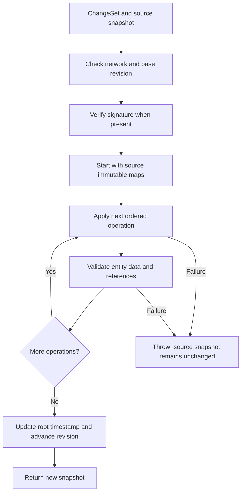

# Architecture and implementation

[Repository overview](../README.md) · [ChangeSets](CHANGESETS.md) · [JSON](JSON.md) · [Signatures](SIGNATURES.md)

## 1. Purpose and scope

WWCP POI provides an in-process data model for charging infrastructure, domain JSON parsers
and versioned updates. Applications can load a network, retain a stable view of it and derive
new versions from discrete batches of changes.

The library provides the data structures and update semantics. The application supplies
persistence, a transport protocol, selection of the current version, access control and signature
verification. There is currently no database, distributed consensus mechanism or synchronization
service implemented by this repository.

## 2. Entity nodes and nested values

The immutable graph has eight node types:

| Node type | Parent | Child JSON field |
| --- | --- | --- |
| `RoamingNetwork` | None | Root |
| `ChargingStationOperator` | `RoamingNetwork` | `chargingStationOperators` |
| `EMobilityProvider` | `RoamingNetwork` | `eMobilityProviders` |
| `ChargingPool` | `ChargingStationOperator` | `chargingPools` |
| `ChargingStation` | `ChargingPool` | `chargingStations` |
| `EVSE` | `ChargingStation` | `EVSEs` |
| `ChargingConnector` | `EVSE` | `socketOutlets` |
| `ChargingTariff` | `ChargingStationOperator` | `chargingTariffs` |

Each `InfrastructureEntitySnapshot` contains:

- `Key`: the entity's type, domain ID and optional connector scope.
- `Parent`: an optional parent key.
- `Properties`: an `ImmutableDictionary<String, JsonElement>` of its own JSON properties.
- `Children`: an `ImmutableHashSet<InfrastructureEntityKey>` of immediate child keys.

Child arrays are separated from the properties during import. A station node therefore does not
contain copies of every EVSE document; it contains their keys. JSON export reconstructs the nesting.

A `RoamingNetworkDataSnapshot` contains the root key, the entity map, a revision, the latest
applied ChangeSet ID and the reverse tariff-reference index.

Brands, licenses, addresses, coordinates, energy mixes, price components, tariff restrictions,
cables, energy meters and transparency software/status are nested property values. They are not
independent ChangeSet node types. Updating one replaces the corresponding property of its owner.

### Identity

`InfrastructureEntityKey` uses domain-aware identity comparison. Equivalent case and separator
forms are normalized for comparison where the corresponding domain ID supports that equivalence.
The stored JSON keeps the parsed ID's wire spelling.

Connector IDs are local. Connector `1` under EVSE `DE*ABC*E1` and connector `1` under
`DE*ABC*E2` have different keys. Connector operations and lookups must supply the EVSE scope.

## 3. Two representations

| Representation | Role | Mutability |
| --- | --- | --- |
| Existing `RoamingNetwork` / operator / pool / station / EVSE objects | Domain API, import and compatibility with existing callers | Mutable |
| `RoamingNetworkDataSnapshot` | Authoritative versioned data after capture | Immutable |

On a network without a captured snapshot, the first access to `DataSnapshot` serializes its
current nested POI data and imports that representation into immutable storage. Accessing
`Revision` or applying a ChangeSet also triggers this capture. A newly captured network starts
at revision zero. Parsing a versioned snapshot with a `revision` restores its immutable version
during parsing.

Capture is a boundary: later edits to those mutable POI objects do not modify the snapshot.
Applications should complete initial mutable construction before capture and then use ChangeSets.

After `RoamingNetwork.ApplyChangeSet()`, the returned network initially contains the root
projection and its authoritative new snapshot. Accessing its legacy hierarchy collections
materializes a complete fresh hierarchy lazily. Child parent links refer to that returned network.
Mutable projection objects are not shared between versions.

`ToJSON()` serializes the legacy projection. `ToJSONSnapshot()` serializes authoritative storage
when it exists. They can differ if an application edits a projection after capture.

## 4. Copy-on-write and structural sharing

The entity map, property maps, child sets and tariff-reference maps use persistent
`ImmutableDictionary` / `ImmutableHashSet` collections. Deriving a new collection reuses
unchanged internal branches. Existing snapshots continue to reference their original collections.

For a property update:

1. Replace the selected `JsonElement` in the entity's property map.
2. Create a new snapshot object for that entity.
3. Validate its new document against its ancestor context.
4. Update its and its ancestors' `lastChange` values.
5. Reuse unrelated entity objects, property values and unaffected collection branches.

For example, a `maxPower` update on an EVSE replaces five entity entries:
the EVSE, its station, pool, operator and root network. Its connectors, sibling EVSEs and
other branches remain shared. A tariff price change replaces the tariff and its ancestors;
the station hierarchy remains shared.

ChangeSet constructors clone incoming JSON payloads so they do not depend on the lifetime of an
external `JsonDocument`. Imported property values likewise own their JSON storage. Mutating a
`JObject` returned by an export cannot mutate a stored `JsonElement`.

Replacing a large nested property, such as an energy meter or a tariff's entire `elements` array,
processes that complete property value. Sharing occurs at entity/property boundaries, not as a
general-purpose persistent editor inside arbitrary JSON arrays.

## 5. Applying a ChangeSet

The implementation works on local references to immutable maps. Every operation sees the
results of preceding operations in the same batch. If any operation fails, no new snapshot is
returned and the source maps remain unchanged. Intermediate versions become unreachable.

`Add` imports a whole supplied subtree, reserves each ID before importing descendants,
attaches the new root to its parent, validates imported nodes and registers tariff assignments.

`Remove` checks the optional expected document, removes assignments belonging to the subtree,
checks that removed tariffs have no remaining consumers, removes the subtree and updates its parent.

`UpdateProperty` checks the field allowlist and optional expected value, replaces the field,
validates the changed node and updates the reverse index if `tariffIds` changed.

A successful batch advances the revision exactly once, even if it contains no operations.
The source version is never promoted automatically to a global current version.

Atomicity here covers snapshot storage. External effects performed by a verifier or other
application code are outside that transaction.

## 6. Validation layers

| Layer | Implemented checks |
| --- | --- |
| ChangeSet/operation construction and deserialization | Required identifiers; nonnegative base revision; initialized changes array without null entries; valid operation kind; required/forbidden payloads; parent type/ID pair; defined JSON values |
| Batch entry | Target network identity; exact base revision; revision overflow; signature verification when an envelope is present |
| Hierarchy import | Domain ID syntax and duplicates; payload ID; parent reference; supported fields; nested child ownership |
| Property update | Editable field allowlist; existence of the target; supplied parent; optional old value |
| Domain parsing | Scalar types, nested JSON shape, electrical/location/tariff data and other rules implemented by the individual parsers |
| Referential integrity | Tariff exists, belongs to the same operator, has no duplicate assignments and is not deleted while still referenced |

`InfrastructureChangeSchema` is the authoritative allowlist and relationship definition.
IDs, child arrays, ancestry and managed revision/timestamp fields are not editable properties.
A parser's support for a field does not automatically make it ChangeSet-editable.

Domain validation reconstructs the affected node and only its ancestor chain through the regular
POI parsers. It does not materialize the whole network to validate a scalar change. Subtree additions
validate each imported node. Tariff-reference validation additionally consults the immutable graph.

Errors from collection parsers retain paths such as `chargingStations[0].EVSEs[1]`.
Operation failures are wrapped in `RoamingNetworkChangeSetException`, with the batch ID and a
zero-based operation index. Batch-level failures have no operation index.

Validation has a defined scope. A well-formed certificate string is not proof of certificate
authenticity; an extensible legal-status label is not a legal approval; a parsed ID is not evidence
that the sender owns that entity. See [signatures and trust](SIGNATURES.md).

## 7. Timestamps and status

Existing creation timestamps remain unchanged by updates. Modified entities and their ancestors
receive the batch's `CreatedAt` as `lastChange`; the root is touched even for an empty batch.
Connectors have no independent managed entity timestamps.

New entities receive default metadata where omitted. Supplied metadata is parsed and validated.
The applier does not require `CreatedAt` to be newer than the preceding version's timestamp;
it is a caller-supplied timestamp, not a monotonic clock enforced by the library.

Status changes carry their own `value` and `timestamp`. Those timestamps are normalized to UTC.
A future status timestamp can be a scheduled value in the compatibility model rather than the
currently effective status.

Nested values such as an energy meter are not independently touched by an EVSE property update.
Supply their desired metadata in the replacement value. The owning EVSE and its ancestors are
updated automatically.

Snapshot import restores persisted timestamps directly, avoiding ordinary mutation notifications
overwriting them with the current deserialization time. This uses the additive protected
`AInternalData.RestoreTimestamps` API supplied by Styx.

## 8. Tariff-reference index

`TariffReferences` maps tariff keys to the EVSE/connector keys using them. Capture builds it once;
later changes update only affected assignments and subtrees.

An added tariff must precede assignments to it in the batch. A removed tariff must follow the
removal or replacement of all assignments to it. Removing an operator removes its tariffs and
infrastructure consumers together.

The reverse index avoids scanning the complete station hierarchy for every tariff removal.
It does not represent provider-specific commercial tariff agreements.

## 9. Cost and concurrency

| Work | Scope |
| --- | --- |
| Initial capture | Whole serialized hierarchy and reference-index construction |
| Scalar property update | Changed property, affected entity/ancestor entries, domain validation and persistent-map operations |
| Nested property replacement | Whole replacement property plus the affected entity/ancestors |
| Subtree addition | All imported nodes, their validation and assignments |
| Subtree removal | Removed descendants, their assignments and affected ancestors |
| `GetEntity()` | Immutable-map lookup |
| `GetEntityJSON()` | Selected entity and its descendants |
| `WriteTo()` / complete export | Whole snapshot |
| First legacy hierarchy access on a derived network | Complete compatibility hierarchy |

`WriteTo(Utf8JsonWriter)` avoids building a complete intermediate `JObject` hierarchy. Exporting
with `ToJSONSnapshot()` allocates a complete JSON document. Projection materialization also has
a whole-hierarchy cost. Prefer immutable lookups for large-data processing.

Retaining previous snapshots retains shared data and any older values that are still reachable.
Applications decide how many versions to retain. There are no measured throughput, memory-budget
or million-entity capacity guarantees supplied by these tests.

Immutable snapshots can be read and used to derive independent versions concurrently. Capture and
legacy projection materialization use a per-network lock. Concurrent mutation of the original
legacy object graph is not made transactional by that lock.

Two ChangeSets based on the same revision can independently produce two successors with the same
numeric revision. The application must coordinate publication of its current head and resolve
divergence. A `BaseRevision` comparison alone does not distinguish those branches.

## 10. Source organization and extending the model

| Location | Responsibility |
| --- | --- |
| [Entities](../WWCP_POI/Entities) | Domain classes and their per-type JSON parsers |
| [Serialization](../WWCP_POI/Serialization) | Shared value parsing, metadata and reference resolvers |
| [ChangeSet records](../WWCP_POI/ChangeSets/RoamingNetworkChangeSet.cs) | Immutable batches, operations and signature envelope |
| [Snapshot storage](../WWCP_POI/ChangeSets/RoamingNetworkDataSnapshot.cs) | Immutable maps, lookup and initial capture |
| [Changes](../WWCP_POI/ChangeSets/RoamingNetworkDataSnapshot.Changes.cs) | Batch checks and operation application |
| [Import](../WWCP_POI/ChangeSets/RoamingNetworkDataSnapshot.Import.cs) | Hierarchy import and timestamp normalization |
| [Validation](../WWCP_POI/ChangeSets/RoamingNetworkDataSnapshot.Validation.cs) | Small domain projections for validation |
| [Tariff references](../WWCP_POI/ChangeSets/RoamingNetworkDataSnapshot.TariffReferences.cs) | Reverse assignment index |
| [JSON export](../WWCP_POI/ChangeSets/RoamingNetworkDataSnapshot.Json.cs) | Property JSON and direct nested writing |
| [RoamingNetwork integration](../WWCP_POI/ChangeSets/RoamingNetwork.CopyOnWrite.cs) | Public API and lazy compatibility projection |
| [Schema](../WWCP_POI/ChangeSets/InfrastructureChangeSchema.cs) | Relationships, identity and editable properties |

When adding a property, update its domain parser/serializer, snapshot metadata handling when
needed, and the ChangeSet allowlist. When adding a node type, also define identity, ownership,
import/export nesting and the validation projection. Referenced nodes may require a reverse index.

Add coverage for the JSON contract, malformed input, ownership, old-value checks, rollback and
sharing of unrelated data. The [test documentation](../WWCP_POI_Tests/README.md) describes existing
coverage, including a 1,000-EVSE sharing test. That test verifies which entries are replaced;
it is not a performance benchmark.
