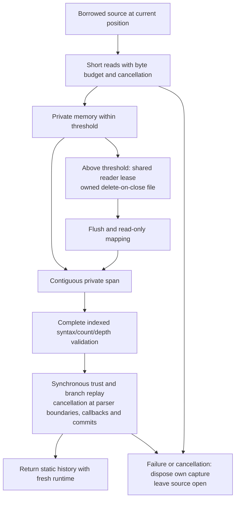

# Borrowed CBOR input streams

[Overview](../README.md) · [Indexed recovery](INDEXED-ARCHIVES.md) · [Limits](ARCHIVE-LIMITS.md) · [Orphan maintenance](ARCHIVE-MAINTENANCE.md)

`RoamingNetworkHistory.ParseCBOR(Stream, ...)` and `ParseCBORAsync(Stream, ...)` accept readable
sources from their current position, including non-seekable streams and short reads. They leave
the source open and never call its `Length`, `Position`, `Seek` or `Flush`. Zero bytes from a
read mean EOF. The async overload uses the source's memory-based `ReadAsync` and passes its
cancellation token through; it does not substitute synchronous source reads.

Both capture the complete encoded archive privately before invoking the existing indexed reader.
Small inputs stay in memory; larger ones spill to an owned temporary file and use a read-only
mapping during synchronous recovery. No complete archive CBOR tree or additional complete
managed byte array for file input is constructed. All four profiles, full syntax-before-trust,
eager v1/v2 and lazy v3/v4 model timing, equal signatures and fresh local runtime remain unchanged.
This adds input APIs and a local capture policy; wire profiles/static identities do not change.



## Usage

```csharp
var limits = new RoamingNetworkHistoryLimits(maxArchiveBytes: 64 * 1024 * 1024);
var capture = new RoamingNetworkArchiveReadOptions(
    memoryThresholdBytes: 1024 * 1024,
    temporaryDirectory: existingPrivateDirectory);

using var history = await RoamingNetworkHistory.ParseCBORAsync(
    source,
    verifyBatchSignature: VerifyBatch,
    verifyCommitSignature: VerifyCommit,
    authorizeSnapshotBoundary: AuthorizeBoundary,
    limits: limits,
    readOptions: capture,
    cancellationToken: cancellationToken);
// The caller still owns source. Recovery imports static data with fresh local runtime.
```

`RoamingNetworkArchiveReadOptions` is immutable. Its default memory threshold is 1 MiB;
zero forces file capture on the first nonempty chunk. The actual managed capture capacity is
bounded by the smaller of that threshold and `MaxArchiveBytes`, including memory-buffer growth.
The reader separately uses at most 64 KiB for input reads and the file stream can have its own
64 KiB buffer. These are capture bounds, not total-recovery bounds.

The directory defaults to the operating system temporary directory and is resolved to an
absolute path when options are constructed. An existing caller-administered private directory
is appropriate for application storage. Only a spill inspects that directory; a wholly in-memory
read can succeed even if it does not exist. Recovery never creates/deletes directories. Linked
directory ancestors and a nonregular coordination lock are rejected before opening a spool.

## Byte observations and validation

Each source read requests no more than the remaining archive budget plus one. The first excess
byte throws `RoamingNetworkHistoryLimitException` with `ArchiveBytes`, the configured maximum
and **maximum + 1 observed bytes**. It is not written to the capture and the rest of the source
is not drained. An exactly full archive needs one further one-byte EOF probe to distinguish
acceptance from overflow. The existing span API still reports its known complete input length;
the stream API only reports what it consumed. Invalid stream read counts are I/O errors.

Commit/receipt/catalog counts, global Styx depth, strict UTF-8, duplicates, EOF, fields/models,
ancestry, branch-state ETags and every peer use the unchanged indexed/span recovery path.
Inventory and syntax checks therefore occur after complete capture and before trust. A malformed
late value cannot cause earlier callbacks. Model errors retain the existing eager/lazy timing.
General stream recovery accepts the same noncanonical/indefinite input as general span recovery;
it does not impose bootstrap's additional deterministic-encoding rule.

The caller cannot alter pending models by changing the original source bytes during a trust
callback: capture is private. Boundary replay still privately freezes pending commit bytes
according to the indexed reader's contract. No partial history is returned on failure.

## Cancellation and failures

- An already requested cancellation stops before the first read or file creation.
- Capture checks cancellation before/after each source read and passes it to asynchronous file
  writes/flushes. Async source cancellation depends on that source honoring its token. Synchronous
  blocking `Read` cannot be interrupted by this API.
- [Parser checkpoints](PARSER-CANCELLATION.md) now check inside owned syntax/limit loops,
  around commit/receipt/root model calls, private suffix capture and root/replay/head preparation.
  Replay also checks before/after user trust/authorization callbacks and before returning. Existing core callback
  errors can wrap cancellation; a requested read cancellation is exposed as `OperationCanceledException`
  with the original token. The token is cleared from retained delegates when recovery ends, so
  cancelling it later does not change the returned history's trust policy or prevent later commits.
- Owned syntax traversal checks at each value boundary. Individual Styx scalar/structured-key/
  `SkipValue`, model/crypto/state calls and bulk copies remain synchronous and are not preempted. Async capture does not imply asynchronous replay or a
  guaranteed cancellation response time.
- Source/file/mapping errors abort recovery. Source I/O errors during capture are propagated;
  existing trust denial/exception semantics are preserved when the read token is not cancelled.
  Retry uses a fresh source or an explicitly repositioned source; recovery never rewinds it.
- File/view/pointer and reader-lease lifetimes are scoped to the call. `DeleteOnClose` deletes
  only the exact file created by that call, including failure/cancellation paths. The returned
  history retains neither capture bytes nor mapping, and recovery clears its captured read token.
  The original application callbacks can retain their own objects. Callback side effects cannot be rolled back.

## Shared readers and explicit orphan maintenance

File capture uses `<TemporaryArchivePath>.tmp-<32 lowercase GUID hex digits>` with `CreateNew`,
exclusive file sharing and `DeleteOnClose`. `TemporaryArchivePath` is the absolute
`wwcp-poi-input.cbor` namespace inside the selected directory; recovery never installs that
archive. Its `.lock` coordination file is retained, as for other archive maintenance workflows.
Each reader holds a shared read lease from spill through recovery/cleanup. Multiple readers can
coexist; the maintenance writer lease rejects inspection or cleanup while any capture is live.

Recovery never scans/deletes earlier temporary files. If a filesystem interruption leaves an
orphan, the existing API can review this exact namespace after readers finish:

```csharp
if (!RoamingNetworkArchiveMaintenance.TryInspectArchive(
        capture.TemporaryArchivePath, out var plan, out var inspection))
    throw new IOException(inspection.Error);

// The default rechecks availability without deleting anything.
RoamingNetworkArchiveMaintenance.TryExecute(plan!, out var preview);
// After explicit administrative selection of this review:
RoamingNetworkArchiveMaintenance.TryExecute(plan!, out var cleaned, cleanup: true);
```

Existing stale-review, digest/inventory, regular-file, partial-progress and directory-entry
budgets apply. An installed file at the namespace path is protected. Unrelated files and other
namespaces are untouched. Normal process handle cleanup removes a live delete-on-close file;
this package does not simulate power loss or filesystem damage.

## Implementation and verification

[`POIArchiveInputSpool`](../WWCP_POI/History/POIArchiveInputSpool.cs) owns bounded memory or a
temporary `FileStream`. When spilling, existing memory is copied once, then released. File bytes
are flushed before a read-only `MemoryMappedFile` view supplies the contiguous span required by
Styx. Unsafe code is enabled only to acquire/release the mapped pointer around the synchronous
restore delegate; no pointer/span escapes that view's lifetime. No dependency package is added.
OS mapped pages and the filesystem cache still consume physical/virtual resources.

[`InputStreams`](../WWCP_POI/History/RoamingNetworkHistory.InputStreams.cs) handles exact read
requests, capture ownership and cancellation-scoped trust delegates. The old span parser,
indexed model reader, persistent/cold paths and bootstrap manifest APIs retain their contracts.
This stream API is an additional general-history import path; it does not install an archive,
verify a supplied cold receipt or activate a bootstrap manifest by itself.

The package adds **160 cases** in
[`ArchiveInputStreamTests`](../WWCP_POI_Tests/Interoperability/ArchiveInputStreamTests.cs):
48 four-profile/mode/short-read combinations, current-position reads, exact capture boundaries,
syntax/error parity and retries, early byte/count limits, initial/read/pending-read/peer cancellation,
post-read token lifetime, source and spool fault paths, missing directories, immutable captured
bytes, required trust/boundary policies, capacity limits, concurrent leases and explicit orphans.

The definitive Release runs on **2026-10-09 pass 511 focused / 2,029 full cases**, zero
failures and one ordinary crash worker skipped. Two explicit reference generators are excluded.
All 160 new cases pass in both runs. The final build succeeds; existing nullable/analyzer warnings
remain in earlier complete builds. Fixed JSON/CBOR/signature references were not regenerated.
Source/assembly/TRX, dependency and report bindings are recorded in
[verification evidence](verification/stream-input-results.json), with the
[scoped production patch](performance/stream-input-reader.diff). The patch has been reversed in a
private temporary copy and reconstructs the preceding source/project bytes exactly.

One initial test build needed an Int32 parameter for a seam enum less accessible than the public
NUnit method. A later pending-read test initially timed out because its test source incremented
the read counter only through an optional observer; the corrected counter makes the gated read
observable. These were test-fixture corrections. An attempted rebuild while earlier own tests
were still running hit Windows DLL locks; those obsolete runs were stopped, and the final build
and executions are bound separately. Interrupted/earlier runs are not final evidence.

## Measurements and remaining costs

**42 fresh workers / 210 measured calls** cover seven shapes/all four profiles, with two
processes, five warmups and five samples per operation. This is a same-build comparison of
input routes; the historical seven-stage recovery suite default remains unchanged.

| Shape | Span allocated MiB | Memory capture MiB | File capture MiB | Span/memory/file median ms |
| --- | ---: | ---: | ---: | --- |
| recover-batch-1-peers-1 | 5.2005 | 5.2675 | 5.3287 | 15.14/16.33/16.94 |
| recover-batch-2048-peers-4 | 1656.9736 | 1659.6032 | 1657.7068 | 2279.68/2285.13/2299.45 |
| recover-boundary-16 | 47.9845 | 48.0950 | 48.1163 | 194.61/203.64/205.62 |
| recover-graph-128 | 425.6019 | 426.1131 | 426.5675 | 718.67/686.12/703.47 |
| recover-graph-512 | 1687.9580 | 1690.6336 | 1688.7723 | 3026.59/2952.12/2920.13 |
| recover-history-64 | 145.7841 | 146.3657 | 145.8476 | 321.37/391.20/291.40 |
| recover-pruned-4 | 122.4238 | 122.6491 | 122.5095 | 299.09/330.61/316.96 |

At 512 EVSEs memory capture adds about **2.68 MiB (+0.16%)** of cumulative allocation over
span input; forced file capture adds **0.81 MiB (+0.05%)**. Model/replay still dominates the
roughly 1,688 MiB total. File capture avoids a complete new managed input array, but its lease/
file/view buffers and individual parsers still allocate. This is not a universal allocation
reduction: graph-128 file allocation exceeds memory capture, and the smallest signed batch
allocates 5.2005 -> 5.3287 MiB (+2.47%) with forced file capture.

Times vary in both directions across shapes/processes; file I/O and sampled mapped-page/managed
peaks do not establish a general speedup or physical-memory reduction. A bounded capture policy
provides controlled input storage and cleanup, while retained states and synchronous model/replay
work need separate optimization.

The [raw report](performance/stream-input-recovery.json) and
[validated summary](performance/stream-input-summary.md) compare fresh same-build span recovery,
full-memory capture and forced file/mapping capture. Each uses the exact same prepared input,
static/history/receipt/peer inventory and expected recovered head. Inputs/results also match the
preceding indexed-reader report; its old timings are not treated as a paired speedup baseline.
The [report script](../WWCP_POI_Benchmarks/stream_input_report.py) checks complete groups, method,
profiles, original input bindings and every repeated result.

The fixture retains the original input bytes for every operation. Capture/source-wrapper/file
I/O/mapping/cleanup are inside measurement; source construction, options, signing and exact
archive/branch/peer/runtime verification are setup or post-measurement. No task builds/tests
overlap the formal series. The host is shared and not affinity controlled; wall times and 10 ms
sampled process peaks are descriptive. Mapped pages differ from managed allocations. These are
local source/disk costs, not network throughput or cancellation latency measurements.

Spooling does not remove total input disk/mapped-page usage, duplicate-key sets, largest part/
scalar/model trees, private boundary suffix bytes, receipts, retained branch states or local
runtime. No constant total-memory guarantee follows. The subsequent
[mapped recovery integration](MAPPED-ARCHIVE-RECOVERY.md) now applies scoped file input to
persistent reopen and cold verification, and bounded capture to manifest-bound bootstrap.
Those routes retain their distinct digest/manifest/lease/activation contracts.

## Reproduction

Complete build/tests first and select fresh output names:

```powershell
dotnet build WWCP_POI_Tests/WWCP_POI_Tests.csproj -c Release --no-restore
dotnet test WWCP_POI_Tests/WWCP_POI_Tests.csproj -c Release --no-build --no-restore --filter 'FullyQualifiedName~ArchiveInputStreamTests|FullyQualifiedName~IndexedArchiveTests|FullyQualifiedName~ArchiveRecoveryContractTests|FullyQualifiedName~ArchiveLimitsTests|FullyQualifiedName~ArchiveMaintenanceTests|FullyQualifiedName~PersistenceTests|FullyQualifiedName~BootstrapTests|FullyQualifiedName~SnapshotBoundaryTests' --logger 'trx;LogFileName=stream-input-focused-rerun.trx' --results-directory WWCP_POI_Tests/bin/TestResults/stream-input-rerun
dotnet test WWCP_POI_Tests/WWCP_POI_Tests.csproj -c Release --no-build --no-restore --logger 'trx;LogFileName=stream-input-full-rerun.trx' --results-directory WWCP_POI_Tests/bin/TestResults/stream-input-rerun
dotnet build WWCP_POI_Benchmarks/WWCP_POI_Benchmarks.csproj -c Release --no-restore
dotnet WWCP_POI_Benchmarks/bin/Release/net10.0/WWCP_POI_Benchmarks.dll --suite recovery --operations read-cbor,read-cbor-input-memory,read-cbor-input-spool --processes 2 --warmups 5 --samples 5 --label stream-input-rerun --output WWCP_POI_Benchmarks/bin/stream-input-rerun.json
python -B WWCP_POI_Benchmarks/stream_input_report.py --input WWCP_POI_Benchmarks/bin/stream-input-rerun.json --previous docs/performance/indexed-archive-after.json --output WWCP_POI_Benchmarks/bin/stream-input-summary-rerun.md
```
