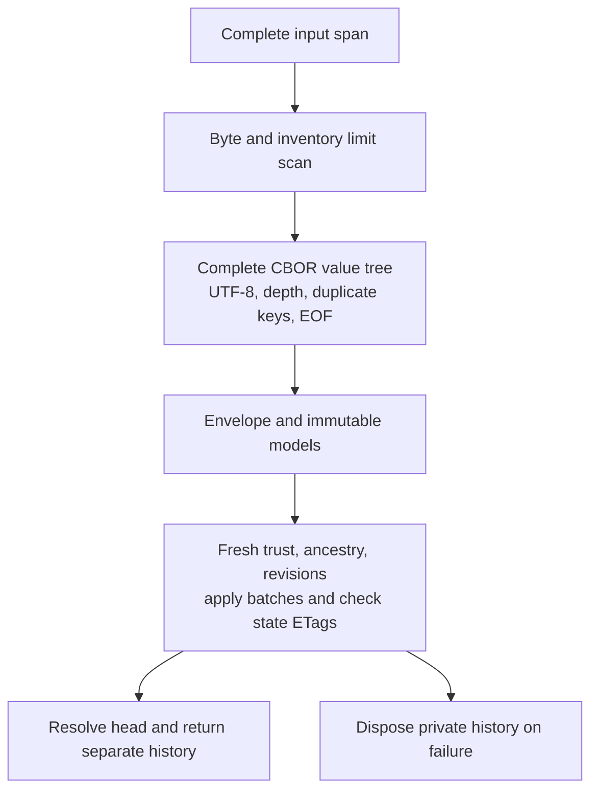

# Archive decoding, trust and replay costs

[Overview](../README.md) · [Archive limits](ARCHIVE-LIMITS.md) · [Streaming output](STREAMING-ARCHIVES.md) · [Roadmap](ROADMAP.md)

This package measures the existing reader and establishes compatibility requirements for an
incremental reader. Production sources, the production assembly and all four archive profiles
remain unchanged. It adds seven benchmark operations and **58 recovery contract tests**.
The Release runs on **2026-10-09 pass 179 focused and 1,791 full tests**, zero failures and one
ordinary crash worker skipped. Two explicit reference generators remain excluded.

These measurements and tree-based implementation describe the preceding build. The subsequent
[indexed reader](INDEXED-ARCHIVES.md) removes the complete archive tree and preserves the contracts
below; its paired recovery/control measurements and current verification are recorded separately.

## Baseline recovery pipeline

`RoamingNetworkHistory.ParseCBOR` consumes an already resident, contiguous byte span:



The first scanner uses Styx `CBORReader.SkipValue` without building the full tree. It counts
commits, receipts and catalog claims and rejects byte limits first. The subsequent
`CBORValue.Parse` validates duplicate keys throughout nested maps before any trust callback.
Profile/field/model checks follow. Complete profiles v1/v2 construct all suffix commit models
before restore; boundary profiles v3/v4 enumerate suffix models lazily inside restore.

Restore verifies original equal peer signatures, required snapshot-boundary authority,
parent/revision relationships and every branch's static before/after ETags. A late unknown head
or invalid suffix can fail after user callbacks have run. No partial history is returned;
external effects of callbacks cannot be rolled back. Recovery initializes fresh local runtime
and never imports source charging statuses into the recovered static state.

General archive parsing accepts valid noncanonical field order and indefinite containers,
then exports canonical bytes. Bootstrap separately requires the original archive to equal its
canonical re-encoding. A future reader must preserve this distinction. Native CBOR commit IDs
still contain a **JSON** digest because commit identity uses canonical JSON.

## Measured boundaries

The [benchmark](../WWCP_POI_Benchmarks/ArchiveRecoveryProbe.cs) binds typed delegates to actual
private production stages during setup. Reflection and fixture construction are outside the
measurement. No production accessors or alternative replay implementation were added.

| Operation | Measured call and prepared input |
| --- | --- |
| `read-cbor-limits` | Actual archive byte/count/depth preflight over resident CBOR bytes |
| `read-cbor-tree` | Actual full `CBORValue.Parse`; no model construction |
| `read-cbor-model` | Envelope composition over a prepared tree, using actual production field/profile/commit/receipt parsers |
| `read-signatures` | Real fixture trust callbacks for every equal commit/batch peer, once each, over prepared immutable models; no state application |
| `read-restore` | Actual production restore over prepared immutable models, including repeated trust, all branch replay and runtime reconstruction |
| `read-cbor` | Complete public CBOR parse, trust and restore |
| `read-json` | Complete public JSON parse, trust and restore |

Model-only envelope composition belongs to the benchmark. Its v3/v4 suffix is eager, whereas
the complete production boundary path is lazy. Prepared models in restore/signature probes
have already been used by setup and warmups; complete reads create fresh models. Signature
callbacks include their fixture key lookup/public-key preparation. These stage medians cannot
be added, subtracted or interpreted as percentages of complete recovery.

Seven shapes cover 128/512-EVSE graphs, a 64-change branched history, four pruning rounds,
a new authorized snapshot suffix and 1/2,048-operation signed batches with one/four peers.
All four archive profiles are represented. Two fresh processes per shape/operation each use
five warmups and five measured calls: **98 workers / 490 samples**.

Every restored head, checkpoint/anchor, branch-state ETag pair, receipt inventory, original
peer envelope and exact CBOR archive is checked after measurement. Source runtime remains
`charging`; recovered runtime is `available`. Six existing CBOR inputs also match the preceding
export reports in digest, bytes and inventory. The boundary fixture is new.

For reader operations, `OutputBytes` means consumed input size for complete JSON/CBOR reads
and the CBOR scanner, and zero for object-only stages. None emits wire bytes.

## Results

Medians of ten measured calls per cell, elapsed ms / operation-thread allocation MiB:

| Operation | 512 EVSEs | 64-change history | 2,048 operations / four peers |
| --- | ---: | ---: | ---: |
| read-cbor-limits | 4.32 / 0.00 | 0.75 / 0.00 | 1.69 / 0.00 |
| read-cbor-tree | 21.60 / 12.76 | 4.35 / 1.79 | 13.54 / 9.17 |
| read-cbor-model | 3015.64 / 999.36 | 174.85 / 60.89 | 701.39 / 345.08 |
| read-signatures | 20.82 / 11.29 | 56.63 / 5.41 | 80.24 / 70.61 |
| read-restore | 1558.98 / 667.08 | 245.77 / 81.94 | 2066.03 / 1294.68 |
| read-cbor | 8494.51 / 1687.92 | 316.00 / 144.84 | 2388.87 / 1662.93 |
| read-json | 3956.48 / 1501.82 | 249.14 / 132.36 | 2345.27 / 1580.94 |

At 512 EVSEs the scanner allocates 760 bytes, the tree 12.76 MiB, isolated model construction 999.36 MiB and prepared-model restore 667.08 MiB; complete CBOR recovery allocates 1687.92 MiB. The allocation-heavy work lies in model validation/conversion and state replay. Removing the whole archive tree targets an avoidable buffer, with modest allocation headroom on this shape. It does not eliminate repeated static processing.

Additional collected recovered-history memory is 13.43–13.43 MiB for 512 EVSEs and 1.03–1.04 MiB for the 64-change branched history. These retained objects are separate from cumulative allocation. Full JSON recovery is included as a control; this package does not change either reader or establish a general encoding preference.

The [raw baseline](performance/archive-recovery-baseline.json) and
[validated stage summary](performance/archive-recovery-summary.md) contain all 49 groups.
The [stdlib report script](../WWCP_POI_Benchmarks/archive_recovery_report.py) rejects incomplete
runs, changed inventories/results, absent profiles and mismatched preceding CBOR inputs.
This is a new decoder baseline; no production optimization or before/after speedup is claimed.

No build/test from this task overlaps the formal series. The Windows host is not dedicated or
affinity controlled. Elapsed times and 10 ms sampled managed/working-set peaks are descriptive;
prepared source/input objects remain live and verification can affect subsequent heap behavior.
Allocation counts cover managed bytes on the operation thread; sampled peaks cover the worker.
The additional recovered-history probe is separate, collected after measured calls, with
source/input held on both sides. Its two process-heap deltas per shape are approximate, not
capacity bounds or logical cache payload sizes. Other objects may become collectible.

## Recovery contracts added

The [58 cases](../WWCP_POI_Tests/Interoperability/ArchiveRecoveryContractTests.cs) use unchanged
fixed references for v1/v2/v3/v4. They cover:

- Truncation at five boundaries and trailing input: rejection before any trust call, followed
  by exact valid recovery on retry.
- Reordered root fields and indefinite root maps: successful recovery and original canonical export.
- A smaller byte budget on malformed input: the typed byte-limit violation wins, reports the
  complete known span length, and invokes no trust callbacks.
- Unknown root fields and missing boundary policies/verifiers: rejection before trust.
- A validly formed unknown JSON-digest head: late failure after trust and successful retry.
- A valid first signature and corrupt second equal peer: both peers must be checked.
- Invalid late commit models: v1/v2 reject before trust; v3/v4 preserve their existing lazy callback timing.
- Explicit snapshot-boundary denial: no recovered history and no batch trust calls.

The focused run also reruns archive limits, persistence, bootstrap and snapshot-boundary tests.
The full run includes existing nested duplicate/depth, signing, crash, merge, numeric/SI and
runtime contracts. Reference artifacts were not regenerated. Source/assembly/TRX/report hashes
and exact counters are recorded in [verification evidence](verification/archive-recovery-results.json).

Two setup corrections preceded the final runs: the benchmark's nullable `CBORValue` needed
explicit struct handling; the unknown-head test needed a JSON-format digest to pass commit-ID
construction and actually reach late head resolution. Production code needed no correction.

## Requirements for incremental reading

1. **Validate the entire CBOR value before trust.** Preserve strict UTF-8, tag/value validation, EOF/truncation and
   duplicate-key validation in every nested map, including Styx equality for non-text map keys.
   `SkipValue` alone does not provide duplicate validation. A malformed later value must not
   cause earlier user trust callbacks. Preserve the separate eager/lazy model behavior above.
2. **Preserve limits and wire content.** Count global bytes/commits/receipts/catalog claims,
   retain the 64-level Styx depth rules across indexed slices and tag nesting, and preserve
   SI tags, native ETags, exact embedded numeric spelling and every equal signature envelope.
   Accept general archive field order/indefinite forms; keep bootstrap's canonical check.
3. **Index or spool before replay.** Root fields can arrive in arbitrary order; canonical
   key ordering can put commits ahead of profile/checkpoint fields. Retain validated ranges
   until the root/profile is available. Recover into a private history and resolve head only
   after all required checks. Existing persistent writer leases and explicit activation remain.
4. **Borrow the input stream.** A later stream overload must support non-seekable sources,
   avoid requiring `Length`, `Position` or `Seek`, and leave the source open. Define short-read,
   cancellation, I/O failure and exact owned spool-file cleanup/retry contracts first.
5. **Define stream limit observations.** A span can report the known entire input length;
   an early rejecting stream only knows bytes consumed, typically the limit plus one.
   Document this difference while retaining existing span diagnostics. Spool limits belong
   to local options, independent of signed content. Orphans use explicit maintenance.
6. **State the remaining memory costs.** Removing whole archive input/tree buffers leaves
   the largest commit/scalar, duplicate-key sets, range/receipt indexes, immutable retained
   branch states and runtime materialization. No constant total-memory guarantee follows.

Styx's current `CBORReader` is a `ref struct` over a contiguous `ReadOnlySpan<byte>`.
It is not a resumable stream/sequence reader and cannot be held across asynchronous reads.
The subsequent [indexed reader](INDEXED-ARCHIVES.md) implements validated ranges over the existing
span, removes the complete archive tree and compares failures/callbacks/results and allocations
against the exact matching subset of this baseline. The subsequent [borrowed-input package](ARCHIVE-INPUT-STREAMS.md)
now captures non-seekable streams into bounded memory or an owned spool with read-only mapping,
cancellation and shared maintenance leases. Replay/model preparation must be optimized and
measured separately; mapped pages, individual values and retained states remain costs.

## Reproduction

Run from the repository, finish build/tests before measurements, and use fresh output names:

```powershell
dotnet build WWCP_POI_Tests/WWCP_POI_Tests.csproj -c Release --no-restore
dotnet test WWCP_POI_Tests/WWCP_POI_Tests.csproj -c Release --no-build --no-restore --filter 'FullyQualifiedName~ArchiveRecoveryContractTests|FullyQualifiedName~ArchiveLimitsTests|FullyQualifiedName~PersistenceTests|FullyQualifiedName~BootstrapTests|FullyQualifiedName~SnapshotBoundaryTests' --logger 'trx;LogFileName=archive-recovery-focused-rerun.trx' --results-directory WWCP_POI_Tests/bin/TestResults/archive-recovery-rerun
dotnet test WWCP_POI_Tests/WWCP_POI_Tests.csproj -c Release --no-build --no-restore --logger 'trx;LogFileName=archive-recovery-full-rerun.trx' --results-directory WWCP_POI_Tests/bin/TestResults/archive-recovery-rerun
dotnet build WWCP_POI_Benchmarks/WWCP_POI_Benchmarks.csproj -c Release --no-restore
dotnet WWCP_POI_Benchmarks/bin/Release/net10.0/WWCP_POI_Benchmarks.dll --suite recovery --processes 2 --warmups 5 --samples 5 --label archive-recovery-rerun --output WWCP_POI_Benchmarks/bin/archive-recovery-rerun.json
python -B WWCP_POI_Benchmarks/archive_recovery_report.py --input WWCP_POI_Benchmarks/bin/archive-recovery-rerun.json --scaling-control docs/performance/direct-archive-changeset-scaling-after.json --batch-control docs/performance/direct-archive-changeset-batches-after.json --output WWCP_POI_Benchmarks/bin/archive-recovery-summary-rerun.md
```

### Subsequent private model/replay preparation

The [model preparation package](MODEL-PREPARATION.md) removes recursive deep copies of descendants
already owned by a private import/completion/binding traversal. Entry-point and projected-value
copies remain; all normalization/validation order, exact bytes/peers, current trust, eager/lazy
recovery and fresh runtime are preserved. No persistent cache is added. Frozen prior algorithms
and atomic failures/retries are covered by 88 new cases; all 1,942 interoperability / 2,274 full
Release cases pass. Matched preparation/restore/full-CBOR reports bind the unchanged harness binary,
dependencies, exact inputs and results. Earlier measurements remain historical. Canonicalization,
cryptography, individual trees, root/head reconstruction and retained branch states remain costs.

### Subsequent bounded canonical identity/signature preparation

The [canonical preparation package](CANONICAL-PREPARATION.md) reuses successful immutable unsigned
bytes within synchronous recovery/peer verification, with 64-entry/1-MiB-value/4-MiB-byte admission
bounds. Every outer scope releases its entries. Original numeric/SI/identity/signature bytes,
public array ownership, eager/lazy errors, all current peer/policy checks, runtime and atomic
publication remain exact. It adds 106 cases; all 2,048 interoperability / 2,380 full Release cases
pass with unchanged fixed artifacts. Four-stage matched reports bind the unchanged harness,
dependencies, inputs and results across 112 workers / 336 samples. Individual signature-only
calls retain the preceding pipeline as a control; actual recovery joins scoped preparation.
Earlier measurements remain historical. Root/head reconstruction, cryptography, individual
model trees, retained versions and wider production/concurrency measurements remain work.
