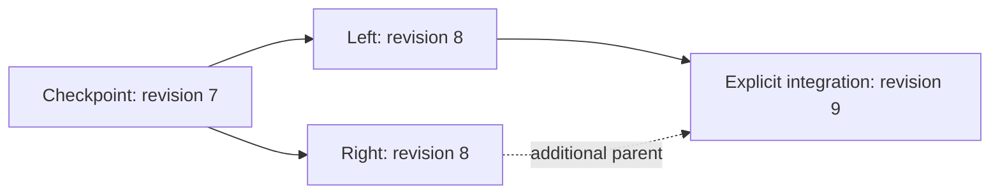

# Commit history and atomic heads

[Repository overview](../README.md) · [ChangeSets](CHANGESETS.md) · [Signatures](SIGNATURES.md) · [Runtime](RUNTIME.md)

`RoamingNetworkHistory` retains immutable commits and their static snapshots, including branches
that have not been published. `Head` returns one coherent `RoamingNetworkHead` containing the
commit envelope, typed commit ID, network and static snapshot. Network runtime data remains mutable.

## State identity and commit identity

| Identity | Input | Purpose |
| --- | --- | --- |
| Static JSON/CBOR ETags | Static stored POI properties and owned descendants | Compare data contents and validate a transition |
| `RoamingNetworkCommitId` | Canonical JSON commit header, ordered parents and complete unsigned batch | Identify one version in its history |
| ChangeSet `Id` | Application-supplied identifier | Detect conflicting reuse within one retained history |

The fixed commit identity profile is **`wwcp-poi-commit-json-v1`**. `GetIdentityBytes()` returns
its Styx canonical UTF-8 JSON. SHA-256 over those bytes yields the typed readonly
`RoamingNetworkCommitId`. The preimage contains exactly:

- `Profile`, `ContentProfile`, `RoamingNetworkId`, resulting `Revision` and ordered `Parents`.
  `ContentProfile` must be `wwcp-poi-static-v1` in both JSON and CBOR.
- The resulting `StateETags` pair and nullable `AppliedChangeSetId`.
- `ChangeSet`: null for the checkpoint; otherwise the unsigned v2 batch content, including its
  ID, target, base revision, UTC timestamp, before/after ETags, descriptions, application metadata,
  ordered operations, paths and optional old/new payload presence.

Both batch and commit peer signature arrays are excluded. `WithSignature()` and replacement of
batch peer envelopes therefore preserve the commit ID. Ancestry, descriptions, metadata, timestamps,
operation order, JSON number spelling and signed SI string spelling are identity-bearing content.
Object property ordering follows Styx canonical JSON; operations and parents remain ordered arrays.
Identical static ETags do not imply identical commits when these history fields differ.

`CreateCheckpoint(snapshot)` has no parents or batch. It anchors the supplied static state,
revision and last applied batch ID without inventing timestamps or earlier history. Independently
anchoring exactly the same snapshot produces the same checkpoint ID. Earlier commits are not
reconstructed from the snapshot's last applied ID.

The ID uses the existing ETag digest tuple contract: JSON
`["json", "sha256", "hex", "<64 lowercase digits>"]`; CBOR
`["json", "sha256", h'<32 digest bytes>']`. Its **commit type and domain-separated profile**
distinguish it from a POI state ETag. The CBOR transport still labels this digest `json` because
the commit identity hashes canonical JSON. `StateETags` continue to carry both the `json` and
`cbor` static-content digests. Display uses `json:sha256:hex:...`.

## Revision and ancestry

Revision is a **first-parent chain coordinate**. A transition has the first parent's revision
plus one and targets that parent's exact static ETags. An imported checkpoint can start above
zero. Parallel branches can legitimately have equal revisions and different commit IDs.



All parents must already be retained and belong to the same checkpoint network. The first parent
is the actual source of the batch. Additional parents record explicit ancestry; they do not
automatically merge data, prove which individual changes were integrated, or advance the revision.
Changing their order changes the identity. Reusing a batch ID for different content or ancestry
returns `ChangeSetIdConflict`; prepare a new integration batch and ID.

The snapshot's batch `TryMerge` still prepares against the inputs' common source. Its result is
not a patch for an already-published branch. `RoamingNetworkHistory.TryMerge(leftId, rightId, ...)`
now compares retained ancestor/left/right states and prepares a new batch against the left tip,
with structured conflicts and explicit resolutions. Its fresh commit has left/right parents and
signed ancestor/resolution metadata. Preview/preparation never publish it. See
[integrating retained branches](MERGING.md) for identity-based collection edits, best ancestor
selection, validation and trust. Recursive virtual merge bases and rebase remain roadmap work.

## Preparing, retaining and publishing

The `network` and prepared `changeSet` below can come from the README's quick start:

```csharp
using var history = new RoamingNetworkHistory(network);
var source = history.Head;
var commit = history.PrepareCommit(source.Id, changeSet);

// Optional: sign the complete commit, including its parents, before delivery.
// commit = commit.Sign(privateKey, "company:alice", algorithm);

if (!history.TryPublish(source.Id, commit, out var result))
    throw new InvalidOperationException($"{result.Outcome}: {result.Error}");

Console.WriteLine(result.Head.Id);
Console.WriteLine(result.Head.Snapshot.ETags[0]);

// All previously retained static states remain available.
var earlier = history.GetSnapshot(source.Id);
```

`PrepareCommit(parentId, batch, additionalParents)` validates the operations, source/result states,
revision and all supplied batch signatures without retaining or publishing a version. It permits
preparation before adding commit signatures. `RoamingNetworkCommit.Create()` prepares only the
immutable header; storage/publication additionally apply and validate its batch.

`TryStoreCommit()` retains a valid branch without moving the head. `TryPublish(expectedHead, commit)`
checks the expected commit ID and the first parent against the current head under a shared gate.
It derives the new network while holding that gate, validates the resulting state and persists a
file-backed archive before installing the new head. Validation, trust, head conflict and persistence
failure do not install a candidate or partially retain it. A conflicting candidate can be explicitly
retained first using `TryStoreCommit()`.

| Outcome | Meaning |
| --- | --- |
| `Published` | New retained commit and head installed |
| `AlreadyPublished` | Same commit is the current head or on its first-parent chain; no reapplication or rewind |
| `Stored` / `AlreadyStored` | Branch retained without publishing it |
| `HeadConflict` | Expected head or candidate's first parent differs from the current head |
| `ChangeSetIdConflict` | Batch ID already identifies different commit content/ancestry |
| `InvalidCommit` | Content, parent, state, signature or authorization rejection |
| `PersistenceFailure` | Archive serialization/write failed; in-memory history/head unchanged |
| `Unavailable` | Disposed instance or reentrant mutation callback |

Successful outcomes return true; rejection returns false and the observed head plus a diagnostic.
Duplicate first-parent delivery is accepted even with a stale expected head, after checking incoming
trust. Additional valid peers are retained without replacing existing peers. Equal envelopes are
deduplicated; newly received peers preserve arrival order. An unpublished additional-parent branch
is not treated as an already-published first-parent commit.
When envelopes are combined, the retained peers and combined authorization policy are checked again.

## Trust and peer signatures

Configure the constructor or archive loader with:

- `verifyBatchSignature(batch, signature)` for **every** supplied batch peer.
- `verifyCommitSignature(commit, signature)` for **every** supplied commit peer.
- Optional `authorizeCommit(commit)` for sender permissions, required signing profiles, distinct
  signers, quorum or an unsigned-commit policy.

Signed content requires its verifier. Unsigned content is allowed unless authorization rejects it.
Use the corresponding `VerifySignature` method and application-trusted public keys in each callback.
Parsing a commit checks its declared ID/header; it does not establish trust or prove applicability.
Storage/recovery validate parents and replay the batch against the retained static source.

Commit `Sign`/`TrySign` and `VerifySignature`/`VerifySignatures` use
**`wwcp-poi-commit-signature-json-v1`** and Styx asymmetric algorithms/COSE keys. Its canonical JSON
input contains `Profile`, `Algorithm`, `KeyId`, `Encoding: "base64"`, `CommitId` and `Commit`
(the complete unsigned identity preimage). Both peer arrays remain excluded. The shared immutable
`RoamingNetworkChangeSetSignature` envelope carries the profile selecting the signed content.
The v2 **batch** signature still authenticates the transition, descriptions and metadata; it does
not authenticate the new commit's parents. Commit signatures add that ancestry binding.

Callbacks run synchronously inside the gate. They may inspect history but must not mutate or dispose
it reentrantly. Keep verification local; fetch keys or missing parents before attempting publication.

## Static archives and recovery

`ToJSON()` and `ToCBOR()` export profile **`wwcp-poi-history-v1`**:

| Field | Content |
| --- | --- |
| `Profile` | Archive profile name |
| `ContentProfile` | Required static content profile (`wwcp-poi-static-v1`) |
| `Checkpoint` | Static snapshot including revision, last batch ID and state ETags |
| `CheckpointCommit` | Its complete immutable envelope and peer signatures |
| `Commits` | All original transitions, including branches, in deterministic parent-before-child order |
| `Head` | Typed published commit identity |

CBOR uses native snapshot/commit maps, SI metrological representations, lossless ChangeSet transport
and binary digest tuples. It does not wrap JSON documents in text or Base64. `Parse`/`ParseCBOR`
validate the checkpoint, recompute every commit ID, verify configured trust, resolve all parents,
replay every branch, check both state tags/revisions and resolve the retained head. Duplicate archive
commit IDs, missing parents, unsupported fields/profiles and corrupted content are rejected.
Replay rebuilds cached static snapshots; subsequent history operations can address every retained state.
Current statuses, schedules, forecasts and measurements are absent and start with domain runtime
defaults after recovery. Restore operational data separately through its own delivery contract.

For integrated file persistence:

```csharp
using (var history = RoamingNetworkHistory.CreatePersistent("network-history.cbor", network))
{
    var source = history.Head;
    var commit = history.PrepareCommit(source.Id, changeSet);
    if (!history.TryPublish(source.Id, commit, out var result))
        throw new InvalidOperationException(result.Error);
}

using var recovered = RoamingNetworkHistory.Open("network-history.cbor");
Console.WriteLine(recovered.Head.Id);
```

Supply the same verifier/authorization arguments when creating or reopening signed histories.
Authorization also checks an imported checkpoint. A local newly created checkpoint starts unsigned;
it can be signed and retained through `TryStoreCommit()` before exchange or stricter recovery.

Creation refuses an existing archive. Open/create hold a writer lease through the sibling `.lock`
file until disposal; cooperating history instances cannot concurrently rewrite the same path.
Each successful mutation writes the complete CBOR archive to a unique sibling temporary file,
flushes its data to disk and replaces the archive through a same-directory rename before swapping
the in-memory head. A crash before replacement leaves the old archive; after replacement recovery
reads the new one, even if the caller did not receive the acknowledgement. Unreferenced temporary
files are ignored. Filesystem rename and storage durability govern power-loss behavior; directory
metadata is not separately flushed. This is a local archive store, not a distributed transaction.

The head reference is mutable archive bookkeeping, outside individual commit signatures. Validating
an archive proves retained content and ancestry; preventing rollback to an older valid head requires
an externally retained expected head or application policy. Archive rewriting and cached per-commit
snapshots favor a simple recoverable implementation; incremental journals, pruning and performance
measurements remain future extensions.

## Runtime delivery

Use `history.ApplyRuntimeUpdate(instruction)` to deliver statuses to the current head through the
same publication gate. It does not change static ETags, revision, commit ID or the archive. Static
publication captures these delivered runtime values into independent schedules of the successor.
Direct writes through a previously obtained network/entity reference bypass this routing. Coherent
multi-entity runtime exports and direct measurement/forecast delivery still need application
coordination. Runtime notification failures retain the existing runtime API's behavior; they do
not acquire the static publication rollback guarantee.

## Implementation and coverage

Sources are in [History](../WWCP_POI/History). The [interoperability package](INTEROPERABILITY.md)
publishes fixed identity/signature/merge/archive vectors and executes signed JSON/CBOR recovery,
peer/duplicate delivery, expected-head races, writer leases, injected failures and abrupt process
exit before/after archive replacement. Runtime independence and continued signed exchange are covered.
The archive also requires `ContentProfile`; unsupported declarations are rejected. Static profile
binding changes commit IDs from development envelopes that lacked it.

`TryPublish` requires the candidate's first parent as the current head. The separate
`TryAdoptHead` API previews and explicitly selects any retained descendant through all parent
edges, including an incoming merge over its right parent. `GetReplicationState`,
`TryCreateCommitPack` and `TryImportCommitPack` exchange missing ancestry in bounded JSON/CBOR
pages, with atomic page retention and unchanged head/runtime on import. See [replication](REPLICATION.md).
Dedicated exchange/adoption/persistence fixtures now contribute 61 passing cases; the full
suite passes 509 tests. They cover boundaries, page rollback, signed second-parent selection,
runtime lifetime resets, trust changes, head races, gated status delivery and disk recovery.
See [replication evidence](REPLICATION.md#implementation-and-evidence). Exhaustive graph cases,
power-loss simulation and performance evidence remain in the [roadmap](ROADMAP.md).

New replicas can obtain the complete checkpoint/history through [bootstrap](BOOTSTRAP.md).
`CreateBootstrap` freezes the current archive and original peers under the gate. Manifest-bound
JSON/CBOR fragments are staged with local limits and verified receipts. Reopen resumes against an
independently retained manifest identity; validation previews and explicit activation recheck
all signatures, authorization and replay every retained branch. Optional persistence requires a
new archive path. The returned history has original version identities and fresh runtime;
existing histories/archives are preserved. Its separate fixture contributes 32 passing cases.

The [structural merge fixture](MERGING.md#structural-merge-evidence) adds 34 passing cases for
deletion/recreation/addition/owner conflicts, typed reference targets, scoped connectors, groups
and parking scopes, whole-subtree resolution with signed recovery, criss-cross ancestor selection
and resolver reentry/exception rollback. Repeated invalid reference decisions terminate, and
revalidation removes issues already repaired by a whole-subtree choice. A valid candidate with an
unschedulable referenced replacement returns conflicts rather than bypassing operation validation.
