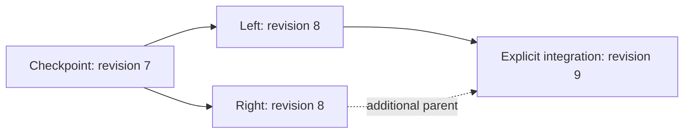

# Commit history and atomic heads

[Repository overview](../README.md) · [ChangeSets](CHANGESETS.md) · [Signatures](SIGNATURES.md) · [Runtime](RUNTIME.md)

`RoamingNetworkHistory` retains immutable commits and their static snapshots, including branches
that have not been published. `Head` returns one coherent `RoamingNetworkHead` containing the
commit envelope, typed commit ID, network and static snapshot. Network runtime data remains mutable.
Commits have explicit `Checkpoint`, `ChangeSet` and `Snapshot` kinds. Administrators can insert
[full snapshot links](SNAPSHOTS.md) into the same chain without changing static data or entity lifetimes.
Separate replicas may also start at an [explicitly authorized snapshot boundary](SNAPSHOT-BOUNDARIES.md).
`CheckpointId` remains the original chain claim; `AnchorId` identifies the local replay root and
`HasCompleteAncestry` distinguishes full history from a trusted suffix. The one boundary root
retains an external parent; every later commit still requires all parents locally.
[Explicit archival/pruning](RETENTION.md) can move that root under a reviewed dependency-safe plan.
It saves the entire preceding local archive before active replacement and preserves the exact live
head/network/runtime. History-v4 includes immutable pruning receipts, permitting typed archived/unknown
lookups and digest-checked retrieval into a separate history. Snapshot/export APIs never prune implicitly.

## State identity and commit identity

| Identity | Input | Purpose |
| --- | --- | --- |
| Static JSON/CBOR ETags | Static stored POI properties and owned descendants | Compare data contents and validate a transition |
| `RoamingNetworkCommitId` | Canonical JSON header, ordered parents and unsigned batch or full snapshot payload | Identify one version in its history |
| ChangeSet `Id` | Application-supplied identifier | Detect conflicting reuse within one retained history |

The checkpoint/ChangeSet identity profile is **`wwcp-poi-commit-json-v1`**. `GetIdentityBytes()` returns
its Styx canonical UTF-8 JSON. SHA-256 over those bytes yields the typed readonly
`RoamingNetworkCommitId`. The preimage contains exactly:

- `Profile`, `ContentProfile`, `RoamingNetworkId`, resulting `Revision` and ordered `Parents`.
  `ContentProfile` must be `wwcp-poi-static-v2` in both JSON and CBOR.
- The resulting `StateETags` pair and nullable `AppliedChangeSetId`.
- `ChangeSet`: null for the checkpoint; otherwise the unsigned v2 batch content, including its
  ID, target, base revision, UTC timestamp, before/after ETags, descriptions, application metadata,
  ordered operations, paths and optional old/new payload presence.

Both batch and commit peer signature arrays are excluded. `WithSignature()` and replacement of
batch peer envelopes therefore preserve the commit ID. Ancestry, descriptions, metadata, timestamps,
operation order, JSON number spelling and signed SI string spelling are identity-bearing content.
Object property ordering follows Styx canonical JSON; operations and parents remain ordered arrays.
Identical static ETags do not imply identical commits when these history fields differ.

`CreateCheckpoint(snapshot)` has no parents or batch. It anchors the supplied static state,
revision and last applied batch ID without inventing timestamps or earlier history. Independently
anchoring exactly the same snapshot produces the same checkpoint ID. Earlier commits are not
reconstructed from the snapshot's last applied ID.

Full snapshot links use **`wwcp-poi-snapshot-commit-json-v1`** with `Snapshot` replacing `ChangeSet`.
The complete static state, creation time, multilingual descriptions and metadata are bound into
their identity. They have exactly one parent, advance its revision once, preserve its state ETags
and last applied batch ID, and introduce no synthetic batch. `PrepareSnapshot` prepares against
the expected current head; sign then publish through the existing APIs. Details are in
[snapshot state, identity and wire contracts](SNAPSHOTS.md).

The ID uses the existing ETag digest tuple contract: JSON
`["json", "sha256", "hex", "<64 lowercase digits>"]`; CBOR
`["json", "sha256", h'<32 digest bytes>']`. Its **commit type and domain-separated profile**
distinguish it from a POI state ETag. The CBOR transport still labels this digest `json` because
the commit identity hashes canonical JSON. `StateETags` continue to carry both the `json` and
`cbor` static-content digests. Display uses `json:sha256:hex:...`.

## Revision and ancestry

Revision is a **first-parent chain coordinate**. Each ChangeSet or snapshot link has the first parent's revision
plus one. A ChangeSet targets its exact ETags; a full snapshot preserves those ETags. An imported checkpoint can start above
zero. Parallel branches can legitimately have equal revisions and different commit IDs.



All parents must already be retained and belong to the same checkpoint network. The first parent
is the actual source of the batch. Additional parents record explicit ancestry; they do not
automatically merge data, prove which individual changes were integrated, or advance the revision.
Changing their order changes the identity. Reusing a batch ID for different content or ancestry
returns `ChangeSetIdConflict`; prepare a new integration batch and ID.

The snapshot's batch `TryMerge` still prepares against the inputs' common source. Its result is
not a patch for an already-published branch. `RoamingNetworkHistory.TryMerge(leftId, rightId, ...)`
now compares retained ancestor/left/right states and prepares a new batch against the left tip,
with structured conflicts and explicit resolutions. Its fresh commit has left/right parents and
signed ancestor/resolution metadata. Preview/preparation never publish it. See
[integrating retained branches](MERGING.md) for identity-based collection edits, best ancestor
selection, validation and trust. Recursive virtual merge bases and rebase remain roadmap work.

Merge derives addressed object lifetimes from original first-parent operation sequences, including
intermediate removal/reintroduction with unchanged final IDs and creation metadata. Additional
parents do not establish first-parent lifetime continuity. Selected recreations are represented
by explicit operations and optional signed lifetime audit records. Origins are recomputed from
retained history during planning, rather than restored from audit claims. See
[object lifetime comparison](MERGING.md#object-lifetimes-from-original-operations).

## Preparing, retaining and publishing

The `network` and prepared `changeSet` below can come from the README's quick start:

```csharp
using var history = new RoamingNetworkHistory(network);
var source = history.Head;
var commit = history.PrepareCommit(source.Id, changeSet);

// Optional: sign the complete commit, including its parents, before delivery.
// commit = commit.Sign(privateKey, "company:alice", algorithm);

if (!history.TryPublish(source.Id, commit, out var result))
    throw new InvalidOperationException($"{result.Outcome}: {result.Error}");

Console.WriteLine(result.Head.Id);
Console.WriteLine(result.Head.Snapshot.ETags[0]);

// All previously retained static states remain available.
var earlier = history.GetSnapshot(source.Id);
```

`PrepareCommit(parentId, batch, additionalParents)` validates the operations, source/result states,
revision and all supplied batch signatures without retaining or publishing a version. It permits
preparation before adding commit signatures. `RoamingNetworkCommit.Create()` prepares only the
immutable header; storage/publication additionally apply and validate its batch.

`TryStoreCommit()` retains a valid branch without moving the head. `TryPublish(expectedHead, commit)`
checks the expected commit ID and the first parent against the current head under a shared gate.
It derives the new network while holding that gate, validates the resulting state and persists a
file-backed archive before installing the new head. Validation, trust, head conflict and persistence
failure do not install a candidate or partially retain it. A conflicting candidate can be explicitly
retained first using `TryStoreCommit()`.

| Outcome | Meaning |
| --- | --- |
| `Published` | New retained commit and head installed |
| `AlreadyPublished` | Same commit is the current head or on its first-parent chain; no reapplication or rewind |
| `Stored` / `AlreadyStored` | Branch retained without publishing it |
| `HeadConflict` | Expected head or candidate's first parent differs from the current head |
| `ChangeSetIdConflict` | Batch ID already identifies different commit content/ancestry |
| `InvalidCommit` | Content, parent, state, signature or authorization rejection |
| `PersistenceFailure` | Archive serialization/write failed; in-memory history/head unchanged |
| `Unavailable` | Disposed instance or reentrant mutation callback |

Successful outcomes return true; rejection returns false and the observed head plus a diagnostic.
Duplicate first-parent delivery is accepted even with a stale expected head, after checking incoming
trust. Additional valid peers are retained without replacing existing peers. Equal envelopes are
deduplicated; newly received peers preserve arrival order. An unpublished additional-parent branch
is not treated as an already-published first-parent commit.
When envelopes are combined, the retained peers and combined authorization policy are checked again.

## Trust and peer signatures

Configure the constructor or archive loader with:

- `verifyBatchSignature(batch, signature)` for **every** supplied batch peer.
- `verifyCommitSignature(commit, signature)` for **every** supplied commit peer.
- Optional `authorizeCommit(commit)` for sender permissions, required signing profiles, distinct
  signers, quorum or an unsigned-commit policy.

Signed content requires its verifier. Unsigned content is allowed unless authorization rejects it.
This ordinary commit policy does not weaken snapshot-boundary entry: its root must have accepted
signatures and an explicit checkpoint/anchor authorization callback. The same requirement applies
to boundary recovery and bootstrap preview/activation.
Use the corresponding `VerifySignature` method and application-trusted public keys in each callback.
Parsing a commit checks its declared ID/header; it does not establish trust or prove applicability.
Storage/recovery validate parents and replay the batch or validate the full snapshot against its retained static source.

Commit `Sign`/`TrySign` and `VerifySignature`/`VerifySignatures` use
**`wwcp-poi-commit-signature-json-v1`** and Styx asymmetric algorithms/COSE keys. Its canonical JSON
input contains `Profile`, `Algorithm`, `KeyId`, `Encoding: "base64"`, `CommitId` and `Commit`
(the complete unsigned identity preimage). Both peer arrays remain excluded. The shared immutable
`RoamingNetworkChangeSetSignature` envelope carries the profile selecting the signed content.
Full snapshot commits use **`wwcp-poi-snapshot-commit-signature-json-v1`** instead, binding their
complete payload and parent through the same methods. `SignatureProfile` selects the required profile.
The v2 **batch** signature still authenticates the transition, descriptions and metadata; it does
not authenticate the new commit's parents. Commit signatures add that ancestry binding.

Callbacks run synchronously inside the gate. They may inspect history but must not mutate or dispose
it reentrantly. Keep verification local; fetch keys or missing parents before attempting publication.

## Static archives and recovery

`ToJSON()` and `ToCBOR()` export **`wwcp-poi-history-v1`** without snapshot links, or
**`wwcp-poi-history-v2`** when a complete history retains any full snapshot. Both retain the original checkpoint and DAG.

These version 1/2 contracts describe complete ancestry. Boundary replicas use
**`wwcp-poi-history-v3`** with `CheckpointId`, complete `SnapshotCommit`, suffix `Commits`, `Head`
and required profile headers. Recovery requires trusted anchor signature verification and explicit
`authorizeSnapshotBoundary`; `Parse`, `ParseCBOR` and `Open` accept that callback. See
[boundary archive and trust contracts](SNAPSHOT-BOUNDARIES.md).
History-v4 additionally requires a nonempty `RetentionReceipts` array for [explicit pruning](RETENTION.md).
Fresh recovery retains the catalog but does not treat its unsigned hashes as independent historical proof.

| Field | Content |
| --- | --- |
| `Profile` | Complete-history archive profile name |
| `ContentProfile` | Required static content profile (`wwcp-poi-static-v2`) |
| `Checkpoint` | Static snapshot including revision, last batch ID and state ETags |
| `CheckpointCommit` | Its complete immutable envelope and peer signatures |
| `Commits` | All original transitions, including branches, in deterministic parent-before-child order |
| `Head` | Typed published commit identity |

CBOR uses native snapshot/commit maps, SI metrological representations, lossless ChangeSet transport
and binary digest tuples. It does not wrap JSON documents in text or Base64. `Parse`/`ParseCBOR`
validate the checkpoint, recompute every commit ID, verify configured trust, resolve all parents,
replay every branch, check both state tags/revisions and resolve the retained head. Duplicate archive
commit IDs, missing parents, unsupported fields/profiles and corrupted content are rejected.
Replay rebuilds cached static snapshots; subsequent history operations can address every retained state.
Current statuses, schedules, forecasts and measurements are absent and start with domain runtime
defaults after recovery. Restore operational data separately through its own delivery contract.

For integrated file persistence:

```csharp
using (var history = RoamingNetworkHistory.CreatePersistent("network-history.cbor", network))
{
    var source = history.Head;
    var commit = history.PrepareCommit(source.Id, changeSet);
    if (!history.TryPublish(source.Id, commit, out var result))
        throw new InvalidOperationException(result.Error);
}

using var recovered = RoamingNetworkHistory.Open("network-history.cbor");
Console.WriteLine(recovered.Head.Id);
```

Supply the same verifier/authorization arguments when creating or reopening signed histories.
`Parse`, `ParseCBOR` and `Open` accept optional `RoamingNetworkHistoryLimits`. Byte limits precede
document/buffer allocation, and a streaming preflight checks actual commit/receipt/catalog arrays
before replay. Failed `Open` releases its writer lease without changing the archive; structured
`RoamingNetworkHistoryLimitException.Violation` identifies the budget and counts. See
[local archive recovery limits](ARCHIVE-LIMITS.md), also shared with cold retrieval and bootstrap.
Authorization also checks an imported checkpoint. A local newly created checkpoint starts unsigned;
it can be signed and retained through `TryStoreCommit()` before exchange or stricter recovery.

Creation refuses an existing archive. Open/create hold a writer lease through the sibling `.lock`
file until disposal; cooperating history instances cannot concurrently rewrite the same path.
Each successful mutation streams the complete CBOR archive to a unique sibling temporary file,
flushes its data to disk and replaces the archive through a same-directory rename before swapping
the in-memory head. A crash before replacement leaves the old archive; after replacement recovery
reads the new one, even if the caller did not receive the acknowledgement. Unreferenced temporary
files are ignored. Filesystem rename and storage durability govern power-loss behavior; directory
metadata is not separately flushed. This is a local archive store, not a distributed transaction.

[Snapshot/retention crash tests](CRASH-RECOVERY.md) now terminate actual child processes before
writing, after temporary-file flushing and after active replacement. Pruning also tests cold-file
publication and digest verification/flush. Complete and previously pruned histories recover exact
old/new bytes with fresh trust and runtime. Persisted receipt plan IDs identify completed pruning;
retry of its stale plan returns `InventoryChanged` without duplicating the event. Signed snapshot
re-delivery returns `AlreadyPublished`. Orphan temporary files are ignored during recovery.

The head reference is mutable archive bookkeeping, outside individual commit signatures. Validating
an archive proves retained content and ancestry; preventing rollback to an older valid head requires
an externally retained expected head or application policy. Archive rewriting and cached per-commit
snapshots favor a simple recoverable implementation; incremental journals remain a future extension.
[Release measurements](SCALING.md) now cover archive rewrite/replay costs and digest reuse.
Explicit archive-before-pruning is implemented separately;
its dedicated pre-replacement failure/retry and recovery cases now pass; see [verification](VERIFICATION-SNAPSHOTS-RETENTION.md).

## Direct archive stream output

`history.WriteJSON(destination)` and `history.WriteCBOR(destination)` write the exact existing
static archive to a borrowed writable stream. Non-seekable streams are supported. Neither API
closes nor flushes the destination. They hold the history gate for the export and reject reentrant
gated mutations. A write failure propagates and can leave partial output; retained entries, head
and runtime stay unchanged. Caller-owned output does not acquire the integrated atomic file contract.

`ToJSON()` and `ToCBOR()` remain available and produce complete string/byte-array results. All four
archive profiles use the stream encoder internally. POI snapshots and [ChangeSets](DIRECT-ARCHIVE-CHANGESET.md)
emit directly after preflight. See [direct POI payloads](DIRECT-ARCHIVE-PAYLOAD.md). Retention computes the reviewed archive digest/length incrementally.
See [streaming contracts, implementation and measurements](STREAMING-ARCHIVES.md).

```csharp
using var destination = new FileStream("history-export.cbor", FileMode.CreateNew, FileAccess.Write);
history.WriteCBOR(destination);
destination.Flush(flushToDisk: true); // Destination ownership/durability belong to this caller.
```

Use `CreatePersistent` / `Open` for integrated temporary-file/lease/replacement handling.

## Runtime delivery

Use `history.ApplyRuntimeUpdate(instruction)` to deliver statuses to the current head through the
same publication gate. It does not change static ETags, revision, commit ID or the archive. Static
publication captures these delivered runtime values into independent schedules of the successor.
Direct writes through a previously obtained network/entity reference bypass this routing. Coherent
multi-entity runtime exports and direct measurement/forecast delivery still need application
coordination. Runtime notification failures retain the existing runtime API's behavior; they do
not acquire the static publication rollback guarantee.

## Implementation and coverage

Sources are in [History](../WWCP_POI/History). The [interoperability package](INTEROPERABILITY.md)
publishes fixed identity/signature/merge/archive vectors and executes signed JSON/CBOR recovery,
peer/duplicate delivery, expected-head races, writer leases, injected failures and abrupt process
exit before/after archive replacement. Runtime independence and continued signed exchange are covered.
The archive also requires `ContentProfile`; unsupported declarations are rejected. Static profile
binding changes commit IDs from development envelopes that lacked it.

`TryPublish` requires the candidate's first parent as the current head. The separate
`TryAdoptHead` API previews and explicitly selects any retained descendant through all parent
edges, including an incoming merge over its right parent. `GetReplicationState`,
`TryCreateCommitPack` and `TryImportCommitPack` exchange missing ancestry in bounded JSON/CBOR
pages, with atomic page retention and unchanged head/runtime on import. See [replication](REPLICATION.md).
Dedicated exchange/adoption/persistence fixtures now contribute 61 passing cases; the full
domain-model suite passed 1,025 tests on 2026-10-08 before the streaming changes, including
snapshot/boundary/retention and bootstrap crash recovery. See
[the recorded execution](VERIFICATION-DOMAIN-MODEL.md). The follow-up
[streaming verification](VERIFICATION-STREAMING.md) adds 149 passing cases and reruns the full
suite with 1,174 passed, zero failures and one skipped worker; existing active/cold/bootstrap crash
cases pass against the new output paths. [Streaming evidence](STREAMING-ARCHIVES.md) records
the separate build and byte/identity-preserving performance measurements. The existing fixtures cover
ordinary exchange boundaries, page rollback, signed second-parent selection,
runtime lifetime resets, trust changes, head races, gated status delivery and disk recovery.
See [replication evidence](REPLICATION.md#implementation-and-evidence). Exhaustive graph cases,
power-loss simulation and broader performance evidence remain in the [roadmap](ROADMAP.md).
The separate [scaling report](SCALING.md) records the measured synthetic archive/runtime workloads.

New replicas can obtain the complete checkpoint/history through [bootstrap](BOOTSTRAP.md).
`CreateBootstrap` freezes the current archive and original peers under the gate. Manifest-bound
JSON/CBOR fragments are staged with local limits and verified receipts. Reopen resumes against an
independently retained manifest identity; validation previews and explicit activation recheck
all signatures, authorization and replay every retained branch. Optional persistence requires a
new archive path by default. Explicit `recoverExistingArchive` can reopen an exact already installed
manifest-bound destination under a writer lease and fresh replay, returning `ActivationRecovered`.
The returned history has original version identities and fresh runtime; existing archive bytes are
preserved. The original fixture contributes 32 cases, and [bootstrap crash recovery](BOOTSTRAP-CRASH-RECOVERY.md)
adds 89 cases, including 36 actual process exits across all four profiles.

[Cold archive discovery](COLD-ARCHIVES.md) locates receipt-bound source bytes through an immutable
local digest/path catalog. Retrieval checks current authority, full replay and receipt membership;
optional missing commits identify unknown IDs or an earlier receipt for explicit further lookup.
Recovered history is separate, with fresh runtime and no persistent source writer lease. Its 98
cases preserve active ancestry/head/runtime, receipt identities and all candidate files.

[Archive maintenance](ARCHIVE-MAINTENANCE.md) reviews installed archive bytes and exact temporary
siblings after the writer is closed. Explicit cleanup rejects a changed inventory under the normal
writer lease, preserves installed data and reports any partial removals. Its 94 cases include five
real process exits followed by maintenance and original-operation retry.

The [structural merge fixture](MERGING.md#structural-merge-evidence) adds 34 passing cases for
deletion/recreation/addition/owner conflicts, typed reference targets, scoped connectors, groups
and parking scopes, whole-subtree resolution with signed recovery, criss-cross ancestor selection
and resolver reentry/exception rollback. Repeated invalid reference decisions terminate, and
revalidation removes issues already repaired by a whole-subtree choice. A valid candidate with an
referenced replacement can now prepare an explicit temporary reference plan using normal operation
validation. Its revised existing test expectation now passes. Plans are exposed before
explicit preparation/publication and recorded in signed merge metadata; remaining unschedulable
dependencies still return conflicts.

## Decoder baseline and incremental reader contracts

The subsequent [reader measurements](ARCHIVE-RECOVERY-COSTS.md) isolate scanning, CBOR trees,
immutable models, trust and branch replay with exact results for all four profiles. Its 58 new
contracts and 179 focused / 1,791 full passing cases preserve full-input errors before trust,
late callback behavior, every peer and fresh local runtime. That baseline did not change production.

The subsequent [indexed reader](INDEXED-ARCHIVES.md) removes the complete archive CBOR tree,
with full syntax/duplicate/depth/EOF validation before trust and preserved eager/lazy model timing.
Bootstrap checks canonical encoding without re-encoding the archive. Callback mutation of the
original input cannot change pending suffix models. All 257 focused / 1,869 full cases pass,
including 78 new cases. Resident input, private boundary bytes, part trees and retained states
remain costs. The subsequent [borrowed-input API](ARCHIVE-INPUT-STREAMS.md) adds general-history
sync/async non-seekable imports with bounded private capture, mapped recovery and cancellation.
This API leaves the source open and does not install an archive, check a cold receipt or activate a
bootstrap manifest. [Mapped recovery integration](MAPPED-ARCHIVE-RECOVERY.md) now updates
those separate routes while preserving their digest/manifest/lease contracts.

Recovery now [reuses private model-preparation descendants](MODEL-PREPARATION.md) after the existing
entry-point copy. State/ancestry validation and every current signature/authority callback remain
fresh, with the same eager complete and lazy boundary model timing. The optimization changes no
head-publication, cancellation, persistence or runtime contract and adds no retained JSON cache.

[Scoped canonical preparation](CANONICAL-PREPARATION.md) now reuses unsigned bytes during
synchronous recovery/peer loops with bounded admission and complete release at return/failure.
Original identity/signature profiles and every key/verifier/authority callback remain exact;
no trust result or key is cached. Direct individual signing-byte calls use their preceding
pipeline. Public arrays stay detached, and runtime remains separate from signed static content.

### Subsequent exact root/head snapshot reuse

[Root/head reconstruction](SNAPSHOT-RECONSTRUCTION.md) now conditionally retains an immutable
snapshot after the complete domain parser, references, metadata and representation completion.
Every stored property byte, child and version must match; different spellings/defaults use the
existing capture path. Separate histories keep independent runtime objects; a private root-only
head can keep its freshly validated root model. Every peer/current policy, eager/lazy error timing,
cancellation and atomic publication remain intact. No persistent model or trust cache is added.
The package adds 86 cases and matched model/signature/restore/full-recovery measurements with
unchanged prepared inputs, outputs, C# harness and dependencies. Earlier results remain historical.

### Subsequent immutable signature-envelope copies

[Signature copies](SIGNATURE-COPIES.md) retain the already validated commit identity when only
peer arrays change. Embedded batch replacements need exact unsigned-content proof; changed
content and independent parses retain the complete constructor. Existing scoped canonical bytes
can be shared within the same conservative bounds, with detached public arrays and full release.
Every current peer policy, atomic duplicate/pack union and independent runtime remains intact.
The package adds 103 cases and direct matched copy/signing measurements; recovery measurements
above remain historical and establish no copy-package end-to-end speedup.

### Subsequent cooperative parser cancellation

[Parser cancellation](PARSER-CANCELLATION.md) passes the existing recovery token explicitly through
owned syntax/budget/canonical loops and around each commit/receipt/model/root/replay/head step.
There is no ambient token or retained parser context. Exact preceding diagnostics, eager/lazy
trust timing, input ownership, scope release, late token clearing and atomic installation remain.
Individual Styx/model/crypto calls and copies remain synchronous; no cancellation latency bound
is claimed. It adds 270 cases; all 2,507 interoperability / 2,839 full Release tests pass with
unchanged fixed references. Matched default/active-token successful reads use 72 workers/216 samples,
the same new harness/dependencies and exact prepared inputs/results. Earlier measurements remain
historical. Broader shared-reference/tariff/parking workloads are measured in the subsequent package below.

### Subsequent domain recovery baseline

[Shared-reference, tariff and parking workloads](DOMAIN-RECOVERY-WORKLOADS.md) add eight
deterministic 16/64-EVSE shapes with all four profiles, shared catalogs, meters, nested values,
targeted membership edits and one signed two-parent merge. Model/restore/full CBOR/JSON stages
use 64 fresh workers/192 samples with exact input/head/branch/peer and independent-runtime checks.
Production/dependency/reference bytes remain unchanged; six old simple-workload controls still
match. The new baseline measures richer data and is separate from historical performance reports.
81 new cases and all 2,588 interoperability / 2,920 full Release tests pass, including current
bootstrap trust rejection/retry and atomic invalid reference/value/additional-peer edits.

### Subsequent temporary validation projection reuse

[Validation projections](VALIDATION-PROJECTION.md) reuse successful ancestors and one station
view per fixed immutable map. Every ordinary parser/reference/trust check and failure order
remains; failed values are uncached and runtime stays private to the pass. The separate tariff
group text/length/empty-flag correction preserves ordering across equivalent operator formats.
71 new cases and all 2,659 interoperability / 2,991 full Release cases pass with unchanged
fixed references. The exact rich baseline/harness/dependencies support matched recovery
measurements; earlier performance reports remain historical. Normalized immutable map
preparation is completed below; larger catalogs and production concurrency remain work.

### Subsequent normalized immutable map preparation

[Normalized snapshot maps](SNAPSHOT-MAP-PREPARATION.md) reuse exactly equal properties, child sets,
entity/map branches and root catalogs after the full ordinary parser and normalization. Binding
reads stable typed IDs directly; all reference/current peer checks, exact errors, independent
runtime, canonical content and atomic publication remain. Removed identities/consumers are handled.
53 new cases and all 2,712 interoperability / 3,044 full Release cases pass with unchanged references.
Matched rich recovery measurements keep the exact archives, branches, peers and C# harness/dependencies.
Earlier reports remain historical. Larger group/catalog/history and concurrency workloads are next.
