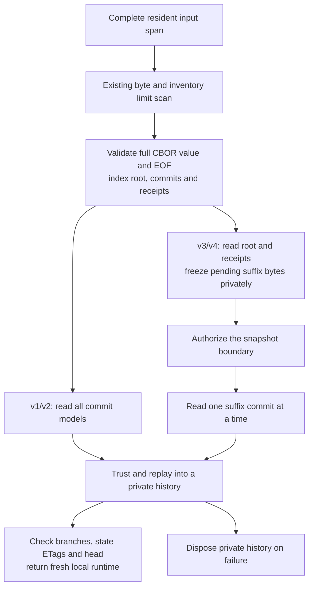

# Indexed CBOR archive recovery

[Overview](../README.md) · [Decoder baseline](ARCHIVE-RECOVERY-COSTS.md) · [Limits](ARCHIVE-LIMITS.md) · [Roadmap](ROADMAP.md)

CBOR archive recovery now validates the complete input and indexes its root fields, commit
parts and receipt parts before reading immutable models. Public `ParseCBOR`, persistent reopen,
cold retrieval and bootstrap use this path. They no longer construct a complete archive
`CBORValue` tree. All four archive profiles, original static identities and equal peer signatures
remain unchanged. JSON uses its existing parser and shares the boundary replay cursor.

The Release verification on **2026-10-09 passes 257 focused and 1,869 full cases**, zero failures
and one ordinary crash worker skipped. Two explicit reference generators remain excluded.
The package adds **78 cases**; existing fixed JSON/CBOR/signature references were not regenerated.

## Validation and replay



[`POIArchiveCBORIndex`](../WWCP_POI/History/POIArchiveCBORIndex.cs) retains only offsets/lengths
and field names. Its validation reader traverses the original complete span with Styx's global
container/tag depth accounting. It checks every nested value before any trust callback, including
strict UTF-8, indefinite string chunks, simple/float/integer rules, truncation and trailing bytes.
Map keys use the actual `CBORValue.ReadFrom` and equality rules, including byte strings,
full-range integers, arrays, maps and tagged keys. Duplicate failures wait until that map's
children finish, matching the original parser's precedence. Duplicate-key sets and individual
key/scalar values can still allocate; `SkipValue` alone would not preserve this contract.

[`IndexedArchive`](../WWCP_POI/History/RoamingNetworkHistory.IndexedArchive.cs) reads small
envelope fields, receipts and individual checkpoint/commit slices with the unchanged model
parsers. Root field order can be arbitrary. Noncanonical headers, ordering and indefinite
containers accepted by general recovery remain accepted, then export the same canonical bytes.
Complete profiles v1/v2 still construct every commit model before trust. Boundary profiles
v3/v4 still authorize the root before constructing suffix models, so a late semantic failure
can occur after earlier callbacks. Syntax failures anywhere precede every callback.

The synchronous `POIArchiveCommitCursor` feeds the existing boundary restore algorithm.
For encoded suffixes it privately copies the contiguous pending-commit region **before any
callback**. A caller-owned `byte[]` can be changed by a callback despite a `ReadOnlySpan<byte>`
parameter; the preceding full tree had already detached these values. The private copy preserves
that behavior while keeping model decoding lazy. Complete profiles need no such copy because
their models are already materialized. The index/cursor/encoded suffix are not retained by the
returned history. External effects performed by callbacks cannot be rolled back.

Bootstrap additionally runs a second Styx reader with `RequireDeterministic = true` over the
original bytes. It checks minimal headers, definite containers, map ordering and preferred
floating-point/NaN encodings without a complete re-encoding buffer. It deliberately does not
enable `RequirePreferredBignums`: Styx's canonical writer did not enforce that rule in the
preceding parse/re-encode comparison. Tests compare acceptance with the actual preceding
`CBORValue.Parse(...).ToByteArray(CBORWriterOptions.Canonical)` oracle, including nonpreferred
bignums. Manifest binding, counts, authority and fresh signature checks remain unchanged.

## Verification

[`IndexedArchiveTests`](../WWCP_POI_Tests/Interoperability/IndexedArchiveTests.cs) adds:

- Four profile cases binding indexed ranges to the complete-tree values and original bytes.
- Twenty-four nested duplicate-key cases: four profiles and six key kinds, including structured keys.
- Four late duplicate-commit cases that fail before trust.
- Eight input-mutation cases: ordinary and bootstrap recovery for each profile, with callbacks
  overwriting the original byte array and recovery preserving the original archive.
- Four noncanonical bootstrap envelope cases rejected before trust.
- Thirty-four independent Styx parser/canonical-writer oracle cases covering scalars, malformed
  UTF-8/chunks/simple values, full integer range, tags, duplicates, floats and depth boundaries.

The focused run also includes the 58 preceding recovery contracts, limits, persistence,
bootstrap and snapshot-boundary fixtures. The full run reruns model, SI/numeric, signing,
merge, runtime, crash and byte-reference contracts. There were no failing setup or test runs
in this package. The build succeeds with the existing nullable/analyzer warnings.

## Matched recovery measurements

The [before report](performance/indexed-archive-before.json) is an **exact derived subset** of
the preceding [98-worker baseline](performance/archive-recovery-baseline.json). Its 42 workers /
210 samples were not rerun. The [after report](performance/indexed-archive-after.json) contains
42 fresh workers / 210 samples: seven shapes, three operations, two processes, five warmups and
five measured calls per process. All four profiles are present.

Complete `read-cbor` measures the new production reader and replay. Complete `read-json` and
prepared-model `read-restore` are controls; boundary restore now uses the shared cursor in both.
The C# harness, runtime tuning, dependencies, input bytes, static/history/peer/receipt inventories
and recovered heads/results match. All branch states, peers and fresh runtime are verified
outside measurement. Individual baseline stage medians remain historical and non-additive.

Complete CBOR recovery, medians of ten calls per shape:

| Shape | Before allocated MiB | After MiB | Change | Before/after ms |
| --- | ---: | ---: | ---: | ---: |
| recover-batch-1-peers-1 | 5.2363 | 5.2000 | -0.69% | 16.80/15.95 |
| recover-batch-2048-peers-4 | 1662.9300 | 1656.3946 | -0.39% | 2388.87/2376.81 |
| recover-boundary-16 | 47.7422 | 47.9859 | +0.51% | 174.62/177.39 |
| recover-graph-128 | 426.2697 | 425.6334 | -0.15% | 697.46/730.71 |
| recover-graph-512 | 1687.9206 | 1688.5022 | +0.03% | 8494.51/3335.12 |
| recover-history-64 | 144.8399 | 145.4852 | +0.45% | 316.00/284.20 |
| recover-pruned-4 | 121.4217 | 122.2105 | +0.65% | 343.58/290.37 |

Controls for the larger graph, long history and long signed batch:

| Shape | Control | Before allocated MiB | After MiB | Change |
| --- | --- | ---: | ---: | ---: |
| recover-graph-512 | read-json | 1501.8238 | 1502.2531 | +0.03% |
| recover-graph-512 | read-restore | 667.0846 | 667.0472 | -0.01% |
| recover-history-64 | read-json | 132.3561 | 132.3709 | +0.01% |
| recover-history-64 | read-restore | 81.9433 | 82.1376 | +0.24% |
| recover-batch-2048-peers-4 | read-json | 1580.9354 | 1580.2547 | -0.04% |
| recover-batch-2048-peers-4 | read-restore | 1294.6825 | 1294.2449 | -0.03% |

Complete CBOR allocation changes range from **-0.69% to +0.65%** across the seven shapes.
At 512 EVSEs it is effectively unchanged (+0.03%), alongside the JSON allocation control
(+0.03%). The boundary and pruned fixtures rise +0.51%/+0.65%; this package therefore establishes
no broad cumulative-allocation reduction. Validation still decodes keys/scalars and model parsing
builds individual part trees; boundary profiles add a private encoded suffix. Removing the archive
tree shortens its lifetime without removing the much larger model/replay costs.

Graph-512 wall time changes 8494.51 -> 3335.12 ms, but JSON and prepared-model time controls also
move and the host is shared. Other shapes vary in both directions. No general speedup or
peak-memory reduction is attributed to the index. The collected graph-512 history delta is
13.4402–13.4440 MiB after, versus 13.4303–13.4314 MiB before. The after history-64 delta ranges
0.9985–1.0419 MiB. These approximate retained-state deltas do not include a retained archive
tree/index/cursor and do not establish total-memory bounds.

The [validated summary](performance/indexed-archive-summary.md) checks the exact baseline
subset and all paired inventories/results; the [complete comparison](performance/indexed-archive-comparison.md)
contains every measurement group. The [stdlib report script](../WWCP_POI_Benchmarks/indexed_archive_report.py)
refuses incomplete groups, changed inputs/results or changed harness/runtime/method fields.

No build/test from this task overlaps the after series. The Windows host is not dedicated or
affinity controlled. Wall times and 10 ms sampled managed/working-set peaks are descriptive.
Allocation covers managed bytes on the operation thread; process CPU also includes sampling.
Separate post-measurement collection estimates additional retained recovered-history memory,
keeping the prepared source/input live on both sides. Other objects can become collectible;
these deltas and sampled peaks are not capacity bounds.

## Evidence and remaining costs

[Verification evidence](verification/indexed-archive-results.json) binds both production source
fingerprints/assemblies, unchanged C# harness, test source/assembly/TRX counters, shared binaries,
original references and raw/generated report hashes. The [scoped production patch](performance/indexed-archive-reader.diff)
can be reversed in a separate matching checkout to reconstruct the preceding source fingerprint;
it includes only this package's six production files, preserving earlier work.

Input remains an already resident contiguous span. The index removes the complete archive tree,
but individual part trees, large keys/scalars, duplicate sets, receipts and range arrays,
boundary suffix byte copies, POI/ChangeSet JSON/model preparation, retained branch states and
local runtime remain. A long replay can retain many large versions. Byte/count/depth limits
are local rejection budgets; this implementation provides no constant total-memory bound.
That package added no `Stream`/asynchronous API or production profile/signing change.
The subsequent [borrowed-input package](ARCHIVE-INPUT-STREAMS.md) now adds sync/async stream APIs,
bounded private capture, mapped file input and cancellation without changing wire/signing rules.

The subsequent [borrowed-input package](ARCHIVE-INPUT-STREAMS.md) implements non-seekable source
capture with bounded memory and an owned spool, current-position/short reads, cancellation, shared
reader leases and explicit orphan maintenance. A read-only mapping supplies Styx's contiguous span
without a complete managed file-input copy. Its tests and fresh same-build span/memory/file controls
are recorded separately. Model/replay preparation, mapped-page/native costs and larger domain/
concurrency workloads remain follow-ups.


## Reproduction

Run from the repository. Finish builds/tests before measurement and use fresh output names:

```powershell
dotnet build WWCP_POI_Tests/WWCP_POI_Tests.csproj -c Release --no-restore
dotnet test WWCP_POI_Tests/WWCP_POI_Tests.csproj -c Release --no-build --no-restore --filter 'FullyQualifiedName~IndexedArchiveTests|FullyQualifiedName~ArchiveRecoveryContractTests|FullyQualifiedName~ArchiveLimitsTests|FullyQualifiedName~PersistenceTests|FullyQualifiedName~BootstrapTests|FullyQualifiedName~SnapshotBoundaryTests' --logger 'trx;LogFileName=indexed-archive-focused-rerun.trx' --results-directory WWCP_POI_Tests/bin/TestResults/indexed-archive-rerun
dotnet test WWCP_POI_Tests/WWCP_POI_Tests.csproj -c Release --no-build --no-restore --logger 'trx;LogFileName=indexed-archive-full-rerun.trx' --results-directory WWCP_POI_Tests/bin/TestResults/indexed-archive-rerun
dotnet build WWCP_POI_Benchmarks/WWCP_POI_Benchmarks.csproj -c Release --no-restore
dotnet WWCP_POI_Benchmarks/bin/Release/net10.0/WWCP_POI_Benchmarks.dll --suite recovery --operations read-cbor,read-json,read-restore --processes 2 --warmups 5 --samples 5 --label indexed-archive-rerun --output WWCP_POI_Benchmarks/bin/indexed-archive-rerun.json
dotnet WWCP_POI_Benchmarks/bin/Release/net10.0/WWCP_POI_Benchmarks.dll --compare-before docs/performance/indexed-archive-before.json --compare-after WWCP_POI_Benchmarks/bin/indexed-archive-rerun.json --summary WWCP_POI_Benchmarks/bin/indexed-archive-comparison-rerun.md
python -B WWCP_POI_Benchmarks/indexed_archive_report.py --before docs/performance/indexed-archive-before.json --after WWCP_POI_Benchmarks/bin/indexed-archive-rerun.json --original docs/performance/archive-recovery-baseline.json --output WWCP_POI_Benchmarks/bin/indexed-archive-summary-rerun.md
```

### Subsequent cooperative parser cancellation

[Parser cancellation](PARSER-CANCELLATION.md) passes the existing recovery token explicitly through
owned syntax/budget/canonical loops and around each commit/receipt/model/root/replay/head step.
There is no ambient token or retained parser context. Exact preceding diagnostics, eager/lazy
trust timing, input ownership, scope release, late token clearing and atomic installation remain.
Individual Styx/model/crypto calls and copies remain synchronous; no cancellation latency bound
is claimed. It adds 270 cases; all 2,507 interoperability / 2,839 full Release tests pass with
unchanged fixed references. Matched default/active-token successful reads use 72 workers/216 samples,
the same new harness/dependencies and exact prepared inputs/results. Earlier measurements remain
historical. Broader shared-reference/tariff/parking workloads are measured in the subsequent package below.

### Subsequent domain recovery baseline

[Shared-reference, tariff and parking workloads](DOMAIN-RECOVERY-WORKLOADS.md) add eight
deterministic 16/64-EVSE shapes with all four profiles, shared catalogs, meters, nested values,
targeted membership edits and one signed two-parent merge. Model/restore/full CBOR/JSON stages
use 64 fresh workers/192 samples with exact input/head/branch/peer and independent-runtime checks.
Production/dependency/reference bytes remain unchanged; six old simple-workload controls still
match. The new baseline measures richer data and is separate from historical performance reports.
81 new cases and all 2,588 interoperability / 2,920 full Release tests pass, including current
bootstrap trust rejection/retry and atomic invalid reference/value/additional-peer edits.
