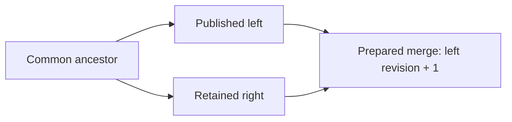

# Integrating retained branches

[Repository overview](../README.md) · [History](HISTORY.md) · [ChangeSets](CHANGESETS.md) · [Element operations](ELEMENT-OPERATIONS.md)

`RoamingNetworkHistory.TryMerge(leftId, rightId, ...)` compares the retained ancestor, left and
right static states. It supports integration after the left branch has already been published.
The default call previews compatibility and returns a notice; it does not retain, publish or
return a commit. Explicit `merge: true` prepares a **new unsigned commit** against the left tip.

This differs from `RoamingNetworkDataSnapshot.TryMerge(leftBatch, rightBatch, ...)`, which checks
unchanged operations in both orders against one exact common source. That API remains available
for incoming batches before either successor becomes the current head. It is conservative about
identical duplicate writes. The history API compares resulting states and synthesizes a new delta;
compatible identical writes or removals are represented once.

## Ancestors and revision

Both tips and all their parents must already be retained. The search includes **all** parent
edges. It finds best common ancestors: common ancestors with no later common descendant.
One candidate is selected automatically. Multiple candidates produce `AmbiguousAncestor` and
`AncestorCandidates`; supply `commonAncestor:` with one of those IDs to make the choice explicit.
An arbitrary earlier ancestor is not accepted as a substitute. Recursive virtual merge bases
are not implemented.

If the right tip is already an ancestor of the left tip, `AlreadyIntegrated` returns true and
no new commit. This acknowledges recorded ancestry; it does not claim that every earlier value
survives later edits or that manually recorded parent links prove data integration.

Otherwise a prepared commit has `Parents = [leftId, rightId]`, a new batch ID and revision
`left.Revision + 1`. Its `BeforeETags` bind the left state; both `AfterETags` describe the validated
result. Even when right descends left, preparation creates this explicit integration commit;
it does not move the head directly to the right tip or adopt the right revision.



## Comparison rules

The profile **`wwcp-poi-three-way-merge-v1`** operates on stored static properties:

| Situation | Result |
| --- | --- |
| Left and right agree | Keep the compatible value once |
| Only one side differs from the ancestor | Select that side |
| Disjoint entity/property edits | Combine the edits |
| Known identified arrays | Compare/add/remove by schema identity; recursively compare existing object elements |
| Same nested singleton identity | Compare its supported properties and nested owned relations |
| Array without an addressed identity / arbitrary JSON object property | Compare the complete value |
| Different changes to one value | Report `DifferentValues` |
| Deletion versus modification | Report `DeleteModify`, including edits beneath a deleted owner |
| Different additions at the same identity | Report `AddAdd` |
| Recreated entity/element versus another state | Report `ReplaceModify` |
| Different owner choices | Report `Ownership` |
| A merged reference has a missing or out-of-scope target | Report `Reference` with consumer, field and typed target |
| Other combined schema/ownership constraints fail, or operations cannot be scheduled | Report `InvalidResult` at the affected entity/path |

Graph identities include connector EVSE scope. Nested meters, brands, licenses and reference lists
use [existing relation identities](ELEMENT-OPERATIONS.md#supported-ownership-paths). No array-index
matching or implicit customer-ID guesses are performed. Embedded connection-point operators and
network registry operators remain separate owned values.

Managed graph/meter/operator `lastChange` fields do not create content conflicts. The prepared
batch recomputes timestamps of modified objects/ancestors through normal application. Creation
timestamps identify retained/recreated data and remain significant. Other dates, explicit null
versus absence, wire ID spelling and JSON number spelling remain significant. Runtime statuses,
schedules, measurements and forecasts never participate in this comparison.

Known identified collections have ordinal wire-ID order when edited. An order-only difference
can be emitted as an explicit whole-property write; arrays with no defined identity retain their
ordinary complete-value ordering. New original branch objects retain supplied creation metadata;
custom objects receive normal schema defaults at the merge timestamp. Custom SI values use the
same quantity/unit normalization as ordinary static operations.

## Preview and explicit preparation

This example assumes two batches prepared against `origin.Snapshot`:

```csharp
using var history = new RoamingNetworkHistory(network);
var origin = history.Head;

var left = history.PrepareCommit(origin.Id, leftBatch);
if (!history.TryPublish(origin.Id, left, out var published))
    throw new InvalidOperationException(published.Error);

var right = history.PrepareCommit(origin.Id, rightBatch);
if (!history.TryStoreCommit(right, out var retained))
    throw new InvalidOperationException(retained.Error);

if (!history.TryMerge(left.Id, right.Id, out _, out var preview))
{
    foreach (var conflict in preview.Conflicts)
        Console.WriteLine($"{conflict.Kind} {conflict.Path}: {conflict.Message}");
}

// Explicit request: neither preview nor preparation changes the published head.
if (history.TryMerge(left.Id, right.Id, out var prepared, out var report,
                     merge: true, mergedChangeSetId: "integrate-42",
                     createdAt: mergeTimestamp) && prepared is not null)
{
    // Optional: sign batch and/or complete commit with fresh equal peer signatures.
    if (!history.TryPublish(prepared.Parents[0], prepared, out var result))
        throw new InvalidOperationException($"{result.Outcome}: {result.Error}");
}
```

Use the observed current head as the left tip for immediate publication. A prepared merge against
another retained left state remains valid for that branch but can fail current-head publication.
Any head advance between preparation and publication produces the normal expected-head conflict.
No implicit overwrite, rewind or automatic retry is performed.

`createdAt` defaults to the later tip batch timestamp, normalized to UTC. Supplying the same tips,
ancestor choice, batch ID, timestamp, descriptions, metadata and deterministic resolutions produces
the same prepared commit ID. Numeric revision and both static ETags are still mandatory.
Preparation requires a fresh batch ID, including against the imported checkpoint's last batch ID.

## Structured conflicts and resolution

`RoamingNetworkMergeResult` exposes `Status`, `Message`, `Left`, `Right`, selected `Ancestor`,
`AncestorCandidates`, ordered `Conflicts` and the validated candidate's `AfterETags`. Tags are empty
when no candidate can be validated. `MergeAvailable` and `Prepared` succeed; `AlreadyIntegrated`
succeeds without a new commit. `Conflicts`, `AmbiguousAncestor`, `InvalidInput` and `Unavailable`
return false.

Each immutable conflict has `Kind`, `Path`, `Entity`, `ElementPath`, `PropertyName`, optional
`RelatedEntity`, detached
`BaseValue`/`LeftValue`/`RightValue`, a diagnostic and optional `Resolution`. A nullable value with
no `JsonElement` denotes **absence**; a present JSON null prints `null`. Graph structural,
reference and validation values are `{ "Parent": <typed reference or null>, "Document": <static subtree> }` so
ownership is visible. The pointer addresses a logical entity/element view using normalized domain
identities, escaped `~`/`/`, and connector scope; it is not an arbitrary patch path into network JSON.

Supply `resolveConflict:` to choose explicitly:

```csharp
RoamingNetworkMergeResolution? Resolve(RoamingNetworkMergeConflict conflict)
    => conflict.PropertyName == "maxPower"
           ? RoamingNetworkMergeResolution.Custom(JsonSerializer.SerializeToElement("175 kW"))
           : null; // Other conflicts remain unresolved.

history.TryMerge(left.Id, right.Id, out var prepared, out var result,
                 merge: true, mergedChangeSetId: "resolved-43",
                 createdAt: mergeTimestamp, resolveConflict: Resolve);
```

Choices are `UseBase`, `UseLeft`, `UseRight`, `Remove` (absence) and `Custom(JsonElement)`.
Custom JSON null is a value, not deletion. Graph structural/validation conflicts select a whole
branch subtree or removal; they do not accept arbitrary replacement graph JSON. Ownership conflicts
select a base/left/right parent. Custom nested array values must retain the addressed identity.
Required fields, duplicate identities, quantity dimensions and reference/ownership constraints
remain enforced after resolution.

Validation conflicts may be resolved by selecting the affected graph entity's branch subtree.
The complete result is validated again. A repeated failure at the same addressed issue is reported unresolved,
preventing resolution loops. A later whole-entity choice can override earlier field choices; the
audit record preserves decision order. Returning null keeps a conflict open and produces no commit.
Callbacks run under the history gate and must not mutate/dispose it reentrantly.
The guard applies to history API calls. External callback side effects and direct writes through
previously obtained mutable runtime entities cannot be rolled back by static merge preparation.

### Reference conflicts

Reference validation uses the same target/owner rules as ordinary operations. Before domain
projection it collects all currently missing or out-of-scope targets, so a group-parser error does
not obscure the actual dependency. `Kind == Reference` identifies the affected consumer in
`Entity`, its reference field in `PropertyName` and the referenced target in `RelatedEntity`.
Connector consumers retain their EVSE scope. Reports sort by path and then related target identity;
one field referencing two deleted tariffs produces two distinct conflicts at the same field path.

For example, left deletes a tariff while right adds that tariff to an EVSE/connector. Both branches
are independently valid, but their combination returns `Reference`, no commit and empty result tags.
The conflict's branch values are whole `{Parent, Document}` wrappers, **including for a named
reference field**. This lets `UseBase`/`UseLeft`/`UseRight` select a consistent complete consumer
subtree; `Remove` deletes it. `Custom` is not accepted for a reference validation conflict.
Choosing the branch without the reference can retain the deletion. Choosing a branch that still
references the missing target remains invalid; it does not automatically resurrect the target.

After each accepted whole-subtree resolution the complete candidate is checked again. A single
EVSE choice may repair both its own references and the references of its connectors. Obsolete
unresolved issues are dropped; only actual accepted decisions enter the audit record. Remaining
issues are reported together. If the same consumer/field/target fails again after a decision,
it is returned unresolved without calling the resolver repeatedly for that address.

Admission lists are distinct from active group membership: future `allowedMemberIds` do not
require targets, whereas `EVSEIds`/station/pool/tariff member lists do. Registry GridOperators and
embedded connection-point GridOperators remain independent owned descriptions; removing the
registry node creates no reference conflict for the embedded description. Parking sensor/space
references additionally enforce their parking operator scope.

## Generated operations and application

Preparation emits graph Add/Remove, property writes/removals and addressed nested element/property
operations against the **left** snapshot. Each applicable edit carries the left/current old value;
paired source ETags also protect absence. Normal graph/property edits preserve unrelated immutable
data when the prepared batch is applied. Ownership/lifetime changes rebuild the affected subtree
through Remove/Add and start fresh runtime lifetimes for those identities.

`RemoveProperty` and `RemoveElementProperty` remove an existing editable property completely,
require no `NewValue`, permit an expected `OldValue`, and validate the remaining object. They preserve
absence instead of converting it to JSON null. They cannot remove managed IDs/timestamps or required
domain content. Removing a whole nested runtime slot resets that slot's lifetime; removing an
ordinary metadata field preserves the surrounding meter/operator histories.

The planner checks the combined graph, references and ownership, then schedules operations through
the existing per-operation validator. It retries deferred operations when preceding accepted edits
make dependencies available, for example adding a tariff before its reference or removing consumers
before targets. If no valid ordering of the generated operations is found, it reports structured
`InvalidResult` failures and creates no batch. It does not invent temporary states or weaken domain
validation to force publication. After scheduling, selected static values are checked again and
normal `CreateChangeSet` computes final timestamps and both result tags.

A valid final graph can still require an unschedulable transition. For example, recreating an EVSE
with new creation metadata while an unchanged group keeps referencing it requires detaching the
consumer before Remove/Add. State comparison does not preserve temporary detach/restore steps
whose final value is unchanged. The planner reports `InvalidResult` when its generated delta cannot
be legally applied, even if the original branch performed those temporary steps. Scheduling failures
do not invoke the state conflict resolver. Explicitly detach/update consumers in a separate transition
and retry, or prepare a deliberate ordered ChangeSet; no hidden temporary operations are generated.

Preview/preparation operate only on static snapshots. `TryPublish` later captures the current left
head's live runtime values under its publication gate. Right-branch runtime values and operational
instructions are not merged or replayed.

## Audit metadata and signatures

The reserved batch metadata key **`wwcpPOIMerge`** contains:

- `Profile: "wwcp-poi-three-way-merge-v1"`.
- Typed `Ancestor`, `Left` and `Right` commit ID tuples.
- `Resolutions`: ordered explicit decisions with `Sequence`, `Path`, `Kind`, `Choice` and optional
  original custom `Value` (including explicit JSON null). Reference/invalid-parent decisions also
  include `RelatedEntity: { EntityType, EntityId, Scope? }` to identify their target/parent.

Supply ordinary multilingual `description:` and application `metadata:` arguments as needed.
They are detached by the batch constructor. The reserved key cannot be supplied by the caller.
Original branch metadata/signatures remain on retained input commits and are not copied into
the new batch. Its audit record, operations and result ETags enter the normal v2 batch signing
input and deterministic commit identity. Commit signatures additionally authenticate its parents.
Peer arrays remain outside commit identity, as for other commits.

Configured batch/commit verifiers and authorization recheck the consumed ancestry before merge.
As in recovery, an authorization policy can explicitly allow a locally trusted unsigned checkpoint.
Both batch and commit signatures on the prepared result start empty. To sign its batch first:

```csharp
prepared = prepared.WithChangeSet(prepared.ChangeSet!.Sign(privateKey, "company:alice", algorithm));
prepared = prepared.Sign(privateKey, "company:alice", algorithm);
```

The prepared commit and original branches persist in the existing history archive once retained
or published; recovery replays its original batch and validates ancestry/ETags. The audit metadata
documents preparation and is authenticated by signatures. Generic history storage replays the
transition; it does not independently rerun a third-party merge policy from that annotation.

## Coverage and remaining work

The [interoperability package](INTEROPERABILITY.md) adds executed disjoint property/meter edits,
structured conflicting values, custom SI resolution, optional property removal versus null,
signed merge/archive exchange and concurrent expected-head publication. Fixed references cover
both disjoint integration and explicit conflict-resolution audit bytes/signatures.

An incoming integration against left can be retained over right after all parents arrive.
`TryPublish` requires left as the current head; the separate `TryAdoptHead` previews and explicitly
selects the original retained integration over right. Bounded [replication](REPLICATION.md) pages
can transfer its missing ancestry. The existing executed reference workflow uses full archive
bootstrap; the new [replication/adoption fixtures](REPLICATION.md#implementation-and-evidence)
add executed incremental JSON/CBOR workflows, original signed merge adoption over right,
local runtime lifetime proofs, head races, revoked parent trust and persistence/recovery.
New replicas can also receive the checkpoint and all original signed branches through the
bounded, restartable [bootstrap](BOOTSTRAP.md) workflow before continuing incremental exchange.
### Structural merge evidence

[StructuralMergeTests](../WWCP_POI_Tests/Interoperability/StructuralMergeTests.cs) adds **34 passing
cases**. Owner deletion versus descendant edits is tested for pools/stations/EVSEs in both branch
orders, with explicit complete-subtree choices and signed archive recovery. Further cases cover
nested meter deletion/recreation, graph recreation, equal/different graph additions, connector
scope, simultaneous deleted tariff references, active groups versus admission lists, independent
grid-operator slots, owner moves and parking-scope violations. Invalid resolution shapes cannot
bypass graph/identity/ownership constraints; reference decisions are revalidated without loops or
stale errors. A valid but unschedulable referenced replacement is explicitly rejected.

Criss-cross history tests produce two best common ancestors, reject an arbitrary earlier base,
require an explicit choice and bind that choice into deterministic unsigned merge identity.
Resolver tests reject reentrant retention/publication/nested merge/disposal, preserve the complete
head/history/runtime on exceptions and successfully retry after failure. These cases add evidence
without changing existing cryptographic reference profiles/bytes.

Exhaustive deletion/recreation/reference/ownership combinations, operation-history lifetime proofs
for reused creation metadata, recursive virtual bases, rebase APIs, multi-tip merges and performance evidence remain in the
[roadmap](ROADMAP.md).
