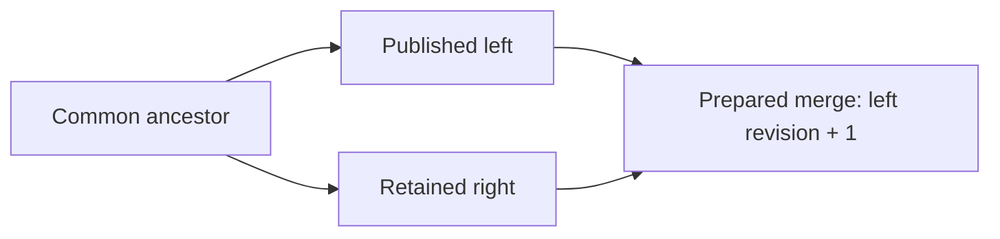

# Integrating retained branches

[Repository overview](../README.md) · [History](HISTORY.md) · [ChangeSets](CHANGESETS.md) · [Element operations](ELEMENT-OPERATIONS.md)

`RoamingNetworkHistory.TryMerge(leftId, rightId, ...)` compares the retained ancestor, left and
right static states. It supports integration after the left branch has already been published.
The default call previews compatibility and returns a notice; it does not retain, publish or
return a commit. Explicit `merge: true` prepares a **new unsigned commit** against the left tip.

This differs from `RoamingNetworkDataSnapshot.TryMerge(leftBatch, rightBatch, ...)`, which checks
unchanged operations in both orders against one exact common source. That API remains available
for incoming batches before either successor becomes the current head. It is conservative about
identical duplicate writes. The history API compares resulting states and synthesizes a new delta;
compatible identical writes or removals are represented once.

## Ancestors and revision

Full [snapshot links](SNAPSHOTS.md) participate in ordinary ancestry and merge-base selection.
Their original parent remains retained. They advance revision but preserve static data and all
operation-derived lifetime origins; a snapshot is not an entity removal/reintroduction. Merge
preparation defaults its timestamp from both payload timestamps, including snapshot creation time.
Dedicated snapshot/retention tests now cover suffix merges, runtime preservation, unavailable bases
and crossing old parents; see [verification](VERIFICATION-SNAPSHOTS-RETENTION.md). [Authorized snapshot boundaries](SNAPSHOT-BOUNDARIES.md)
now support known suffix merges while refusing unavailable requested tips or explicit bases with
`HistoryRequired` and typed `MissingCommits`. They do not prove pre-boundary object lifetimes or
replace missing historical bases with an invented comparison. Sufficient earlier history is required
for parent paths crossing the boundary.

Both tips and all their parents must already be retained. The search includes **all** parent
edges. It finds best common ancestors: common ancestors with no later common descendant.
One candidate is selected automatically. Multiple candidates produce `AmbiguousAncestor` and
`AncestorCandidates`; supply `commonAncestor:` with one of those IDs to make the choice explicit.
An arbitrary earlier ancestor is not accepted as a substitute. Recursive virtual merge bases
are not implemented.

If the right tip is already an ancestor of the left tip, `AlreadyIntegrated` returns true and
no new commit. This acknowledges recorded ancestry; it does not claim that every earlier value
survives later edits or that manually recorded parent links prove data integration.

Otherwise a prepared commit has `Parents = [leftId, rightId]`, a new batch ID and revision
`left.Revision + 1`. Its `BeforeETags` bind the left state; both `AfterETags` describe the validated
result. Even when right descends left, preparation creates this explicit integration commit;
it does not move the head directly to the right tip or adopt the right revision.



## Comparison rules

The profile **`wwcp-poi-three-way-merge-v1`** operates on stored static properties:

| Situation | Result |
| --- | --- |
| Left and right agree | Keep the compatible value once |
| Only one side differs from the ancestor | Select that side |
| Disjoint entity/property edits | Combine the edits |
| Known identified arrays | Compare/add/remove by schema identity; recursively compare existing object elements |
| Same nested singleton identity | Compare its supported properties and nested owned relations |
| Array without an addressed identity / arbitrary JSON object property | Compare the complete value |
| Different changes to one value | Report `DifferentValues` |
| Deletion versus modification | Report `DeleteModify`, including edits beneath a deleted owner |
| Different additions at the same identity | Report `AddAdd` |
| Recreated entity/element versus another state | Report `ReplaceModify` |
| Different owner choices | Report `Ownership` |
| A merged reference has a missing or out-of-scope target | Report `Reference` with consumer, field and typed target |
| Other combined schema/ownership constraints fail, or operations cannot be scheduled | Report `InvalidResult` at the affected entity/path |

Graph identities include connector EVSE scope. Nested meters, brands, licenses and reference lists
use [existing relation identities](ELEMENT-OPERATIONS.md#supported-ownership-paths). No array-index
matching or implicit customer-ID guesses are performed. Embedded connection-point operators and
network registry operators remain separate owned values.

Managed graph/meter/operator `lastChange` fields do not create content conflicts. The prepared
batch recomputes timestamps of modified objects/ancestors through normal application. Creation
timestamps remain significant; original operations additionally distinguish recreated objects
whose IDs and creation timestamps are reused. Other dates, explicit null
versus absence, wire ID spelling and JSON number spelling remain significant. Runtime statuses,
schedules, measurements and forecasts never participate in this comparison.

Known identified collections have ordinal wire-ID order when edited. An order-only difference
can be emitted as an explicit whole-property write; arrays with no defined identity retain their
ordinary complete-value ordering. New original branch objects retain supplied creation metadata;
custom objects receive normal schema defaults at the merge timestamp. Custom SI values use the
same quantity/unit normalization as ordinary static operations.

### Object lifetimes from original operations

Before comparing branch states, history merge derives owned-object lifetimes by replaying each
tip's original first-parent operations from the checkpoint. It observes every intermediate state,
including multiple operations in one batch. A graph subtree removal, an addressed element removal,
or temporarily clearing an owned property followed by reintroduction starts a new lifetime even
when the final payload, ID and `created` are unchanged. Changed ownership, nested identity or
creation metadata also starts a new lifetime. Continuous same-identity property replacements
preserve lifetimes; owner recreation propagates to all owned graph and nested descendants.

Lifetimes cover graph entities and schema-addressed owned values, including meters, connection
points, cables, brands and licenses. Shared registry operators have graph lifetimes. Reference strings are membership values;
their removal/readdition does not recreate the referenced target. Collections without addressed
identities retain whole-value comparison. Connector origins retain their EVSE scope and nested
origins retain their complete schema ownership path.

`RoamingNetworkLifetimeOrigin` exposes the original `CommitId` and zero-based `OperationIndex`.
Index -1 identifies the checkpoint. Origins are interpreted together with the addressed object;
several descendants can begin at the same subtree-add operation. Structural conflicts expose
`BaseLifetime`, `LeftLifetime` and `RightLifetime`, so identical JSON values can still have
different lifetimes. Deletion versus recreation reports `DeleteModify`; recreation versus edits
or independent recreation reports `ReplaceModify`. Selecting Base/Left/Right chooses the complete
owned state. Compatible identical additions at an identity absent from the ancestor retain the
existing duplicate-add behavior.

Independent moves to different owners retain the `Ownership` conflict and `$parent` values.
Its Base/Left/Right parent choice also selects that branch's complete subtree and lifetime, so
properties from independently reintroduced objects are not combined. Custom/removal owner choices
remain invalid.

An untouched branch can accept the other branch's recreation automatically. Preparation still
requires explicit `merge: true`. When the selected lifetime differs from the left lifetime, the
generated batch expresses Remove/Add even for identical static payloads. Required nested child
recreation can require rebuilding its optional owner slot. Publication starts fresh local runtime
for these rebuilt slots. Referenced graph recreation can additionally prepare explicit temporary
detach/restore operations as described below.

Additional parents remain ancestry claims: they do not transfer first-parent object lifetimes.
Rebuilt objects in a published merge begin at that merge's actual operations. Later comparisons
can therefore require an explicit lifetime choice even when additional-parent branch data agrees.
Merge recomputes origins from retained operations and does not trust application-supplied audit
annotations as lifetime evidence. Replay currently inventories owned slots per operation; caching
and performance measurements remain planned. Dedicated coverage for these new rules remains planned.

## Preview and explicit preparation

This example assumes two batches prepared against `origin.Snapshot`:

```csharp
using var history = new RoamingNetworkHistory(network);
var origin = history.Head;

var left = history.PrepareCommit(origin.Id, leftBatch);
if (!history.TryPublish(origin.Id, left, out var published))
    throw new InvalidOperationException(published.Error);

var right = history.PrepareCommit(origin.Id, rightBatch);
if (!history.TryStoreCommit(right, out var retained))
    throw new InvalidOperationException(retained.Error);

if (!history.TryMerge(left.Id, right.Id, out _, out var preview))
{
    foreach (var conflict in preview.Conflicts)
        Console.WriteLine($"{conflict.Kind} {conflict.Path}: {conflict.Message}");
}

// Explicit request: neither preview nor preparation changes the published head.
if (history.TryMerge(left.Id, right.Id, out var prepared, out var report,
                     merge: true, mergedChangeSetId: "integrate-42",
                     createdAt: mergeTimestamp) && prepared is not null)
{
    // Optional: sign batch and/or complete commit with fresh equal peer signatures.
    if (!history.TryPublish(prepared.Parents[0], prepared, out var result))
        throw new InvalidOperationException($"{result.Outcome}: {result.Error}");
}
```

Use the observed current head as the left tip for immediate publication. A prepared merge against
another retained left state remains valid for that branch but can fail current-head publication.
Any head advance between preparation and publication produces the normal expected-head conflict.
No implicit overwrite, rewind or automatic retry is performed.

`createdAt` defaults to the later tip batch timestamp, normalized to UTC. Supplying the same tips,
ancestor choice, batch ID, timestamp, descriptions, metadata and deterministic resolutions produces
the same prepared commit ID. Numeric revision and both static ETags are still mandatory.
Preparation requires a fresh batch ID, including against the imported checkpoint's last batch ID.

## Structured conflicts and resolution

`RoamingNetworkMergeResult` exposes `Status`, `Message`, `Left`, `Right`, selected `Ancestor`,
`AncestorCandidates`, ordered `Conflicts`, the validated candidate's `AfterETags`, complete
`PlannedOperations` and `ReferenceTransitions`. Tags and plans are empty
when no candidate can be validated. `MergeAvailable` and `Prepared` succeed; `AlreadyIntegrated`
succeeds without a new commit. `Conflicts`, `AmbiguousAncestor`, `InvalidInput` and `Unavailable`
return false.

Each immutable conflict has `Kind`, `Path`, `Entity`, `ElementPath`, `PropertyName`, optional
`RelatedEntity`, detached
`BaseValue`/`LeftValue`/`RightValue`, a diagnostic and optional `Resolution`. A nullable value with
no `JsonElement` denotes **absence**; a present JSON null prints `null`. Graph structural,
reference and validation values are `{ "Parent": <typed reference or null>, "Document": <static subtree> }` so
ownership is visible. The pointer addresses a logical entity/element view using normalized domain
identities, escaped `~`/`/`, and connector scope; it is not an arbitrary patch path into network JSON.

Supply `resolveConflict:` to choose explicitly:

```csharp
RoamingNetworkMergeResolution? Resolve(RoamingNetworkMergeConflict conflict)
    => conflict.PropertyName == "maxPower"
           ? RoamingNetworkMergeResolution.Custom(JsonSerializer.SerializeToElement("175 kW"))
           : null; // Other conflicts remain unresolved.

history.TryMerge(left.Id, right.Id, out var prepared, out var result,
                 merge: true, mergedChangeSetId: "resolved-43",
                 createdAt: mergeTimestamp, resolveConflict: Resolve);
```

Choices are `UseBase`, `UseLeft`, `UseRight`, `Remove` (absence) and `Custom(JsonElement)`.
Custom JSON null is a value, not deletion. Graph structural/validation conflicts select a whole
branch subtree or removal; they do not accept arbitrary replacement graph JSON. Ownership conflicts
select a base/left/right parent. Custom nested array values must retain the addressed identity.
Required fields, duplicate identities, quantity dimensions and reference/ownership constraints
remain enforced after resolution.

Validation conflicts may be resolved by selecting the affected graph entity's branch subtree.
The complete result is validated again. A repeated failure at the same addressed issue is reported unresolved,
preventing resolution loops. A later whole-entity choice can override earlier field choices; the
audit record preserves decision order. Returning null keeps a conflict open and produces no commit.
Callbacks run under the history gate and must not mutate/dispose it reentrantly.
The guard applies to history API calls. External callback side effects and direct writes through
previously obtained mutable runtime entities cannot be rolled back by static merge preparation.

### Reference conflicts

Reference validation uses the same target/owner rules as ordinary operations. Before domain
projection it collects all currently missing or out-of-scope targets, so a group-parser error does
not obscure the actual dependency. `Kind == Reference` identifies the affected consumer in
`Entity`, its reference field in `PropertyName` and the referenced target in `RelatedEntity`.
Connector consumers retain their EVSE scope. Reports sort by path and then related target identity;
one field referencing two deleted tariffs produces two distinct conflicts at the same field path.

For example, left deletes a tariff while right adds that tariff to an EVSE/connector. Both branches
are independently valid, but their combination returns `Reference`, no commit and empty result tags.
The conflict's branch values are whole `{Parent, Document}` wrappers, **including for a named
reference field**. This lets `UseBase`/`UseLeft`/`UseRight` select a consistent complete consumer
subtree; `Remove` deletes it. `Custom` is not accepted for a reference validation conflict.
Choosing the branch without the reference can retain the deletion. Choosing a branch that still
references the missing target remains invalid; it does not automatically resurrect the target.

After each accepted whole-subtree resolution the complete candidate is checked again. A single
EVSE choice may repair both its own references and the references of its connectors. Obsolete
unresolved issues are dropped; only actual accepted decisions enter the audit record. Remaining
issues are reported together. If the same consumer/field/target fails again after a decision,
it is returned unresolved without calling the resolver repeatedly for that address.

Admission lists are distinct from active group membership: future `allowedMemberIds` do not
require targets, whereas `EVSEIds`/station/pool/tariff member lists do. Points reference registered
GridOperators, so deletion with a surviving point is a reference conflict. Software/certificate
IDs in meter assignments are also indexed, and certificate edits revalidate software coverage.
Nested dependencies are attributed to the owner's complete meter/point property. Parking
sensor/space/garage/product references enforce the same parking operator scope.

## Generated operations and application

Preparation emits graph Add/Remove, property writes/removals and addressed nested element/property
operations against the **left** snapshot. Each applicable edit carries the left/current old value;
paired source ETags also protect absence. Normal graph/property edits preserve unrelated immutable
data when the prepared batch is applied. Ownership/lifetime changes rebuild the affected subtree
through Remove/Add and start fresh runtime lifetimes for those identities.

`RemoveProperty` and `RemoveElementProperty` remove an existing editable property completely,
require no `NewValue`, permit an expected `OldValue`, and validate the remaining object. They preserve
absence instead of converting it to JSON null. They cannot remove managed IDs/timestamps or required
domain content. Removing a whole nested runtime slot resets that slot's lifetime; removing an
ordinary metadata field preserves the surrounding meter/operator histories.

The planner checks the combined graph, references and ownership, then schedules operations through
the existing per-operation validator. It retries deferred operations when preceding accepted edits
make dependencies available, for example adding a tariff before its reference or removing consumers
before targets. If ordinary scheduling stalls on referenced removals, it can prepare explicit
temporary reference changes. Every intermediate operation still passes the normal validator.
Remaining schema/dependency failures return structured `InvalidResult` conflicts and no batch.
After scheduling, selected static values are checked again and normal `CreateChangeSet` computes
final timestamps and both result tags. Scheduling failures do not invoke the state conflict resolver.

### Explicit temporary reference transitions

Recreating an EVSE still referenced by an unchanged group can prepare this complete sequence:

1. `RemoveElement` for the group's affected `EVSEIds` membership.
2. Remove the original EVSE subtree.
3. Add its selected replacement subtree.
4. `AddElement` to restore the selected membership.

The planner uses the shared reverse reference index and schema target identities. It detaches only
references blocking remaining graph removals from outside each removed subtree. References internal
to that subtree disappear with ordinary removal. Arrays use addressed member operations; optional
scalar references use `RemoveProperty` and their selected final property value. Unaffected members
are retained. Pending edits to a detached field are replaced with a delta against its actual
detached value, so the original branch's final additions/removals are retained without stale
preconditions. Final absent properties and explicit JSON null remain distinct.

Restoration operations wait for the remaining removal operations observed at detachment; ordinary
reference validation then requires their targets to exist. This prevents restoration to an old
instance while another consumer still blocks its removal. If the consumer is rebuilt, its pending
subtree Add imports the selected final references and is recorded as restoration. A permanently
removed consumer needs no restoration. Temporary values that violate domain constraints are
rejected; the planner does not disable scope, identity, membership or reference validation.

Successful preview and preparation expose the complete `PlannedOperations`. Each immutable
`RoamingNetworkMergeReferenceTransition` identifies `Consumer`, `PropertyName`, ordered `Targets`,
actual `BeforeValue`, `DetachedValue`, normalized final `AfterValue`, and zero-based
`DetachOperationIndices`/`RestoreOperationIndices` into that operation sequence. A missing value
denotes absence. Failed plans expose no partial operation/transition arrays. These steps are part
of the newly prepared ChangeSet, available for review and explicit signing/publication. Preview
and preparation leave the head, retained commits, local runtime and persistent archive unchanged.

Only schema-indexed graph references participate. Unsupported dependency cycles, invalid temporary
domain states and cyclic full-subtree additions can still return `InvalidResult`. A caller can
provide a deliberate ordered transition when additional domain-specific intermediate values are
required. New reference-transition behavior has build evidence; broader regression coverage remains
planned. The existing referenced-replacement fixture now passes with its explicit prepared plan.

Preview/preparation operate only on static snapshots. `TryPublish` later captures the current left
head's live runtime values under its publication gate. Right-branch runtime values and operational
instructions are not merged or replayed.

## Audit metadata and signatures

The reserved batch metadata key **`wwcpPOIMerge`** contains:

- `Profile: "wwcp-poi-three-way-merge-v1"`.
- Typed `Ancestor`, `Left` and `Right` commit ID tuples.
- `Resolutions`: ordered explicit decisions with `Sequence`, `Path`, `Kind`, `Choice` and optional
  original custom `Value` (including explicit JSON null). Reference/invalid-parent decisions also
  include `RelatedEntity: { EntityType, EntityId, Scope? }` to identify their target/parent.
- Lifetime-dependent records add `LifetimeProfile: "wwcp-poi-operation-lifetime-v1"`. Resolved
  structural decisions can include `BaseLifetime`, `LeftLifetime` and `RightLifetime`, each carrying
  typed `CommitId` and `OperationIndex`; absence omits that side's origin. `LifetimeSelections`
  lists selected existing origins differing from the left, in ordinal `Path` order, as
  `{ Path, Origin: { CommitId, OperationIndex } }`. These document selected source lifetimes;
  any rebuilt result starts at the new merge's actual operations. Ordinary property-only merges
  retain their existing metadata shape.
- Reference-transition plans add `ReferenceTransitionProfile: "wwcp-poi-reference-transition-v1"`
  and `ReferenceTransitions`, carrying typed consumer/target references, property name, actual
  before/detached/final values and operation indices. Absent detached/final values are omitted;
  explicit JSON null remains present. These ordered records and all temporary operations are bound
  by the ordinary batch/commit signatures and lossless JSON/CBOR transports.

Supply ordinary multilingual `description:` and application `metadata:` arguments as needed.
They are detached by the batch constructor. The reserved key cannot be supplied by the caller.
Original branch metadata/signatures remain on retained input commits and are not copied into
the new batch. Its audit record, operations and result ETags enter the normal v2 batch signing
input and deterministic commit identity. Commit signatures additionally authenticate its parents.
Peer arrays remain outside commit identity, as for other commits.

Configured batch/commit verifiers and authorization recheck the consumed ancestry before merge.
As in recovery, an authorization policy can explicitly allow a locally trusted unsigned checkpoint.
Both batch and commit signatures on the prepared result start empty. To sign its batch first:

```csharp
prepared = prepared.WithChangeSet(prepared.ChangeSet!.Sign(privateKey, "company:alice", algorithm));
prepared = prepared.Sign(privateKey, "company:alice", algorithm);
```

The prepared commit and original branches persist in the existing history archive once retained
or published; recovery replays its original batch and validates ancestry/ETags. The audit metadata
documents preparation and is authenticated by signatures. Generic history storage replays the
transition; it does not independently rerun a third-party merge policy from that annotation.

## Coverage and remaining work

The [interoperability package](INTEROPERABILITY.md) adds executed disjoint property/meter edits,
structured conflicting values, custom SI resolution, optional property removal versus null,
signed merge/archive exchange and concurrent expected-head publication. Fixed references cover
both disjoint integration and explicit conflict-resolution audit bytes/signatures.

An incoming integration against left can be retained over right after all parents arrive.
`TryPublish` requires left as the current head; the separate `TryAdoptHead` previews and explicitly
selects the original retained integration over right. Bounded [replication](REPLICATION.md) pages
can transfer its missing ancestry. The existing executed reference workflow uses full archive
bootstrap; the new [replication/adoption fixtures](REPLICATION.md#implementation-and-evidence)
add executed incremental JSON/CBOR workflows, original signed merge adoption over right,
local runtime lifetime proofs, head races, revoked parent trust and persistence/recovery.
New replicas can also receive the checkpoint and all original signed branches through the
bounded, restartable [bootstrap](BOOTSTRAP.md) workflow before continuing incremental exchange.
### Structural merge evidence

[StructuralMergeTests](../WWCP_POI_Tests/Interoperability/StructuralMergeTests.cs) has **34 passing
cases** in the 2026-10-08 full run, including operation-history lifetimes and temporary reference plans.
Owner deletion versus descendant edits is tested for pools/stations/EVSEs in both branch
orders, with explicit complete-subtree choices and signed archive recovery. Further cases cover
nested meter deletion/recreation, graph recreation, equal/different graph additions, connector
scope, simultaneous deleted tariff references, active groups versus admission lists, independent
grid-operator slots, owner moves and parking-scope violations. Invalid resolution shapes cannot
bypass graph/identity/ownership constraints; reference decisions are revalidated without loops or
stale errors. The formerly rejected referenced-replacement case now expects explicit detachment,
restoration and unchanged history during preparation; its revised expectation now passes.

Criss-cross history tests produce two best common ancestors, reject an arbitrary earlier base,
require an explicit choice and bind that choice into deterministic unsigned merge identity.
Resolver tests reject reentrant retention/publication/nested merge/disposal, preserve the complete
head/history/runtime on exceptions and successfully retry after failure. These cases add evidence
without changing existing cryptographic reference profiles/bytes.

Operation-history lifetime handling now covers reused creation metadata as described above;
the full suite reruns the existing cases and explicitly resolves recreated-EVSE adoption before
checking its runtime reset. The [73-case model fixture](VERIFICATION-DOMAIN-MODEL.md) adds shared
registry/reference conflicts, disjoint catalog/parking edits, recreation in both branch orders and
signed second-parent adoption. Temporary plans now detach software/document assignments at all
meter positions and required operator references by clearing the optional connection-point slot.
Meter assignment edits preserve meter lifetimes; clearing a point resets its child meter runtime.
Restoration replaces pending operations within the affected field, including deeper element edits.
Broader regression coverage remains planned. Exhaustive deletion/recreation/reference/ownership
combinations, broader reference-transition coverage, recursive virtual bases, rebase APIs,
multi-tip merges and merge performance evidence remain in the
[roadmap](ROADMAP.md).
